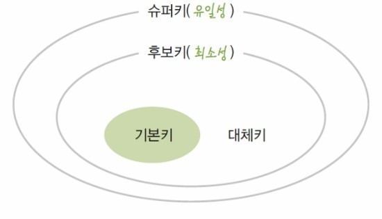
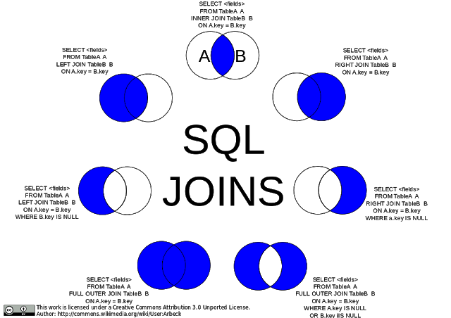

# Database

참고자료: [링크](https://hyeonu1258.github.io/2018/03/15/데이터베이스 면접/)

## 각종 키

참고자료: [링크1](https://coding-factory.tistory.com/220), [링크2](https://hyeonu1258.github.io/2018/03/15/데이터베이스 면접/)

**후보키**

1. 릴레이션을 구성하는 속성들 중에서 튜플을 유일하게 식별하기 위해 사용하는 속성들의 부분집합, 즉 **기본키로 사용할 수 있는 속성**들을 의미한다.

2. 하나의 릴레이션에는 중복된 튜플이 있을 수 없으므로 반드시 **하나 이상의 후보키가 존재한다.**

3. 후보키는 릴레이션에 있는 모든 튜플에 대해서 **유일성**과 **최소성**을 만족해야 한다.

   > *유일성: 하나의 키값으로 하나의 튜플만을 유일하게 식별할 수 있어야 한다.*
   >
   > *최소성: 모든 레코드들을 유일하게 식별하는데 꼭 필요한 속성만으로 구성되어야 한다.*

**기본키**

1. 기본키는 **후보키 중에서 선택된** Main key이다.
2. 한 릴레이션에서 특정 튜플을 **유일하게 구별할 수 있는** 속성이다.
3. Null값을 가질 수 없다.
4. 기본키로 정의된 속성에는 동일한 값이 중복되어 저장될 수 없다.

**대체키**

1. 기본키를 제외한 **나머지 후보키**
2. 보조키라고도 한다.

**슈퍼키**

1. 한 릴레이션 내에 있는 속성들의 집합으로 구성된 키. 릴레이션을 구성하는 모든 튜플들 중 슈퍼키로 구성된 속성의 집합과 동일한 값을 나타내지 않는다.

2. 릴레이션을 구성하는 모든 튜플에 대해 **유일성을 만족하지만, 최소성은 만족시키지 못한다.**

   > *최소성: 학번 + 주민번호를 사용하여 슈퍼키를 만들면 다른 튜플들과 구분할 수 있는 유일성은 만족하지만 학번이나 주민번호 하나만 가지고도 다른 튜플들을 구분할 수 있으므로 최소성은 만족시키지 못한다.*

**외래키**

1. 관계를 맺고 있는 서로 다른 릴레이션 R1, R2가 있을 때, R1이 참조하고 있는 R2의 기본키와 같은 R1 릴레이션의 속성을 외래키라 한다.
2. 외래키는 참조되는 릴레이션의 기본키와 대응되어 **릴레이션 간에 참조관계**를 표현하는데 중요한 도구이다.

## 데이터베이스 무결성

무결성이란 데이터의 정확성과 일관성을 유지하고 보증하는 규칙을 말한다.

**엔티티 무결성**

- 기본키와 관련된 규칙
- 모든 테이블은 기본키를 가져야 하며, 기본키는 고유하고 null이 아니여야 한다.

**참조 무결성**

- 외래키와 관련된 규칙
- 모든 외래키의 값이 특정 테이블의 기본키 값을 참조하거나, null값 이어야 한다.
- 예를 들어, 참조하고 있는 기본키가 삭제되었을 경우 존재하지 않는 기본키를 참조하게 되므로 참조 무결성에 위배된다.

**도메인 무결성**

- 속성 값과 관련된 규칙
- 같은 속성의 값들은 같은 성격을 가진 값들이어야 한다. (성격이란 null값 허용 여부, 자료형 등을 의미)

## 데이터베이스 이상 (Anomaly)

데이터 간 종속성, 일관성이 비논리적으로 설계되어 데이터터 변경시 부작용을 일으키는 현상

**삽입 이상**

- 원치 않는 데이터까지 삽입해야하는 현상

**삭제 이상**

- 원치 않는 데이터까지 삭제해야되는 현상

**갱신 이상**

- 데이터의 일관성이 유지되지 않는 현상.
- 예를 들어, 학생 테이블에서 한 학생의 학년을 변경했는데 수강한 과목의 필요학년과 안 맞는 경우 데이터의 일관성이 유지되지 않는 문제가 발생한다.

## 정규화

참고자료: [링크1](https://3months.tistory.com/193) 

**목적)**

1. 불필요한 데이터(data redundancy) 제거
2. 데이터 저장을 "논리적으로" 한다.
   - 데이터 테이블의 구성이 논리적으로 직관적이 되도록 한다.

**예제)**

아래와 같은 테이블을 상상해보자

| S_id | S_Name | S_Address | Subject_opted |
| ---- | ------ | --------- | ------------- |
| 401  | Adam   | Noida     | Bio           |
| 402  | Alex   | Panipat   | Maths         |
| 403  | Stuart | Jammu     | Maths         |
| 404  | Adam   | Noida     | Physics       |

위의 테이블을 핸들링 시 나타날 수 있는 문제의 예시는 아래와 같다.

1. **Update**

   Adam의 Address가 변경되었을 때, 여러 줄의 데이터를 갱신해야 한다. 이로 인해 데이터 불일치(**inconsistency**)가 발생한다.

2. **Insert**

   만약 학생이 아무 과목도 수강하지 않는다고 하면, Subject_opted 칼럼에는 NULL이 들어갈 것이다.

3. **Deletion**

   만약 Alex 학생이 과목 수강을 취소한다면 Alex의 레코드가 아예 테이블에서 지워져버립니다.

위와 같은 문제들을 해결하기 위해 테이블의 구조를 논리적으로 변경하는 것이 **정규화**다.

### 1NF

1차 정규형은 각 Row마다 Column의 값이 1개씩(**Atomic Value**)만 있어야 한다. 아래 예에서 Adam의 Subject가 Biology와 Math 두 개이기 때문에, 이는 1차 정규형을 만족하지 못한다.

| Student | Age  | Subject       |
| ------- | ---- | ------------- |
| Adam    | 15   | Biology, Math |
| Alex    | 14   | Math          |
| Stuart  | 17   | Math          |

위 테이블이 1차 정규형을 만족하도록 변경한다면, 아래와 같은 형태가 된다. 

| Student | Age  | Subject |
| ------- | ---- | ------- |
| Adam    | 15   | Biology |
| Adam    | 15   | Math    |
| Alex    | 14   | Math    |
| Stuart  | 17   | Math    |

하지만, 1차 정규화를 함으로써 **Data Redundancy는 오히려 증가**하였다.(데이터의 논리적 구성을 위한 희생)

### 2NF

2차 정규형은 모든 컬럼이 **완전 함수적 종속**을 만족해야 한다. 다시말해, **기본키** 중에 특정 컬럼에만 종속된 컬럼(**부분적 종속**)이 없어야 한다. 위 테이블의 기본 키는 `Student`, `Subject` 두 개로 볼 수 있다. 이 두 개의 키가 합쳐져야 한 로우를 구분할 수 있다. 근데 `Age`의 경우 이 기본키 중 `Student`에만 종속되어 있다. 즉, `Student` 컬럼의 값을 알면 `Age`의 값을 알 수 있다. 따라서 `Age`가 두 번 들어가는 것은 불필요하다고 판단할 수 있다.

아래는 위 테이블을 2차 정규형을 만족하도록 쪼갠 것이다.

**Student Table**

| Student | Age  |
| ------- | ---- |
| Adam    | 15   |
| Alex    | 14   |
| Stuart  | 17   |

**Subject Table**

| Student | Subject |
| ------- | ------- |
| Adam    | Biology |
| Adam    | Math    |
| Alex    | Math    |
| Stuart  | Math    |

위의 두 테이블은 모두 2차 정규형을 만족한다.

### 3NF

아래와 같은 테이블을 생각해보자.

**Student_Detail Table**

| Student_id | Student_name | DOB  | Street | City | State | Zip  |
| ---------- | ------------ | ---- | ------ | ---- | ----- | ---- |
| -          | -            | -    | -      | -    | -     | -    |

위 테이블에서 `Student_id`가 기본키이고, 기본 키가 하나이므로 2차 정규형은 만족하는 것으로 볼 수 있다. 하지만 이 데이터들의 `Zip` 컬럼값을 알게 되면 `Street`, `City`, `State`값을 결정할 수 있다. 또한 여러 학생들이 동일한 `Zip`값을 가질 경우 동일한 `Street`, `City`, `State` 데이터들이 중복되어 저장될 수 있다.

3차 정규형은 *기본키를 제외한* 속성들 간의 **이행적 함수 종속이 없는 것**을 의미한다. **다시 말해, 기본키 이외의 컬럼이 다른 컬럼을 결정할 수 없어야 한다.**

3차 정규화 또한 2차 정규화와 마차가지로 테이블을 분리함으로써 해결할 수 있다. 아래와 같이 데이터가 논리적인 단위(학생, 주소)로 분리될 수 있고, data redundancy도 줄어들었음을 알 수 있다.

**Student_Detail Table**

| Student_id | Student_name | DOB  | ZIP  |
| ---------- | ------------ | ---- | ---- |
| -          | -            | -    | -    |

**Address Table**

| Zip  | Street | City | State |
| ---- | ------ | ---- | ----- |
| -    | -      | -    | -     |

### BCNF (Boyce and Codd Normal Form)

3차 정규형을 만족하더라도, **일반 컬럼이 후보키를 결정**하는 경우 BCNF를 만족하지 못한다.

BCNF란 3차 정규형을 만족하면서, **모든 결정자가 후보키 집합에 속한 정규형**이다.  아래 예를 확인해보자

| 학생 | 과목  | 교수   | 학점 |
| ---- | ----- | ------ | ---- |
| 1    | AB123 | 김인영 | A    |
| 2    | CS123 | Mr.Sim | A    |
| 3    | CS123 | Mr.Sim | A    |

후보키는 슈퍼키 중에서 최소성을 만족하는 키를 의미하는데, 위 예에서 **후보키**는 (`학생`, `과목`)이다. (`학생`, `과목`)은 그 로우를 유일하게 구분할 수 있다. 근데 이 테이블의 경우 `교수`가 **결정자**이다.(교수가 한 과목만 강의할 수 있다고 가정) 즉, 교수가 정해지면 과목이 정해진다. 그럼에도 `교수`는 **후보키가 아니다.** 이런 경우 BCNF를 만족하지 못한다고 한다.

위와 같이 테이블이 구성된 경우 데이터가 중복되고, 갱신 이상이 발생한다. 예를 들어 Mr.Sim이 강의하는 과목명이 바뀐다면 두 개의 로우를 갱신해야 한다. 이를 해결하기 위해 테이블을 분리한다.

**교수 테이블**

| 교수   | 과목  |
| ------ | ----- |
| 김인영 | AB123 |
| Mr.Sim | CS123 |

**수강 테이블**

| 학생 | 과목  | 학점 |
| ---- | ----- | ---- |
| 1    | AB123 | A    |
| 2    | CS123 | A    |
| 3    | CS123 | A    |

### 4NF

테이블 내에서 M:N관계를 가지는 속성들을 분리해 낸다. 아래 테이블을 예로 들어보자.

| 학번 | 이름 | 과목번호 | 과목명 |
| ---- | ---- | -------- | ------ |
|      |      |          |        |

이러한 테이블이 존재할 때, (`학번`, `이름`)과 (`과목번호`, `과목명`)은 서로 M:N의 관계를 이루고 있다. 

### 5NF

(생략)

## 데이터베이스 트랜잭션, ACID

트랜잭션이란 복수의 쿼리를 하나의 단위로 묶어서 실행하는 것을 의미. 트랜잭션을 제대로 수행하기 위해서는 **ACID**라는 특성을 만족해야 한다.

**Atomicity**

- 일련의 쿼리가 전부 성공할지 실패할지를 보증하는 구조로서, 중간에 쿼리가 **실패하면 Rollback**을 통해 처음으로 돌아가고, 모든 쿼리가 **성공하면 commit**을 통해 실행을 확정함으로써 보장한다.

**Consistency**

- 일련의 쿼리 전후로 상태를 유지하는 것을 의미한다. 데이터 별로 제약이 있다면 쿼리가 종류된 후에도 제약에 만족하는 일관성을 가져야 한다. 예를 들어, `unique` 제약이 걸린 데이터인 경우 일련의 쿼리가 종료된 후에도 `unique` 제약을 만족해야 한다.

**Isolation**

- 일련의 쿼리를 동시에 실행해도 각각의 처리가 모순없이 실행되는 것이 보장되어야 한다. 이것을 보증하기 위해 `lock`을 걸어 후속처리를 블록하는 방법이 있다.

  - 테이블 전체 lock
  - 블록 단위 lock
  - 행 단위 lock

- 격리화(Isolation)는 성능저하를 유발하기 때문에 격리 수준에 따라 `Read Uncommitted`, `Read Committed`, `Repeatable Read`, `Serializable`로 구분되며, `Dirty Read`, `Non-Repeatable Read`, `Phantom Read` 등의 문제가 발생한다.

  - 격리 수준

    1. Read Uncommitted

       선행하는 트랜잭션이 데이터를 변경 중일 때 다른 트랜잭션이 해당 데이터를 **읽을** 수 있다. 동시성 처리능력이 가장 좋은 반면 `Dirty Read`, `Non-Repeatable Read`, `Phantom Read` 문제가 발생할 수 있다.

    2. Read Committed

       선행하는 트랜잭션이 데이터를 변경 중일 때 다른 트랜잭션은 **커밋이 완료된 데이터에만** 접근 가능하다. 변경 중인 데이터를 읽는 것을 막음으로써 `Dirty-Read`를 예방하지만, 다른 문제는 여전히 발생한다.

    3. Repeatable Read

       동일한 트랜잭션 내에서 한 번이라도 조회한 데이터는 트랜잭션이 끝날 때까지 변경 불가능하도록 설정하여 **반복 조회시에도 같은 데이터가 조회됨을 보장**한다. `Non-Repeatable Read` 문제는 해결하지만 새로운 데이터의 추가와 삭제는 가능하기에 `Phantom Read` 문제가 발생할 수 있다.

    4. Serializable

       선행한 트랜잭션이 종료된 후 다른 트랜잭션이 실행된다. 이때는 새로운 데이터의 추가 및 삭제가 불가능하기에 `Phantom Read` 문제가 해소된다. 가장 엄격한 격리수준이라 격리 문제는 발생하지 않지만, 성능이 급격히 떨어진다.

  - 격리 수준에 따른 문제점

    1. Dirty Read

       선행한 트랜잭션이 아직 커밋하지 않은 상태에서 데이터를 수정 중일때, 후행하는 트랜잭션이 해당 데이터를 읽을 경우 잘못된 데이터를 읽게 되는 문제.

    2. Non-Repeatable Read

       선행하는 트랜잭션이 읽고 있는 데이터를 후행하는 트랜잭션이 접근하여 값을 변경할 때 선행한 트랜잭션은 잘못된 데이터를 읽게되는 문제.

    3. Phantom Read

       후행하는 트랜잭션이 데이터를 추가/삭제하여 선행하는 트랜잭션이 데이터를 다시 읽을 때 새로운 데이터를 읽거나 이전에 읽었던 데이터가 사라져있는 문제.

**Durability**

일련의 쿼리가 실행완료되었다면 해당 결과는 데이터베이스에 반영되어 영구히 지속되어야 한다.

## NoSQL과 RDBMS의 비교

**RDBMS**

- 프로그래밍 언어를 몰라도 데이터를 쉽게 조작할 수 있도록 설계된 언어인 SQL을 통하여 데이터 조작을 할 수 있어 편리하다. 하지만 데이터의 일관성을 엄격히 준수하고 중복을 최소화하는 특징에 의해 **속도가 비교적 느리고, 유연성이 낮다.** 따라서 데이터를 수많은 서버에 분산 저장하는 **data sharding이 어려워 서버 확장이 힘들다.**

**NoSqL**

- 빅데이터에서 발생하는 방대한 양의 비정형 데이터를 처리하기 위해 설계된 데이터베이스. 기존의 RDB는 정형화된 데이터만 처리할 수 있었다. 데이터의 **일관성을 보장하지 않는 대신 빠른 속도**를 가지고, **schema-less 구조이기에 유연성이 높다.** 데이터의 중복을 허용하는 구조때문에 scale out 방식 중 하나인 **sharding 적용이 쉬워** 서버 확장이 쉽다. 하지만 결국 데이터 손실 위험을 안고있고, 복잡한 join이 어렵다는 단점이 존재한다.

## SQL

**(redis 프로젝트와 비교)**

- 간단한 CRUD 조작
- JOIN / GROUP BY / HAVING X

### JOIN

2개 이상의 테이블에서 필요한 값들을 하나의 테이블로 보기위해 사용하는 명령어. join에는 조건에 만족하지 않는 행을 포함하느냐에 따라 내부조인과 외부조인으로 나누어진다.

**내부 조인**

- 내부 조인은 조건에 만족하는 행들만 보여주는 것.

**외부 조인**

- 조건에 만족하지 않는 테이블의 행 또한 포함하여 보여주는 것. 기준 테이블을 왼쪽 테이블에 두면 left, 오른쪽에 두면 right라 한다.

## INDEX

테이블의 읽기속도를 높이기 위한 자료구조. 테이블의 컬럼 인덱스를 설정하여, 테이블 검색 시 full scan이 아닌 index 파일 검색으로 **검색속도를 빠르게 한다.**

**장점**

- 테이블 **검색과 정렬 속도**를 향상시킨다. 또한 index를 기본키로 자동설정하여 관리가 편하다.

**단점**

- 인덱스 파일을 별도로 만들어야하므로 파일의 **크기가 늘어나고** 인덱스 최소 생성시 시간이 많이 소요될 수 있다. 또한 인덱스된 컬럼값이 변경하거나 인덱스를 업데이트해야 할 경우 성능이 떨어지게 된다.

**그럼 인덱스를 언제 써?**

- 변경이 잦은 컬럼에서는 인덱싱을 피하고, true/false 값을 갖는 컬럼처럼 중복도가 높은 컬럼은 인덱싱을 해도 고유성이 없기에 효용이 떨어진다.
- WHERE 절과 JOIN, ORDER BY등이 자주 사용되는 컬럼의 경우 인덱싱을 하면 검색 속도를 효과적으로 높일 수 있다.

### 인덱스 구조

참고자료: [b-tree](https://potatoggg.tistory.com/174) 

검색의 효율을 높이기 위해 `B-tree` 혹은 `B+tree` 구조를 사용한다.

**B-Tree**

- Balanced-Tree 자료구조의 하나로 하나의 노드에 여러 자료가 배치되고 2개이상의 자식노드를 가질 수 있는 tree 구조이다. 

- 
- 삽입/삭제 시에도 트리 균형을 유지할 수 있다는 특징과, **언제나 균등한 탐색속도**를 보장한다는 특징이 있지만, 트리의 균형을 유지하기 위해 복잡한 연산이 요구되며 **중위순회방식을 사용하기에 순회탐색이 비효율적이다.**

**B+Tree**

- B-Tree의 순회탐색 비효율을 보완한 구조. 노드의 데이터들이 `linked-list`로 연결되어 있어 순차적 처리가 가능해 순회탐색이 빠르다.
- 트리의 최하단 노드에만 데이터들이 `linked-list`로 정렬되어 있으며 **나머지 노드들은 키값만 가지고 있다.**

> **Balanced-Tree**
>
> Tree 자료형의 기본적인 구조인 이진트리는 좌우 균형이 안 맞아 비효율적이라는 단점을 가지는데 이것을 해결한 구조가 Balanced-Tree 구조다. Balanced-Tree는 한쪽으로 몰린 depth를 **균일하게 재배치함으로서** 모든 자식 노드들의 depth를 균일하게 한다. 따라서 **어떠한 상황에서도 검색성능을 O(logN)까지 일관된 속도를 보장한다.**

## Replication

데이터베이스를 접근하는 DB서버와 데이터를 저장하는 저장소를 구성하는 하나의 세트를 **복제**하여 여러 세트로 구성함으로써 위험을 분산하는 구조를 말한다. 이러한 구조는 저장소를 공유한다 하여 **`shared disk`**라고 부릅니다. 분산처리를 통해 성능 향상을 기대할 수 있는 장점이 있는 반면, 여러 데이터가 복제되어 있는 만큼 데이터의 정합성을 유지하기 어렵습니다. 따라서 갱신 주기를 어떻게 하느냐가 중요한데 이것은 성능과 데이터의 정합성에 트레이드오프 관계가 발생한다는 단점이 있다.

## Sharding

참고자료: [링크](https://genesis8.tistory.com/211) 

데이터의 정합성 문제와 갱신에 의한 성능 저하가 발생하는 `shared disk`의 문제를 해결하기 위해 고안된 아키텍쳐가 `shared nothing`이며, 이 개념에 기반하여 구글에서 만든 구조가 `sharding`이다. `sharding`은 데이터를 여러 저장소에 **분할 저장** 함으로써 동기화에 대한 이슈를 제거했기에 속도 또한 빠르다. 하지만 특정 저장소에 정해진 데이터가 저장되어있기에 데이터를 찾으려면 특정 저장소를 찾아가야한다는 문제점이 있으며, 하나의 DB 서버가 다운이 되면 복구할 수가 없다는 문제가 있습니다. 이러한 문제는 **커버링**이라는 구성을 통해 하나의 DB 서버가 다운되었을 때 그것을 이어받아 처리하는 조치가 필요하다.

**Vertical Partitioning**

- 테이블 별로 서버를 분할하는 방식
- 예를 들어, 사용자 프로필 정보용 서버, 사용자 친구 리스트용 서버, 사용자 생성 컨텐츠(사진 등)용 서버 등으로 분할하는 방식이 있다.
- 장점) 구현이 간단하고, 전체 시스템에 큰 변화가 필요 없다.
- 단점) 각 서버의 데이터가 점점 거대해지면 추가 샤딩이 필요해진다.

**Range Based Partitioning**

- 하나의 feature(또는 table)가 점점 거대해지는 경우 서버를 분리하는 방식
- 예를 들어, 거대한 유저 정보를 지역정보별로, 혹은 가입날짜별로 분리하는 방식이 있다.
- 주의점) 데이터를 분할하는 방법이 예측가능해야 한다.

**Key or Hash Based Partitioning**

- 엔티티를 해쉬함수에 넣어서 나오는 값을 이용해서 서버를 정하는 방식.
- 예를 들어, 사용자ID의 해쉬값을 이용해 저장하는 데이터베이스를 나눌 수 있다.
- 주의점) 데이터가 균등하게 분포되도록 해쉬함수를 정하는게 중요하다.
- 단점) 서버의 수를 늘리기 위해서 해쉬함수를 변경하는 작업은 비용이 매우 크다.

**Directory Based Partitioning**

- 파티셔닝 매커니즘을 제공하는 추상화된 서비스를 만드는 방식.

**샤딩 적용시 발생할 수 있는 문제점 & 고려사항**

- 데이터 재분배(Rebalancing Data)

  Sharing된 DB의 물리적인 용량한계나 성능한계에 다다르면 shard의 수를 늘리는 scale-up 작업이 필요하다. *서비스가 중단되지 않고 scale-up*할 수 있도록 설계하는게 중요하다.

- 여러 샤드들로부터 데이터 JOIN하기

  sharding-db간에 JOIN이 불가능 하기에 처음부터 **역정규화**를 어느정도 감수해야 한다. Shard의 목적이 대용량 데이터 처리이므로, 대용량처리시 수행성능을 위해서 데이터 중복은 trade-off 관계.

- 샤드 내에서 데이터 파티션하는 방법

  shard 해쉬함수를 잘 설계해야 한다.

- 샤드 간 트랜잭션 문제

  Global transaction을 사용하면 shard DB 간 트랜잭션도 가능하다. 하지만 성능저하가 동반된다.

- Global unique key

  DBMS에서 제공하는 auto-increment를 사용하면 key가 중복될 수 있으므로, application 레벨에서 key 생성을 담당해야 한다.

- 데이터는 작게

  Table 단위를 가능한 작게 만들어야 한다.