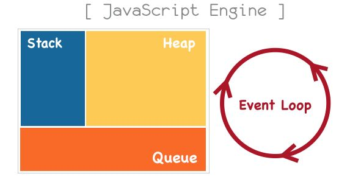
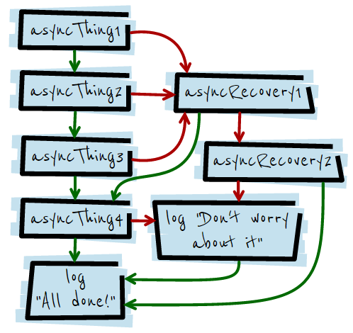
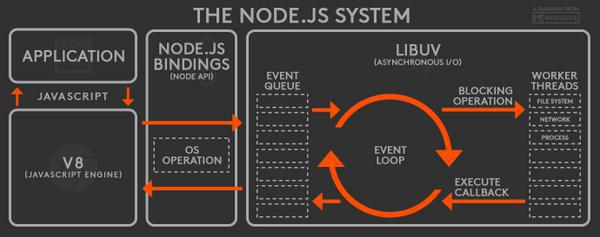

# Javascript

참고자료: [링크](https://github.com/JaeYeopHan/Interview_Question_for_Beginner/tree/master/JavaScript) 


## Javascript의 이벤트 루프

참고자료: [링크](https://asfirstalways.tistory.com/362) [링크](http://sculove.github.io/blog/2018/01/18/javascriptflow/) 

### Javascript Engine?

Javascript를 해석하는 Javascript engine과 웹 브라우저에 화면을 그리는 Rendering engine은 **다른 것**이다. Rendering engine(Layout engine)은 HTML과 CSS로 작성된 마크업 관련 코드들을 콘텐츠로서 웹  페이지에 **rendering**하는 역할을 한다. 반면 Javascript engine이란 Javascript로 작성한 코드를 해석하고 실행하는 **인터프리터**다. 주로 웹 브라우저에서 이용되지만 최근에는 `node.js`가 등장하면서 server side에선 V8과 같은 engine이 사용된다. (V8은 구글에서 개발한 JS 엔진)

대부분의 JS 엔진은 크게 세 영역으로 나뉜다. (대표적 예: V8)

- Call Stack
- Task Queue(Event Queue)
- Heap

여기에 추가적으로 **Event loop**이 존재하여 Task queue에 들어가는 task들을 관리하게 된다.



### Call Stack

JS는 **단 하나의 호출 스택(call stack)**을 사용한다. 이러한 특징 때문에 JS의 함수가 실행되는 방식을 "Run to Completion"이라고 한다. 즉, 하나의 함수가 실행되면 *이 함수의 실행이 끝날 때까지 다른 어떤 task도 수행될 수 없다는 의미*이다. 요청이 들어올 때마다 해당 요청을 **순차적**으로 호출 스택에 담아 처리한다. 메소드가 실행될 때, 호출 스택에 새로운 프레임이 생기고 **push**되고 메소드의 실행이 끝나면 해당 프레임은 **pop**된다.

JS 엔진은 기본적으로 하나의 쓰레드에서 동작하기 때문에, *'하나의 스택 '*만 가지고 있고, 이는 곧 *'동시에 단 하나의 작업만 할 수 있음 '*을 의미한다.

아래는 이를 확인하기 위한 예시다.

```javascript
function foo(b) {
    var a = 10
    return a + b
}

function bar(x) {
    var y = 2
    return foo(x+y)
}

console.log(bar(1))
```

`bar` 함수를 호출하였으므로 해당 함수의 **스택 프레임이 형성**되고 그 안에는 `y`와 같은 **local variable**과 **arguments**가 함께 생성된다. 그리고 이 `bar` 함수는 `foo`라는 함수를 호출한다. 아직 `bar` 함수는 종료되지 않았으니 **pop**되지 않고 호출된 `foo` 함수가 호출 스택에 **push**된다. (이 때도 마찬가지로 `foo`를 위한 스택 프레임이 형성되고, local variable과 arguments가 생성된다.)

이후 `foo`함수에서는 `a+b`라는 값을 return 하면서 모든 작업을 마치게 되므로 stack에서 **pop**한다. 다시 `bar` 함수로 돌아와서 `foo`로부터 받은 값을 return하면서 `bar` 함수 또한 종료되고, **pop**한다.

### Heap

동적으로 생성된 객체(인스턴스)는 heap에 할당된다. 대부분 *구조화되지 않은 '더미'같은 메모리 영역*을 heap이라 표현한다.

### Task Queue(Event Queue)

JS 런타임 환경 (JavaScript Runtime Environment)에서는 처리해야 하는 task들을 임시 저장하는 대기 큐가 존재한다. 그 대기 큐를 의미하며 **Call stack이 비어졌을 때** 대기열에 먼저 들어온 순서대로 작업을 수행한다.

아래는 이를 확인하기 위한 예시다.

```javascript
setTimeout(function() {
    console.log("first")
}, 0)
console.log("second")
// second
// first
```

JS에서 **비동기로 호출**되는 함수들은 Call stack에 쌓이지 않고 **Task Queue**에 **enqueue**된다. JS에서는 이벤트에 의해 실행되는 함수(handler)들이 비동기로 실행된다. JS 엔진이 아닌 **Web API 영역**에 따로 정의되어 있는 함수들은 비동기로 실행된다.

아래 예를 통해 이를 다시 확인한다.

```javascript
function test1() {
    console.log("test1")
    test2()
}

function test2() {
    let timer = setTimeout(function() {
        console.log("test2")
    }, 0)
    test3()
}

function test3() {
    console.log("test3")
}

test1()
// test1
// test3
// test2
```

위 함수의 작동 순서

1. `test1()` 함수 실행(call stack **push**)
2. "test1" 출력
3. `test2()` 함수 실행(call stack **push**)
4. `setTimeout` 함수의 내부에 걸려있는 핸들러(익명함수)가 **event queue**에 **enqueue**
5. `test3()` 함수 실행(call stack **push**)
6. "test3" 출력
7. `test3()` **pop**
8. `test2()` **pop**
9. `test1()` **pop**
10. event queue 에서 하나의 이벤트를 **deque**하여 call stack에 **push** 및 실행
11. "test2" 출력 

**이벤트에 걸려있는 핸들러는 절대 먼저 실행될 수 없다!**

**가능한 의문들)**

1. Event loop는 백그라운드 스레드가 존재해서 call stack을 polling하면서 비어있는지 확인하는 건가?
2. Event queue에도 event가 있는지 polling으로 검사하는건가?
3. Event loop에 의해서 event queue에 있던 하나의 이벤트가 call stack에 들어간 다음에는 그 이벤트가 끝나기 전까지 이벤트 루프는 이벤트 큐에서 이벤트를 dequeue하지 않나?
4. Call stack에서 이벤트가 진행중일 때도 event loop는 어떻게 확인을 하나?

**해답)**

예제 코드

```javascript
while (queue.waitForMessage()) {
    queue.processNextMessage()
}
```

*이벤트 루프는 현재 실행 중인 태스크가 없는지와 태스크 큐에 태스크가 있는지를 반복적으로 확인한다.*

queue에 메세지, 즉 처리해야할 event(or task)가 존재하면 **while-loop 안으로 들어가서 해당하는 이벤트를 처리하거나 작업을 수행한다**. 그리고는 다시 queue로 돌아와 새로운 이벤트가 존재하는지 파악하는 것이다. **Event queue에서 대기하고 있는 event들은 한 번에 하나씩 Call Stack으로 호출되어 처리된다.**


## Javascript의 비동기 처리


## Hoisting

*ES6 이후 크게 염려하지 않아도 되는 부분*

`var` 키워드로 선언된 모든 변수 선언은 **호이스트** 된다. 즉, 변수의 정의가 그 범위에 따라 `선언`과 `할당`으로 분리된다. 변수가 함수 내에서 정의되었을 경우, 선언이 함수의 최상위로, 함수 바깥에서 정의되었을 경우, 전역 컨텍스트의 최상위로 변경이 된다. (`선언`이 호이스팅 되는 것.)

```javascript
function getX() {
    console.log(x) // undefined
    var x = 100
    console.log(x) // 100
}
getX()
```

자바스크립트에서는 위와 같이 변수 `x`를 선언하지 않고 출력하려 하더라도, `undefined`만을 리턴하고 넘어간다. 이는 `var x = 100` 이 구문에서 `var x`를 호이스트하기 때문에 가능한 일이다. 즉, 내부적으로 아래와 같이 코드가 동작하는 것이다.

```javascript
function getX() {
    var x
    console.log(x)
    x = 100
    console.log(x)
}
getX()
```

`선언`문은 자바스크립트 엔진 구동시 항상 최우선으로 해석하므로 호이스팅되고, **할당 구문은 런타임 과정에서 이루어지기 때문에** 호이스팅되지 않는다.

```javascript
foo()
function foo() {
    console.log('hello')
}
> hello
```

위 예에서 foo 함수에 대한 선언을 호이스팅하여 global 객체에 등록시키기 때문에 `hello`가 문제없이 출력된다.

```javascript
foo()
var foo function() {
    console.log('hello')
}
> Uncaught TypeError: foo is not a function
```

위 예에서 함수 표현은 함수 리터럴을 할당하는 구조이기 때문에 호이스팅 되지 않으며, 런타임 환경에 `Type error`가 발생하게 된다.


## Closure

**두 개의 함수로 만들어진 환경**으로 이루어진 특별한 객체의 한 종류이다. 여기서 **환경**이란 클로저가 새엇ㅇ될 때 그 **범위**에 있던 여러 지역 변수들이 포함된 `context`를 말한다. 이를 활용해 JS에서 기본적으로 제공하지 않는 private 속성과 메소드, public 속성과 메소드를 구현할 수 있다.

### 클로저 생성

클로저가 생성되는 조건은 다음과 같다.

1. 내부 함수가 익명 함수로 되어 외부 함수의 반환값으로 사용되다.
2. 내부 함수는 외부 함수의 실행 환경(execution environment)에서 실행된다.
3. 내부 함수에서 사용되는 변수 x는 외부 함수의 변수 스코프에 있다.

```javascript
function outer() {
    var name = 'closure'
    function inner() {
        console.log(name)
    }
    inner()
}
outer()

> closure
```

`outer` 함수를 싱행시키는 `context`에는 `name`이라는 변수가 존재하지 않는다는 것을 확인할 수 있다. 비슷한 맥락에서 코드를 아래와 같이 변경할 수 있다.

```javascript
var name = 'Warning'
function outer() {
    var name = 'closure'
    return function inner() {
        console.log(name)
    }
}
var callFunc = outer()
callFunc()

> closure
```

위 코드에서 `callFunc`를 클로저라고 한다. `callFunc` 호출에 의해 `name`이라는 값이 콘솔에 출력되는데, `outer` 함수의 `context`에 속해있는 변수를 참조하고 있음을 확인할 수 있다. 여기서 `outer` 함수의 지역변수로 존재하는 변수(`name`)를 `free variable(자유변수)`라고 한다.

구체적 설명) **`inner`는 자신이 생성된 렉시컬 스코프에서 벗어나 global에서 `callFunc`라는 이름으로 호출이 되었고, 스코프 탐색은 현재 실행 스택과 관련 없는 `outer`를 거친다.** `inner`를 `callFunc`로 초기화할 때에는 이미 `inner`의 `outer lexical environent`를 `outer`로 결정한 이후이다. 때문에, `inner`의 생성과 직접적인 관련이 없는 `global`에서 아무리 호출하더라도 `outer`에서 `name` 변수를 찾는 것이다. 이런 `inner` 와 같은 함수를 *클로저*라고 부른다.

외부 함수 호출이 종료되더라도 외부 함수의 지역 변수 및 변수 스코프 객체의 체인 관계를 유지할 수 있는 구조를 클로저라고 한다. 보다 정확히는 ***외부 함수에 의해 반환되는 내부 함수***를 가리키는 말이다.

내 정리) 외부 함수에 의해 반환되는 내부 함수를 클로저라고 하는데, 이 클로저는 자신을 감싸는 외부 함수의 스코프를 자신의 환경으로 삼는다.

### 반복문 클로저

```javascript
function count() {
    var i
    for (i=1; i<10; i++) {
        setTimeout(function timer(){
            console.log(i)
        }, i*100)
    }
}
count()
>> 10 10 10 10 10 10 10 10 10
```

위 코드는 1,2,3,...9를 0.1초마다 출력하는 것이 목표였으나, 결과로는 `10`이 9번 출력된다.

위 코드의 `timer` 함수는 클로저로, 언제 어디서 어떻게 호출되던지 항상 상위 스코프인 `count`에게 `i`값에 대한 정보를 알려달라고 요청할 것이다. 그리고 `timer`는 0.1초 뒤에 호출된다. 결국, `timer`함수는 `i`가 이미 10이 되어버린 이후에 `i`값을 출력하게 된다.

**의도대로 1~9까지 차례대로 출력하려면 어떻게 해야 할까?**

1. 새로운 스코프를 추가하여 반복 시마다 그곳에 따로 값을 저장하는 방식

   ```javascript
   function count() {
       var i
       for (i=0; i<10; i++){
           (function(countingNumber) {
               setTimeout(function timer() {
                   console.log(countingNumber)
               }, i*100)
           })(i)
       }
   }
   count()
   ```

2. ES6에서 추가된 블록 스코프를 이용하는 방식

   ```javascript
   function count() {
       for (let i=1; i<10; i++){
           setTimeout(function timer() {
               console.log(i)
           }, i*100)
       }
   }
   count()
   ```

   

## this

JS에서 모든 함수는 실행될 때마다 함수 내부에 `this`라는 객체가 추가된다. `arguments`라는 유사 배열 객체와 함께 내부로 암묵적으로 전달되는 것이다. 그렇기에 JS에서의 `this`는 함수가 호출된 상황에 따라 그 모습을 달리한다.

### 상황1. 객체의 메소드를 호출할 때

객체의 프로퍼티가 함수일 경우 메소드라고 부른다. `this`는 함수를 실행할 때 함수를 소유하고 있는 객체(메소드를 포함하고 있는 인스턴스)를 참조한다. 즉, 해당 메소드를 호출한 객체로 바인딩된다. `A.B`일 때 `B`함수 내부에서의 `this`는 `A`를 가리킨다.

```javascript
var myObject = {
    name: 'foo',
    sayName: function() {
        console.log(this)
    }
}
myObject.sayName()
> Object {name: 'foo'}
```

### 상황2. 함수를 호출할 때

특정 객체의 메소드가 아니라 함수를 호출하면, 해당 함수 내부 코드에서 사용된 `this`는 전역객체에 바인딩 된다. `A.B`일 때 `A`가 전역 객체가 되므로 `B`함수 내부에서의 `this`는 당연히 전역 객체에 바인딩 되는 것이다.

```javascript
var value = 100
var myObj = {
    value: 1
    func1: function() {
        console.log(`func1's this.value: ${this.value}`)
        
        var func2 = functon() {
            //여기서의 this는 전역객체에 바인딩된다.
            console.log(`func2's this.value ${this.value}`) 
        }
        func2()
    }
}
myObj.func1();
> func1's this.value: 1
> func2's this.value: 100
```

`func1`에서의 `this`는 **상황1**과 같다. 그러기에 `myObj`가 `this`로 바인딩되고 `myObj`의 `value`인 1이 출력된다. 하지만 `func2`는 **상황2**에 해당한다. `A.B` 구조로 나타내고자 할 때 `func2`는 `A`가 없으므로 `this`가 전역 객체를 참조하여 전역의 `value`값인 100이 출력된다.

### 상황3. 생성자 함수를 통해 객체를 생성할 때

그냥 함수를 호출하지 않고, `new`키워드를 통해 생성자 함수를 호출할 때는 `this`가 다르게 바인딩된다. `new` 키워드를 통해서 호출된 함수 내부에서의 `this`는 객체 자신이 된다. 

`new` 연산자를 통해 함수를 생성자로 호출하게 되면, 일단 빈 객체가 생성되고 `this`가 바인딩 된다. 이 객체는 함수를 통해 생성된 객체이며, 자신의 부모인 프로토타입 객체와 연결되어 있다. 만약 return문이 명시되지 않은 경우 `this`로 바인딩된 새로 생성한 객체가 리턴된다.

```javascript
var Person = function(name) {
    console.log(this)
    this.name = name
}
var foo = new Person('foo') // Person
console.log(foo.name) // foo
```

### 상황4. apply, call, bind를 통한 호출

위의 다른 상황에 의존하지 않고, `this`를 JS 코드로 직접 주입/설정할 수 있는 방법이다. 아래 예에서 `func2`를 호출할 때 `func1`에서의 `this`를 주입하기 위해 위 세 가지 메소드를 사용할 수 있다. 또 각 메소드의 차이점을 파악하기 위해 `func2`에 파라미터를 받을 수 있도록 한다.

**`bind` 메소드 사용**

```javascript
var value = 100
var myObj = {
    value: 1
    func1: function () {
        console.log(`func1's this.value: ${this.value}`)
        
        var func2 = function(val1, val2) {
            console.log(`func2's this.value ${this.value} and ${val1} and ${val2}`)
        }.bind(this, `param1`, `param2`)
        func2()
    }
}
myObj.func1()
> func1's this.value: 1
> func2's this.value: 1 and param1 and param2
```

**`call` 메소드 사용**

```javascript
var value = 100
var myObj = {
    value: 1
    func1: function() {
        console.log(`func1's this.value: ${this.value}`)
        
        var func2 = function(val1, val2) {
            console.log(`func2's this.value: ${this.value} and ${val1} and ${val2}`)
        }
        func2.call(this, `param1`, `param2`)
    }
}
myObj.func1()
> func1's this.value: 1
> func2's this.value: 1 and param1 and param2
```

**`apply` 메소드 사용**

```javascript
var value = 100
var myObj = {
    value: 1
    func1: function() {
        console.log(`func1's this.value: ${this.value}`)
        
        var func2 = function(val1, val2){
            console.log(`func2's this.value: ${this.value} and ${val1} and ${val2}`)
        }
        func2.apply(this, [`param1`, `param2`])
    }
}
myObj.func1()
> func1's this.value: 1
> func2's this.value: 1 and param1 and param2
```

`bind` vs `apply`&`call` 

- `bind`는 함수를 **선언할 때**, `this`와 파라미터를 지정해줄 수 있으며, `call`과 `apply`는 함수를 **호출할 때** `this`와 파라미터를 지정해준다.

`apply` vs `bind`&`call`

- `apply` 메소드에는 첫 번째 인자로 `this`를 넘겨주고 두 번쨰 인자로 넘겨야 할 파라미터를 **배열**의 형태로 전달한다. `bind`와 `call` 메소드는 각각 파라미터를 하나씩 넘겨주는 형태이다.


## Promise

참고자료: [링크](https://programmingsummaries.tistory.com/325) 

JS에서 비동기 적업을 할 때 이전에는 콜백 함수로 처리할 수 있었지만 프론트엔드의 규모가 커지면서 코드의 복잡도가 높아지는 문제가 발생했다. 콜백이 중첩되는 경우가 발생했고, 이를 해결하기 위해 `Promise` 패턴이 등장하게 되었다. `Promise` 패턴을 사용해 비동기 작업들을 순차적으로 진행하거나, 병렬로 진행하는 등의 컨트롤이 보다 수월해진다. 또, 예외처리에 대한 구조가 존재하기 때문에 오류 처리 등에 대해 보다 가시적으로 관리할 수 있다. (ECMAScript 6에서 정식으로 포함)

아래 예제 코드를 통해 이해해보자.

```javascript
//Promise 선언
var _promise = function(param) {
    return new Promise(function (resolve, reject) {
        //비동기를 표현하기 위해 setTimeout 함수 사용
        window.setTimeout(function() {
            // 파라미터가 참이면
            if (param) {
                // 해결 완료 출력
                resolve("해결 완료")
            //파라미터가 거짓이면
            } else {
                // 실패
                reject(Error("실패!!"))
            }
        }, 3000)
    })
}

//Promise 실행
_promise(true)
.then(function (text) {
    //성공시
    console.log(text)
}, function (error) {
    //실패시
    console.error(error)
})
> 해결 완료
```

- *`Promise.resolve(value)`가 뭐야? 주어진 값으로 이행하는 `Promise.then` 객체를 반환하는 메소드*

- *`Promise.reject(reason)`가 뭐야? 주어진 이유로 거부된 `Promise` 객체를 반환하는 메소드*

**Promise 선언부**

promise는 다음 네 가지 중 하나의 상태(state)가 된다.

1. pending

   아직 약속을 수행 중인 상태(fulfilled 혹은 reject가 되기 전)

2. fulfilled

   약속(promise)이 지켜진 상태

3. rejected

   약속(promise)가 어떤 이유에서 못 지켜진 상태

4. settled

   약속이 지켜졌든 안지켜졌든 일단 결론이 난 상태이다.

위의 Promise 선언부를 보면, Promise 객체를 생성하기 위해 Promise 객체를 리턴하도록 함수로 감싸고 있다. Promise 객체만 보면 파라메터로 익명함수(`function`)를 담고 있고, 익명 함수는 `resolve`와 `reject`를 파라메터로 받고 있다.

`new Promise`로 Promise가 생성되는 직후부터 `resolve`나 `reject`가 호출되기 전까지의 순간을 *pending* 상태라고 볼 수 있다.

이후 비동기 작업을 마친 뒤 결과물을 약속대로 잘 줄 수 있다면 주입되는 `resolve` 함수를 호출하고, 실패했다면 `reject` 함수를 호출하는 것이 Promise의 골자다.

**Promise 실행부**

`_promise()`를 호출하면 Promise 객체가 리턴된다. Promise 객체에는 정사적으로 비동기 작업이 완료되었을 때 호출하는 `then`이라는 API가 존재한다. 위의 예제는 `then` API를 호출해서 비동기 작업이 완료되면 결과에 따라 성공 혹은 실패 메세지를 콘솔에 띄워준다.

`then` API는 *첫 번째 파라메터에는 성공 시 호출할 함수를, 두 번째 파라메터에는 실패 시 호출할 함수를 선언*하여 Promise의 상태에 따라 수행하게 된다.

 ### 에러를 잡는 Promise.catch API

체이닝으로 연결된 상태에서 비동기 작업이 에러를 발생시킬 경우, 이를 처리하기 위해 `catch` API가 존재한다. `.then(null, function(){})`를 메소드 형태로 바꾼 거라고 해도 무방하다.

아래는 그 예제다.

```javascript
_promise(true)
	.then(JSON.parse)
	.catch(function() {
    	window.alert('체이닝 중간에 에러가!!')
	})
	.then(function (text) {
    	console.log(text)
	})
```

우리가 작성한 `_promise` 는 성공/실패 시 JSON 객체가 아닌 String을 리턴하므로 `JSON.parse` 에서 에러가 반드시 발생할 것이다. 따라서 다음 `then`으로 이동하지 못하고 `catch`에서 작업을 이어가게 된다. 이와 같이 `catch`는 promise가 연결되어 있을 때 발생하는 오류를 처리해주는 역할을 한다.

아래는 `then`과 `catch` 구문을 사용해 만든 예제이다.

```javascript
asyncThing1()
	.then(function() { return asyncThing2() })
	.then(function() { return asyncThing3() })
	.catch(function(err) { return asyncRecovery1() })
	
	.then(function() {
    	return asyncThing4()
	}, function(err) {
    	return asyncRecovery2()
	})
	.catch(function(err) { console.log("don't worry about it")})

	.then(function() { console.log("all done!") })
```

위 코드는 아래와 같은 순서도를 따른다.



### 여러 프로미스가 모두 완료될 때 실행하려면? Promise.all API

여러 비동기 작업들이 존재하고 *이들이 모두 완료되었을 때 작업을 진행*하고 싶다면, Promise.all API를 활용한다.

아래 예제 코드를 사용한다.

```javascript
var promise = new Promise(function (resolve, reject) {
    // 비동기를 표현하기 위해 setTimeout 함수를 사용
    window.setTimeout(function () {
        // 해결됨
        console.log("첫 번쨰 promise 완료")
        resolve("11111")
    }, Math.random()*20000 + 1000)
})

var promise2 = new Promise(function (resolve, reject) {
    // 비동기를 표현하기 위해 setTimeout 함수를 사용
    window.setTimeout(function () {
        //해결됨
        console.log("두 번쨰 Promise 완료")
        resolve("222222")
    }, Math.random()*10000 + 1000)
})

Promise.all([promise1, promise2]).then(function (values) {
    console.log("모두 완료됨~", values)
})
```

위 코드의 작업 순서

1. `promise2`가 완료됨
2. `promise1`가 완료됨
3. 콘솔에 "모두 완료됨~" 출력

### return을 사용하지 않고 바로 new Promise로 생성하기

`new Promise`를 return 하는 형식과 바로 위처럼 `new Promise`를 할당하는 형식에는 어떠한 차이가 있을까

아래 예를 확인하자

```javascript
var _promise = new Promise(function(resolve, reject) {
    // 어떠한 작업을 수행
    
    // 50프로 확률로 resolve
    if (+new Date()%2 === 0) {
        resolve("Stuff worked!")
    } else {
        reject(Error("It broke"))
    }
})
```

위와 같이 사용할 경우 Promise 객체에 파라메터로 넘겨준 익명함수는 즉각 실행된다. 즉각 실행되므로 `_promise.then(alert)` 등의 형태로 사용할 수 있다.

이후 여러차례 `_promise.then(alert)` 를 호출해도 이미 한 번 수행이 되었기 때문에 계속해서 `resolve` 혹은 `reject`가 수행될 것이다. 예를 들어, 한 번 "Stuff worked!" 가 나왔다면, 몇 번을 반속해서 수행해도 계속 "Stuff worked!" 가 나오게 된다.

Promise 객체를 `new`로 바로 생성할 경우, 아래와 같은 형태도 가능하다.

```javascript
new Promise(function(resolve, reject) {
    // 50프로 확률로 resolve
    if (+new Date()%2 === 0) {
        resolve("Stuff worked!")
    } else {
        reject(Error("It broke"))
    }
}).then(alert).catch(alert)
```

이번에는 앞서 Promise.all를 확인할 때 사용했던 예제에서 Promise를 return 하는 형태로 바꿀 경우의 예다.

```javascript
var promise1 = function() {
    return new Promise(function(resolve, reject) {
        //비동기를 표현하기 위해 setTimeout 함수 사용
        window.setTimeout(function () {
            //해결됨
            console.log("첫번째 Promise 완료")
            resolve("11111")
        }, Math.random()*20000 + 1000)
    })
}

var promise2 = function() {
    return new Promise(function (resolve, reject) {
        //비동기를 표현하기 위해 setTimeout 함수 사용
        window.setTimeout(function() {
            //해결됨
            console.log("두 번쨰 promise 완료")
            resolve("2222")
        }, Math.random()*10000 + 1000)
    })
}
```

위와 같이 코드를 작성한 경우, 우리가 사용했던 것과 같이 Promise.all API를 사용할 수 없다. (`promise1`, `promise2`가 Promise 객체가 아니기 때문에 오류가 발생한다.)

```javascript
Promise.all([promise1, promise2]).then(function(values) {
    console.log("모두 완료됨", values)
})
```

이 경우 아래와 같이 Promise.all API를 사용해야 한다. (`promise1`, `promise2`가 Promise 객체를 반환하는 함수라는 점을 이해.)

```javascript
Promise.all([promise1(), promise2()]).then(function(values){
    console.log("모두 완료됨", values)
})
```


## Arrow Function

화살표 함수는 항상 익명이며, 자신의 `this`, `arguments`, `super` 그리고 `new.target`을 바인딩하지 않는다. **따라서 생성자로는 사용할 수 없다.**

- 화살표 함수의 도입 영향: 짧은 함수, 상위 스코프 `this`

예시(짧은 함수)

```javascript
var materials = [
    'Hydrogen',
    'Helium',
    'Lithum',
    'Berylium'
]

materials.map( function(material) {
    return material.length
}) // [8,6,7,9]

materials.map( (material) => {
    return material.length
}) // [8,6,7,9]

materials.map( ({length}) => length )
```

예시(상위 스코프 `this`)

```javascript
function Person(){
    this.age = 0
    setInterval(() => {
        this.age++ //this가 person 객체를 참조
    }, 1000)
}

var p = new Person()
```

일반 함수에서 `this`는 자기 자신을 `this`로 정의한다. 하지만 화살표 함수 `this`는 Person의 `this`와 동일한 값을 갖는다. `setInterval`로 전달된 `this`는 Person의 `this`를 가리키며, Person 객체의 age에 접근한다.


---


# Node.js

*다음 [링크](https://sjh836.tistory.com/79)의 글을 참고하여 정리한 내용입니다.*

*브라우저 바깥의 JS 동향 및 전망. [링크](https://d2.naver.com/helloworld/7700312)*

*2019년과 이후 JS의 미래 [링크1](https://d2.naver.com/helloworld/4007447) [링크2](https://d2.naver.com/helloworld/2108442)*


구글 V8 JavaScript 엔진 기반, 싱글스레드 기반으로 비동기 이벤트 위주 I/O를 사용하는 시스템.

- 오픈 소스 JIT 가상 머신 형식의 JS 엔진. JS를 바이트코드로 컴파일하거나 인터프리트하는 대신 실행하기 전 직접적인 **기계어로 컴파일**하여 성능을 향상. 추가적으로 **인라인 캐싱**과 같은 최적화 기법을 도입.


**특징**

- 싱글 스레드: 문맥 교환으로 인한 오버헤드 없음
- 비동기 I/O: CPU time loss 회피, I/O 요청이 있으면 **worker**에게 맞기고 쓰레드는 다른 일을 계속 받는다.
- 이벤트 기반: epool or kqueue 사용
- 경량형 프레임워크
- 풍부한 라이브러리, 모듈
- 서버와 클라이언트에서 사용하는 언어 (JS)가 같음




## 싱글스레드?

1. 싱글스레드 기반의 **이벤트 루프**가 돌면서 요청을 처리한다. I/O 요청이 있는 경우, 스레드 풀에 요청을 전달한다. 이 스레드 풀에는 워커들이 여럿 존재한다. 즉, **이벤트 루프**만 싱글 스레드라서 request, response가 싱글스레드일 뿐 뒤에서 일하는 워커들(I/O처리)은 멀티 스레드로 동작한다.

2. 기본적으로 NodeJS는 event loop를 돌리는데 하나의 쓰레드를 사용한다. 그러나 CPU를 많이 사용해야 하는 일들을 이 main thread에서 모두 처리할 경우 다른 일을 처리할 수 없게 된다. 따라서 nodejs는 기본적으로 CPU Intensive한 작업들은 다른 쓰레드에서 처리한다. 예를 들어, nodejs 모듈 중 **crypto** 모델의 **pbkdf2()**라는 암호 생성 함수는 CPU Intensive하기 때문에 event loop가 돌아가는 main thread가 아닌 다른 thread에서 돌아간다.**(Event loop가 block될 수 있기 때문에)**

3. **Event Loop**와 내가 작성한 JS 코드를 실행할 때에만 "nodejs는 싱글스레드"이다.

   비동기 file I/O를 하는 경우 OS가 비동기적으로 지원하지 않기 때문에 추가적인 thread를 사용한다.

   nodejs의 비동기 I/O인 추상화 라이브러리인 Libuv는 기본적으로 4개의 thread를 가지고 있다(변경 가능). 이용자가 fs모듈의 `readFile()`함수 혹은 crypto 모듈의 `pbkdf2()`함수를 사용할 경우 내부적으로 이런 작업들을 thread를 사용해 처리하게 된다.
   
4. 이벤트 루프가 싱글 스레드에서 동작 한다는 것이지 **내부적으로 스레드풀**을 두어 **I/O 작업**에 스레드를 사용할 수 있도록 한다. 이를 통해 병렬적으로 작업을 진행할 수 있는 것이다. 

   조금 더 구체적으로, node.js가 사용하는 `libuv` 모듈은 내부적으로 **thread pool**을 두어 I/O 작업을 thread pool에 존재하는 thread를 사용해 처리하기 때문에 event loop는 Block 당하지 않고 빠르게 작업할 수 있는 것이다.

   그러므로 node.js는 싱글 스레드다 라는 말은 거짓이다. 하지만 프로그래머가 처리할 수 있는 일반적인 javascript 코드들은 싱글 스레드인 이벤트 루프에서 작업하게 된다. 따라서 CPU 작업량이 많은 코드는 다른 JS 코드를 block하게 만들어 다른 작업이 중단된 것처럼 보일 수 있다.

   But) node.js 10.5버전부터 **worker_thread**라는 모듈을 통해 thread pool에 스레드를 프로그래머가 직접 생성할 수 있게 되었다. 이제 CPU hard한 작업들을 event loop에서 처리할 필요 없이 생성한 스레드에 할당하여 작업할 수 있게 되었다. 그리하여 event loop는 CPU hard한 작업에서 벗어날 수 있게 되었다.

**싱글스레드로 여러 요청을 어떻게 받지?**

- 멀티플렉싱


## Network I/O 작업은 다르게 동작한다?

위에서 언급한 **pbkdf2()**와 같은 **file system I/O** 작업이 병렬처리 되는 것과 같이, **network I/O**작업 또한 병렬 처리 된다. 하지만, 위와 같이 **thread pool** 안에 있는 여러 thread들을 사용하는게 아니라 운영체제의 **Process** 안에서 병렬로 처리하게 된다.


## Event-loop 

**참고자료: [링크](https://medium.com/@rpf5573/nodejs-event-loop-part-1-big-picture-7ed38f830f67)  **

서버가 많은 클라이언트로부터 I/O요청을 받게 될 경우, 처리해야 할 callbak funciton 또한 많아지게 된다. Nodejs에서는 **event queue**와 **event loop**을 사용해 callback function들을 처리한다.

서버는 I/O 요청을 받아서 disk나 network device에게 일을 시키고 일이 끝나면 **event queue**에 설정해 놓은 **callback function**을 순서대로 담고, **event loop**는 그 **callback function**을 하나하나 빼서 실행한다.

이 때, 네트워크 관련 I/O 작업들은 OS를 통해 OS의 프로세스 자원을 사용하여 처리하며, 파일 입출력/암호만들기 등은 **libuv** 비동기 I/O처리 라이브러리의 **thread pool**안에 있는 thread에서 처리를 한다.

타이머는 **Event loop** 안에서 정해진 시간이 지났는지를 계속 체크한다.


**여러 Event Queue들**

1. timers: `setTimeout()`, `setInterval()`로 등록한 callback 함수와 호출 시간이 들어 있다. **Event loop**는 timers queue에 들어있는 타이머 아이템(callback 함수, 호출시간)에 설정된 호출시간이 지났는지 판단해서 callback 함수를 호출한다.
2. I/O events: I/O작업이 끝난 후에 호출될 callback 함수가 들어있다.
3. Immediates: `setImmediate()`로 설정된 callback 함수가 들어있다.
4. close handler: `*.on('close')`로 설정된 callback 함수가 들어있다.


**Event loop phase**

Event loop는 아래와 같은 순서대로 호출된다.

1. timers: **timer event queue**를 한 바퀴 돌면서 지연 시간이 지난 타이머들의 callback 함수를 호출한다.
2. pending callbacks(I/O Callbacks): **pending queue**에 있는 callback 함수들을 처리한다. TCP 오류 같은 시스템 작업의 callback을 반환한다. **poll**단계에서 처리하지 못하고 다음 루프로 지연된 callback 함수들 또한 이곳에 담겨있을 것이다. 
3. idle: `uv_idle_{init, start, stop}` API를 사용해 idle queue에 등록된 callback 함수를 호출한다.
4. prepare: `uv_prepare_{init, start, stop}` API를 사용하여 prepare queue에 등록된 calback 함수를 호출한다. **Poll** 단계에서 event loop가 잠시 *block*될 수 있기 때문에, *block*되기 전에 실행할 것들이 이 단계에서 실행된다.
5. poll: 여유가 있다면 I/O 작업이 끝나기를 기다린다. 작업이 끝나면 **pending queue**에 넣지 않고 여기서 바로 실행한다. 예를 들어, 다음 타이머가 실행되기 까지 10초가 남았고 다른 큐에는 할일이 없다면, 10초동안 I/O 작업(파일 Read/Write)이 끝나기를 기다린다. 
6. check: `setImmediate()`로 설정된 callback 함수들을 호출한다.
7. close callbacks: `*.on('close')`로 설정된 callback 함수들을 호출한다.
8. 각 단계 사이사이 **next tick queue**와 **micro task queue**에 들어있는 callback 함수들을 호출한다.


## Blocking vs Non-Blocking

**Blocking**

JS 코드가 line-by-line으로 실행되는 도중, I/O 관련 작업이나 네트워크 통신을 하는 코드를 CPU(nodejs의 single-thread에 할당된 CPU 자원)가 마주쳤을 때, OS에게 해당 작업을 맡긴다. 이 때 CPU는 잠시 대기상태로 전환되어 결과를 기다린다. OS로부터 작업이 끝났다는 신호를 받으면, 바로 다음 JS 코드를 한 줄씩 실행한다. 이와 같이 **CPU가 잠시 쉬면서 OS로부터의 신호를 기다리는 상태를 Blocking이라고 한다.**

**Non-Blocking**

**CPU를 쉬게 냅두지 않는다.** I/O관련 작업이나 네트워크 통신 관련 일을 하라는 코드를 만났을 때, OS에게 일을 맡기고, **다시 자기가 하던 일을 한다.** 이후 OS에게 맡긴 일이 끝났을 때 CPU에게 이를 알리도록 설정한다.

Node.js에서는 non-blocking 방식으로 일을 처리하기 위해서 **Event-loop**와 **Event-Queue**를 만들어 사용한다. CPU는 OS에게 일을 맡기면서, 작업이 끝날 경우 '특정 코드 블락'(=**Callback Function**)을 Event-queue 안에 넣도록 시킨다. 이후 해당 queue(Event-queue)를 감시하면서 뭔가(callback function) 들어있으면 해당 코드를 실행시킨다.


## 비동기의 장점?

I/O 요청이 발생했을 때 워커들에게 일을 맞기고, CPU는 쉬지않고 계속 다른 요청들을 받는다. I/O처리가 끝나면 워커가 콜백함수와 함께 파일쓰기가 끝났다고 알려준다. CPU 효율의 입장에서 큰 차이를 만든다.


## 기존 웹서버와이 차이?

Apache와 같은 웹서버는 웹 리소스가 요청될 때마다 이를 처리하기 위한 별도의 스레드를 매번 생성하거나, 새 프로세스를 호출한다. 이로 인해 **request가 많아질 경우 병목 현상**이 발생하는 경우가 많다. Synchronous 방식에서는 이를 해결하기 위해 흔히 멀티스레드에 스케일아웃하고 로드밸런싱을 한다.

하지만 **Node와 같이 비동기 처리**를 지원할 경우, Non-blocking으로 요청을 처리할 수 있기 때문에 훨씬 가벼우면서도 빠르다.

Node는 **싱글 스레드이기 때문에 오버헤드가 적어** 어플리케이션 확장성을 쉽게 얻을 수 있다. 또한 **리소스 사용을 최소화**했기 때문에 굳이 멀티스레드로 만들 필요가 없다.

