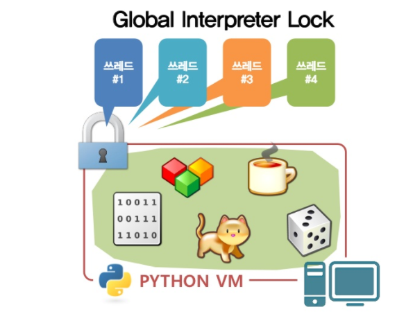
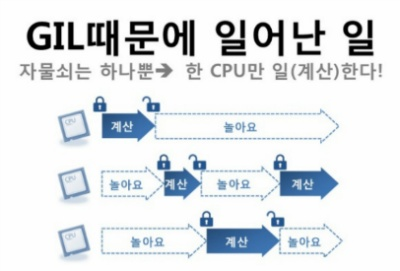
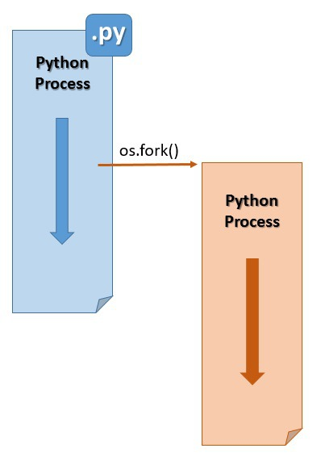

# Python


## GIL

참고자료: [링크1](https://wangin9.tistory.com/entry/pythonthreadGIL) [링크2](https://brownbears.tistory.com/215) 

파이썬에서는 GIL에 의해 멀티 스레딩을 할 경우 오히려 속도가 느려지는 현상이 발생한다. GIL에 의해 자원에 접근할 수 있는 스레드가 한 개로 제한되기 때문이다.






**그렇다면, GIL을 왜 쓰는거지?**

- GIL을 도입하면 인터프리터의 구현이 쉬워지고, Garbage Collector을 만들기 좋아며, C/C++ 확장 개발에 용이하다. 또한 프로그램이 I/O를 많이 쓸 경우 대부분 I/O bound 이기 때문에 파이썬의 스레드를 사용하는 것이 좋은 경우도 있다.

**파이썬에서 병렬작업은 못하는 건가?**

- 쓰레드 대신 프로세스를 만들어주는 라이브러리 `multiprocessing` 모듈을 사용하면 된다. (쓰레드 대신 프로세스를 띄워준다.) 즉, 하나의 인터프리터를 쓰는게 아니라 여럿의 프로세스를 구동시키는 것이다. 이 경우 **프로세스의 관리는 OS에서 하기 때문에, OS에서 적절하게 프로세스를 코어별로 할당을 하게 해서, 전체적으로 성능을 향상시키게 된다.** 
- `multiprocessing` 모듈은 `fork()`를 통해 동시에 여러 프로세스에 원하는 작업을 실행할 수 있도록 도와주는 모듈이다. 파이썬에서는 OS 모듈에 속한 `fork()`함수를 사용해 여러 프로세스를 생성할 수 있다. `fork()`를 통해 생성된 프로세스의 복사본은 모든 데이터와 코드를 부모 프로세스로부터 가져오며, 운영 체제에서 자체 PID를 얻는 완전히 독립적인 프로세스로 수행된다. **IPC(프로세스 간 통신)**에서 손해가 발생하지만, 이를 지원하는 각종 메커니즘이 존재하며 쓰레드와 똑같이 사용할 수 있다.



- `multiprocessing` 패키지에는 `threading` 모듈에 없는 API가 포함되어 있다. 예를 들어, 여러 입력에서 함수 실행을 병렬화하는 데 사용할 수 있는 깔끔한 `Pool` 클래스가 있다. [참고자료](https://hamait.tistory.com/755) 
- `threading` 모듈을 사용한 멀티쓰레드 구현 또한 가능하다. (But, 여전히 GIL의 영향을 받음에는 변함이 없다.)


**그렇다면, 파이썬은 멀티스레딩이 좋을까, 멀티프로세싱이 좋을까?**

- 쓰레드는 가볍지만 GIL로 인해 계산 처리를 하는 작업은 한 번에 하나의 쓰레드에서만 작동하여 **CPU 작업이 적고 I/O 작업이 많은** 병렬 처리 프로그램에서 효율적이다. (파일 읽기/쓰기, 네트워크와의 상호작용, 디스플레이같은 장치와의 통신 동 **Blocking I/O**작업을 할 경우, 스레드는 운영체제가 이런 요청에 응답하는데 드는 시간을 프로그램과 분리하므로 유용하다.)

  또, 멀티스레드를 사용할 경우 프로그램이 동시에 여러 작업을 하는 것철머 보이게 만들기 용이하다. 함수를 마치 병렬로 실행하는 것처럼 애주는 일을 파이썬에게 맡길 수 있다. (비록 GIL 때문에 한 번에 한 쓰레드만 진행하지만, CPython은 파이썬 스레드가 어느정도 공평하게 실행됨을 보장한다.)

- 프로세스는 각자가 **고유한 메모리 영역을 가지기 때문에 더 많은 메모리**를 필요로 하지만, 각각 프로세스에서 병렬로 CPU 작업을 할 수 있고 이를 이용해 여러 머신에서 동작하는 **분산 처리** 프로그래밍도 구현할 수 있다. 


**추가**

- Blocking I/O를 처리하는데 스레드 대신 내장모듈 `asyncio`를 사용할 수 도 있다.


## Garbage Collector

파이썬에서는 기본적으로 **garbage collection**과 **reference counting**을 통해 할당 된 메모리를 관리한다. 기본적으로 참조 횟수가 0이 된 객체를 메모리에서 해제하는 레퍼렁스 카운팅 방식을 사용하지만, 참조 횟수가 0이 아님에도 도달할 수 없는 상태인 **reference cycle(순환 참조)**가 발생했을 때는 garbage collection으로 그 상황을 해결한다. (엄밀히는 레퍼런스 카운팅 방식이 가비지 컬렉션의 한 형태.)

어떤 객체의 레퍼런스 카운트를 보고 싶다면 `sys.getrefcount()`로 확인할 수 있다.

가비지 컬렉터의 경우 파이썬의 `gc` 모듈을 통해 직접 제어할 수 있다. 이 모듈은 cyclic garbage collection을 지원하여 순환 참조를 해결할 수 있다. **`gc` 모듈은 오로지 순환 참조를 탐지하고 해결하기 위해 존재한다.** 


### 가비지 컬렉션의 작동 방식

**가비지 컬렉션이 발생하는 기준**

- GC는 내부적으로 generation(세대)과 threshold(임계값)로 가비지 컬렉션 주기와 객체를 관리한다. 세대는 0, 1, 2세대로 구분되며, 최근에 생성된 객체는 0세대(young)에 들어가고 오래된 객체일수록 2세대(old)에 존재한다. **더불어 한 객체는 단 하나의 세대에만 속한다. 가비지 컬렉터는 0세대일수록 더 자주 가비지 컬렉션을 하도록 설계되어 있다.** 이는 *generational hypothesis*에 근거한다. ([링크](https://www.memorymanagement.org/glossary/g.html#term-generational-hypothesis)) 
  - *generation hypothesis*의 두 가지 가설
    1. 대부분의 객체는 금방 도달할 수 없는 상태(unreachable)가 된다.
    2. 오래된 객체(old)에서 젊은 객체(young)로의 참조는 아주 적게 존재한다.

- 주기는 threshold와 관련되며, `gc.get_threshold()`로 확인해 볼 수 있다.

  ```python
  >>> gc.get_threshold()
  (700, 10, 10)
  ```

  각각 `threshold 0`, `threshold 1`, `threshold 2`를 의미한다. `n`세대에 객체를 할당한 횟수가 `threshold n`을 초과하면 가비지 컬렉션이 수행되며 이 값은 변경될 수 있다.

  0세대의 경우 메모리에 객체가 할당된 횟수에서 해제된 횟수를 뺀 값, 즉 객체 수가 `threshold 0`을 초과하면 가비지 컬렉션이 실행된다. 

  0세대 가비지 컬렉션이 일어난 후 0세대 객체를 1세대로 이동시킨 후 *카운터*를 1 증가시킨다. 이 1세대 카운터가 `threshold 1`을 초과한다면 그 때 1세대 가비지 컬렉션이 일어난다. (위의 threshold 값들을 기준으로, 0세대 가비지 컬렉션이 객체 생성 700번 만에 일어난다면 1세대는 7000번 만에, 2세대는 70000번 만에 일어난다는 뜻이다.)


### 라이프 사이클

1. 새로운 객체가 만들어질 때 파이썬은 객체를 메모리와 0세대에 할당한다. 만약 0세대의 객체 수가 `threshold 0`보다 크면 `collect_generations()`를 실행한다. 

   `collect_generations()`가 호출되면 모든 세대(기본적으로 3개의 세대)를 검사하는데 가장 오래된 세대(2세대)부터 역으로 확인한다. 해당 세대에 객체가 할당된 횟수가 각 세대에 대응되는 `threshold n`보다 크면 `collect()`를 호출해 가비지 컬렉션을 수행한다.

2. `collect()` 메소드는 **순환 참조 탐지 알고리즘**을 수행하고 특정 세대에서 도달할 수 있는 객체(reachable)과 돋라할 수 없는 객체(unreachable)를 구분하고 도달할 수 없는 객체 집합을 찾는다. 도달할 수 있는 객체 집합은 다음 상위 세대로 합쳐지고 (0세대에서 수행되었으면 1세대로 이동), 도달할 수 없는 객체 집합은 콜백을 수행한 후 메모리에서 해제된다.

   

**가비지 컬렉터가 어떻게 순환 참조를 발견하는가?**

- 먼저 순환 참조는 컨테이너 객체(`tuple`, `list`, `set`, `dict`, `class`)에 의해서만 발생할 수 있음을 알아야 한다. 컨테이너 객체는 다른 객체에 대한 참조를 보유할 수 있다. 그러므로 `정수`, `문자열`은 무시한 채 컨테이너 객체에만 관심을 집중한다.
- 모든 컨테이너 객체를 추적하는 게 아이디어다. 객체 내부의 링크 필드에 더블 링크드 리스트를 사용하는 방법이 가장 좋다. 이렇게 하면 추가적인 메모리 할당 없이도 **컨테이너 객체 집합**에서 객체를 빠르게 추가하고 제거할 수 있다. 컨테이너 객체가 생성될 때 이 집합에 추가되고 제거될 때 집합에서 삭제된다.
- 모든 컨테이너 객체에 접근할 수 있게 되었으니 아래와 같은 방법으로 순환 참조를 찾을 수 있어야 한다.
  1. 객체에 `gc_refs` 필드를 레퍼런스 카운트와 같게 설정한다.
  2. 가 객체에서 참조하고 있는 다른 컨테이너 객체를 찾고, 참조되는 컨테이너의 `gc_refs`를 감소시킨다. 
  3. `gc_refs`가 0이면 그 객체는 컨테이너 집합 내부에서 자기들끼리 참조하고 있다는 뜻이다.
  4. 그 객체를 unreachable하다고 표시한 뒤 메모리에서 해제한다.

