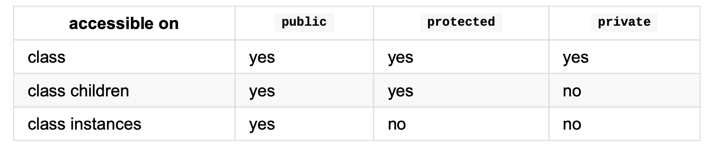

# 2. Future JavaScript: Now


## Classes

`classes`가 중요한 이유?

1. 구조를 추상화
2. 각 프레임워크별로 따로 지원되는 class 개념이 아닌, 공식적으로 JS에서  지원하는 기능
3. OOP 개발자들은 이미 class의 개념을 알고 있다.

아래는 Point class의 예시

```js
class Point {
    x: number;
    y: number;
	constructor(x: number, y: number) { 
    this.x = x;
		this.y = y; 
  }
	add(point: Point) {
		return new Point(this.x + point.x, this.y + point.y);
	} 
}
var p1 = new Point(0, 10);
var p2 = new Point(10, 20);
var p3 = p1.add(p2); // {x:10,y:30}
```


## Inheritance

TS의 클래스는 `extends` 키워드를 사용한 단일 상속을 지원한다.

```ts
class Point3D extends Point {
  z:number;
  constructor(x: number, y: number, z: number) {
    super(x, y);
    this.z = z;
  }
  
  // override parent member function
  add (point: Point3D) {
    var point2D = super.add(point)
    return new Point3D(point2D.x, point2D.y, this.z + point.z);
  }
}
```


## Statics

TS class는 `static` 프로퍼티를 지원한다. (class의 모든 인스턴스와 공유)

```ts
class Something {
    static instances = 0; // 모든 Something 인스턴스들에게 공유되는 값
    constructor() {
			Something.instances++; 
    }
}
var s1 = new Something();
var s2 = new Something(); 
console.log(Something.instances); // 2
```


## Access Modifiers

TS는 `public`, `private`, `protected` 접근자를 지원한다.



runtime에는 (JS로 변환된 상태) 아무런 영향을 끼치지 않지만, 컴파일 시 에러를 표출해준다.

```ts
class FooBase {
    public x: number;
    private y: number;
    protected z: number;
}
// EFFECT ON INSTANCES
var foo = new FooBase(); 
foo.x; // okay
foo.y; // ERROR : private 
foo.z; // ERROR : protected

// EFFECT ON CHILD CLASSES
class FooChild extends FooBase {
    constructor() {
      super();
      this.x; // okay
      this.y; // ERROR: private this.z; // okay
    } 
}
```


## Abstract

- `abstract` **클래스**는 바로 인스턴스화 할 수 없다. 해당 추상 클래스를 상속받는 클래스를 만든 뒤에 인스턴스를 만들 수 있다.
- `abstract` **멤버**는 바로 접근할 수 없으며, 자식 클래스가 기능을 구체화해야 한다.


## Constructor is optional

Class는 생성자가 반드시 필요하지는 않다.

```js
class Foo {}
var foo = new Foo();
```


## Define using constructor

클래스의 멤버는 아래와 같이 초기화할 수 있다.

```ts
class Foo {
  x: number;
	constructor(x: number) {
    this.x = x;
  }
}
```

TS에서는 다음과 같이 접근자를 사용하여 줄여 쓸 수 있다.

```ts
class Foo {
  constructor(public x: number) {}
}
```


## Property Initializer

생성자를 사용하지 않고도 클래스 멤버를 초기화할 수 있다.

```ts
class Foo {
  members = []; // Initialize directly
  add(x) {
    this.members.push(x);
  }
}
```


## IIFE (Immediately-Invoked Function Expression)

다음과 같은 Point 클래스가 있을 때

```js
function Point(x, y) { 
  this.x = x;
	this.y = y; 
}
Point.prototype.add = function (point) {
	return new Point(this.x + point.x, this.y + point.y);
};
```

TS에서는 상속 시 base class를 `_super` 변수 안에 잡아둘 수 있다.

```ts
var Point3D = (function (_super) { 
  __extends(Point3D, _super); 
  function Point3D(x, y, z) {
      _super.call(this, x, y);
      this.z = z; 
  }
  Point3D.prototype.add = function (point) {
        var point2D = _super.prototype.add.call(this, point); 
        return new Point3D(point2D.x, point2D.y, this.z + point.z);
  };
  return Point3D;
})(Point);
```

> IIFE 형태
>
> ```ts
> (function () {
>     // BODY
>     return Point;
> })();
> ```


## __extends

`TBD` (page35)

