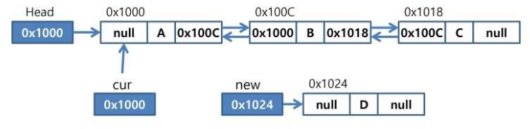
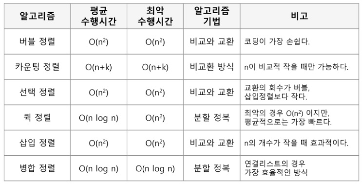

# SSAFY Algorithm (190902)

## List

- 순서를 가진 데이터의 집합을 가리키는 추상자료형
- 동일한 데이터를 가지고 있어도 상관없다.
- 구현방법에 따라 크게 두 가지로 나뉜다.
  - 순차 리스트: 배열을 기반으로 구현된 리스트
  - 연결 리스트: 메모리의 동적할당을 기반으로 구현된 리스트

- 주요 함수

  addtoFirst(), addtoLast(), add(), delete(), get()

- 순차 리스트의 문제점
  - 단순 배열을 이용해 순차리스트를 구현해 사용하는 경우, 자료의 삽입/삭제 연산 과정에서 연속적인 메모리 배열을 위해 원소들을 이동시키는 작업이 필요하다.
  - 원소의 개수가 많고 삽입/삭제 연산이 빈번하게 일어날수록 작업에 소요되는 시간이 크게 증가한다.
  - 배열의 크기가 정해져 있는 경우, 실제로 사용될 메모리보다 크게 할당하여 메모리의 낭비를 초래할 수도 있고, 반대로 할당된 메모리보다 많은 자료를 사용하여 새롭게 배열을 만들어 작업을 해야 하는 경우가 발생할 수도 있다.

### 연결 리스트(Linked List)

- 자료의 **논리적인 순서와 메모리 상의 물리적인 순서가 일치하지 않고**, 개별적으로 위치하고 있는 원소의 주소를 연결하여 하나의 전체적인 자료구조를 이룬다.
- 링크를 통해 원소에 접근하므로, 순차 리스트에서처럼 물리적인 순서를 맞추기 위한 작업이 필요하지 않다.
- 자료구조의 크기를 동적으로 조정할 수 있어, **메모리의 효율적인 사용**이 가능하다.

#### 노드

- 연결 리스트에서 하나의 원소에 필요한 데이터를 갖고 있는 자료단위
- 구성 요소
  1. 데이터 필드
     - 원소의 값을 저장하는 자료구조
     - 저장할 원소의 종류나 크기에 따라 구조를 정의하여 사용함
  2. 링크 필드
     - 다음 노드의 주소를 저장하는 자료구조

#### 헤드

- 리스트의 처음 노드를 가리키는 레퍼런스

#### 단순 연결 리스트 (Singly Linked List)

- 노드가 하나의 링크 필드에 의해 다음 노드와 연결되는 구조를 가진다.
- 헤드가 가장 앞의 노드를 가리키고, 링크 필드가 연속적으로 다음 노드를 가리킨다.
- 최종적으로 NULL을 가리키는 노드가 리스트의 가장 마지막 노드이다.

- 'A','C','D'를 원소로 가지고 있는 리스트의 두 번째에 'B' 노드를 삽입할 때
  1. 메모리를 할당하여 새로운 노드 new 생성
  2. 새로운 노드 new의 데이터 필드에 'B' 저장
  3. 삽입될 위치의 바로 앞에 위치한 노드의 링크 필드를 new에 복사
  4. new의 주소를 앞 노드의 링크 필드에 저장

- 'A', 'B', 'C', 'D' 리스트의 'B' 노드를 삭제할 때
  1. 삭제할 노드의 앞 노드(선행노드) 탐색
  2. 삭제할 노드의 링크 필드를 선행노드의 링크 필드에 복사

#### 이중 연결 리스트 (Double Linked List)

- 양쪽 방향으로 순회할 수 있도록 노드를 연결한 리스트
- 두 개의 링크 필드와 한 개의 데이터 필드로 구성

- cur가 가리키는 노드 다음으로 D값을 가진 노드를 삽입하는 과정

1. 메모리를 할당하여새로운 노드 new를 생성하고 데이터 필드에 'D'를 저장한다.
2. cur의 next를 new의 next에 저장하여 cur의 오른쪽 노드를 삽입할 노드 new의 오른쪽 노드로 연결한다.
3. new의 주소를 cur의 next에 저장하여 노드 new를 cur의 오른쪽 노드로 연결한다.
4. cur에 있는 링크 값을 new의 prev에 저장하여 cur를 new의 왼쪽노드로 연결한다.
5. new의 주소를 new의 오른쪽노드의 next에 저장하여 노드 new의 오른쪽노드의 왼쪽노드로 new를 연결한다.

- cur가 가리키는 노드를 삭제하는 과정

1. 삭제할 노드 cur의 오른쪽노드의 주소를 cur의 왼쪽노드의 next에 저장하여 cur의 오른쪽노드를 cur의 왼쪽노드의 오른쪽노드로 연결한다.
2. 삭제할 노드 cur의 왼쪽노드의 주소를 cur의 오른쪽노드의 prev에 저장하여 cur의 왼쪽노드를 cur의 오른쪽노드의 왼쪽노드로 연결한다.
3. cur가 가리키는 노드에 할당된 메모리를 반환한다.

#### 삽입 정렬 (Insertion Sort)

- O(n^2)

#### 병합 정렬 (Merge Sort)

- O(nlogn)

##### 정렬 알고리즘 비교

