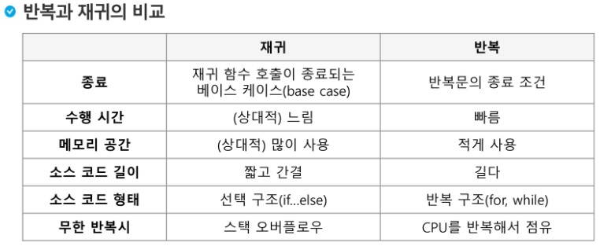
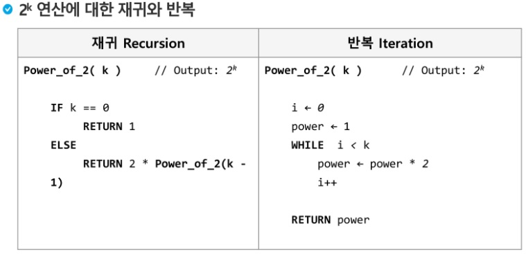
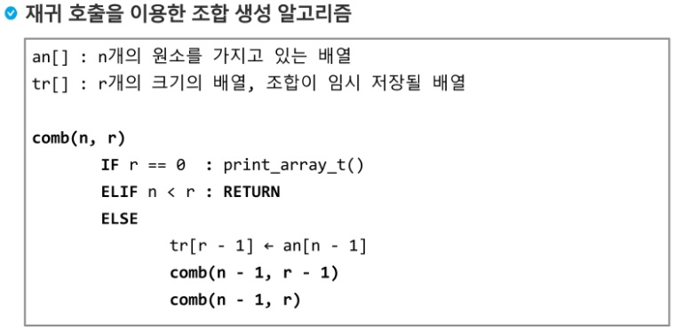
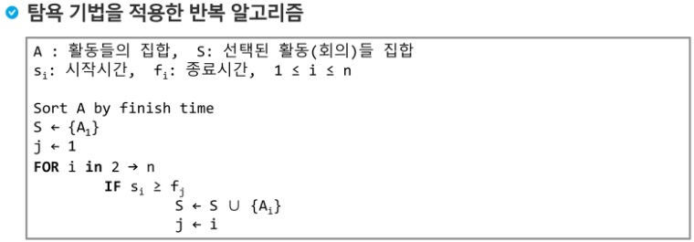
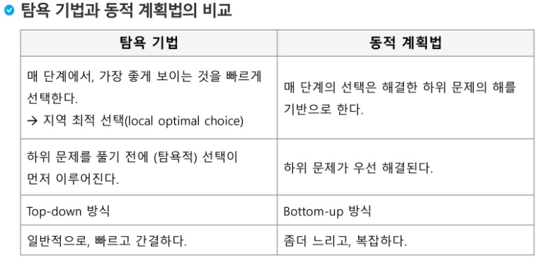
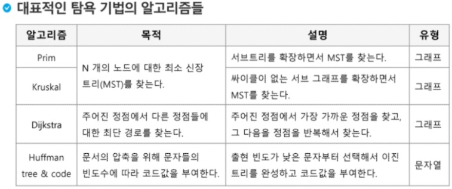

# SSAFY Algorithm (190920)

## APS 응용 완전탐색, 그리디

### 반복과 재귀

- 반복과 재귀는 유사한 작업 수행 가능
- 반복은 수행하는 작업이 완료될 때까지 계속 반복
- 재귀는 주어진 문제의 해를 구하기 위해 동일하면서 더 작은 문제의 해를 이용하는 방법


### 반복 구조

- 초기화: 반복 명령을 실행하기 전 조건 검사에 사용할 변수의 초기값 설정
- 조건검사
- 반복할 명령문 실행
- 업데이트: 무한루프가 되지 않게 조건이 거짓이 되게 한다.


### 재귀적 알고리즘

- 하나 또는 그 이상의 기본 경우 (basis case or rule)
  - 집합에 포함되어 있는 원소로 induction을 생성하기 위한 seed역할
- 하나 또는 그 이상의 유도된 경우 (inductive case or rule)
  - 새로운 집합의 원소를 생성하기 위해 결합되어는 방법


### 재귀 함수

- 함수 내부에서 직접 혹은 간접적으로 자기 자신을 호출하는 함수
- 일반적으로 재귀적 정의를 이용해서 재귀 함수를 구현
- 기본 구현(basis part)와 유도 파트(inductive part)로 구성된다.
- 재귀적 프로그램을 작성하는 것은 반복 구조에 비해 간결하고 이해하기 쉽다.
- 함수 호출은 프로그램 메모리 구조에서 스택을 사용한다. 따라서 재귀 호출은 일반벅인 스택의 사용을 의미하며 메모리 및 속도에서 성능저하가 발생한다.





---

### 완전 검색

- 많은 종류의 문제들이 특정 조건을 만족하는 경우나 요소를 찾는 것이다.
- 또한, 이들은 전형적으로 순열, 조합, 그리고 부분집합과 같은 조합적 문제들과 연관된다.
- 완전 검색은 조합적 문제에 대한 brute-force 방법이다.


### 조합적 문제

#### 순열

- 서로 다른 것들 중 몇 개를 뽑아서 한 줄로 나열하는 것
- 다수의 알고리즘 문제들은 순서화된 요소들의 집합에서 최선의 방법을 찾는 것과 관련이 있다. (TSP)


#### 부분집합

- 집합에 포함된 원소들을 선택하는 것이다.
- 다수의 중요 알고리즘들이 원소들의 그룹에서 최적의 부분집합을 찾는 것이다. (knapsack)
- N개의 원소를 포함한 집합
  - 자기 자신과 공집합 포함한 모든 부분집합(power set)의 개수는 2^n개
  - 원소의 수가 증가하면 부분집합의 개수는 지수적으로 증가

- Binary Counting

  - 부분집합을 생성하기 위한 가장 자연스러운 방법.

  - 원소 수에 해당하는 N개의 비트열을 이용한다.

  - n번째 비트값이 1이면 n번째 원소가 포함되었음을 의미한다.

  - ```python
    arr = [3,5,7,1,5,4]
    n = len(arr)
    
    for i in range(0, (1<<n)):
    	# 1<<n : 부분집합의 개수
    		for j in range(0, n):
    			#원소의 수만큼 비트를 비교함
    				if i & (1<<j):
    					#i의 j번째 비트가 1이면 j번째 원소 출력
    				print("%d, " % arr[j], end='')
    ```

  

#### 조합

- 서로 다른 n개의 원소 중 r개를 순서 없이 골라낸 것을 조합이라고 부른다.

- 재귀 호출을 이용한 조합 생성 알고리즘

  

---


### 탐욕 알고리즘

- 탐욕 알고리즘은 최적해를 구하는 데 사용되는 근시안적인 방법
- 일반적으로, 머리 속에 떠오르는 생각을 검증 없이 바로 구현하면 greedy 접근이 된다.
- 여러 경우 중 하나를 선택할 때마다 그 순간에 최적이라고 생각되는 것을 선택해 나가는 방식으로 진행하여 최종적인 해답에 도달한다.
- 찾은 해답이 **최적이라는 보장은 없다.**
- 한번 선택된 것은 번복하지 않는다. 이런 특성 때문에 대부분의 탐욕 알고리즘은 단순하며, 제한적인 문제들에 적용된다.


#### Knapsack problem

- 담을 수 있는 물건의 총 무게(W)가 정해져 있는 배낭이 존재
- 각각의 **무게**와 **값**이 정해진 n개의 물건이 존재
- 배낭이 수용할 수 있는 무게를 초과하지 않으면서, 값이 최대가 되는 물건을 담아야 한다.

##### Knapsack problem 유형

1. 0-1 Knapsack
   - 배낭에 물건을 통째로 담아야 하는 문제
   - 물건을 쪼갤 수 없는 경우
2. Fractional Knapsack
   - 물건을 부분적으로 담는 것이 허용되는 문제
   - 물건을 쪼갤 수 있는 경우

-> 0-1 Knapsack 문제의 최적해를 구하기 위해서는, 부분집합으로 완전검색을 해야한다. 탐욕 알고리즘으로는 최적해 구하기 어려워

-> Fractional Knapsack의 경우에는 탐욕 알고리즘으로 최적해 구할 수 있음.

- 문제 유형에 따라 **탐욕 알고리즘이 통할수도, 통하지 않을 수도 있다.**


#### 회의실 배정하기 (Activity-selection problem)

- 회의실은 하나만 존재하고, 다수의 회의가 신청된 상태
- 회의는 시작과 종료 시간이 있으며, 회의 시간이 겹치는 회의들은 동시에 열릴 수 없다.
- 가능한 많은 회의가 열리기 위해서는 회의들을 어떻게 배정해야 할까?




#### 탐욕 알고리즘의 필수 요소

- 탐욕적 선택 속성 (greedy choice property)
  - 탐욕적 선택은 최적해로 갈 수 있음을 보여라
- 최적 부분 구조 (optimal substructure property)
  - 최적화 문제를 정형화하라. 하나의 선택을 하면 풀어야 할 하나의 하위 문제가 남는다.

- **[원문제의 최적해 = 탐욕적 선택 + 하위 문제의 최적해]** 임을 증명하라








