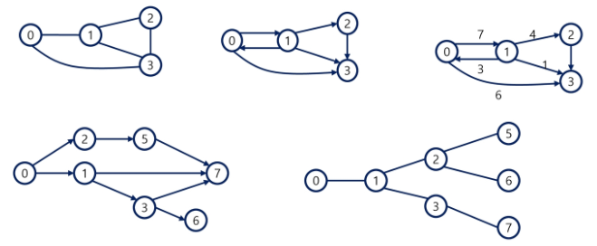
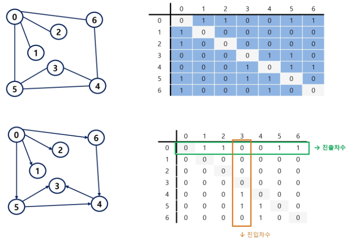
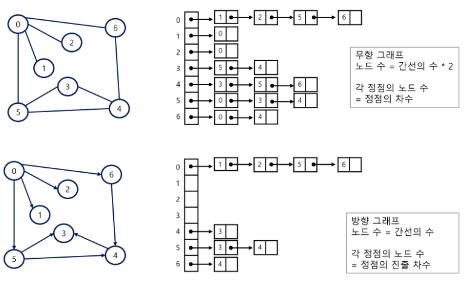
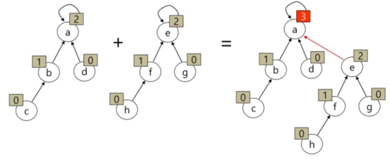
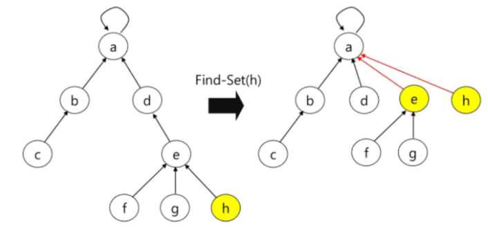
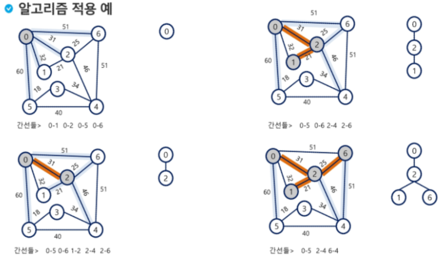
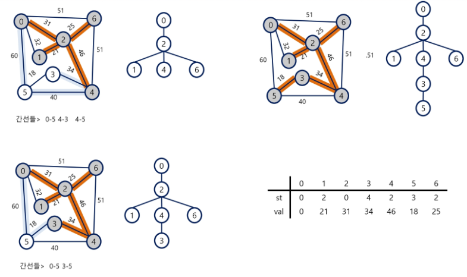
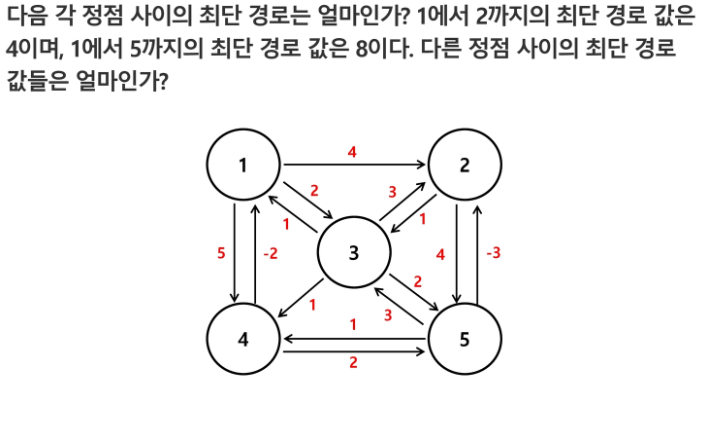

# SSAFY Algorithm (191016)

## 그래프

**학습 목표**

- 그래프 탐색 기법(BFS, DFS) 학습
- 상호배타 집합(Disjoint-Sets)의 자료구조 학습
- MST를 이해하고 탐욕 기법을 이용해서 MST를 찾는 알고리즘 학습
- 두 정점 사이의 최단 경로 찾는 방법 학습


### 그래프 기본

그래프는 아이템(사물 or 추상적 개념)들과 이들 사이의 연결 관계를 표현한다.

그래프는 정점(Vertex)들의 집합과 이들을 연결하는 간선(Edge)들의 집합으로 구성된 자료 구조.

- |V|개의 정점을 가지는 그래프는 최대 |V|(|V|-1)/2 간선이 가능 (조합식: |V|C2)

선형 자료구조나 트리 자료구조로 표현하기 어려운 N:N 관계를 가지는 원소들을 표현하기에 용이하다.


**그래프 유형**

- 무향 / 유향 / 가중치 / 사이클 없는 방향 그래프(DAG, Directed Acyclic Graph)



- 완전 그래프

  정점들에 대해 **가능한 모든 간선**들을 가진 그래프

- 부분 그래프

  원래 그래프에서 일부의 정점이나 간선을 제외한 그래프


**인접 정점(Adjacency)**

두 개의 정점에 간선이 존재하면 서로 인접해 있다고 한다.

완전 그래프에 속한 임의의 두 정점들은 **모두 인접**해 있다.


**경로**

한 정점을 최대 한 번만 지나는 경로를 **단순경로**라고 한다.

시작한 정점에서 끝나는 경로를 **사이클**이라 한다.


**표현**

- 인접 행렬(Adjacent matrix)

  |V|x|V|크기의 2차원 배열을 이용해서 간선 정보를 저장

  행 번호와 열 번호는 그래프의 정점에 대응

  단점) 불필요한 정보가 많아서 메모리, 시간 모두 비효율적



- 인접 리스트(Adjacent List)

  각 정점마다 해당 정점으로 나가는 간선의 정보를 저장

  단점) 무향 그래프일 경우 동일한 간선에 대한 정보를 두 개 저장하게 된다. 방향 그래프에서 특정 정점에의 진입 차수를 구하기 위해서는 리스트를 전부 순회해야 한다. 미리 한 번 순회하면서, 진입차수 등을 미리 구해놓는 전처리 과정을 거치면 편하게 쓸 수 있다.

  

  

- 간선의 배열

  간선(시작 정점, 끝 정점)을 배열에 연속적으로 저장


### 그래프 탐색

[DFS](https://github.com/Kuhnhee/TIL/blob/master/algorithm/Algorithm (190821) Stack1%2C DFS.md) / [BFS](https://github.com/Kuhnhee/TIL/blob/master/algorithm/Algorithm%20(190828)%20Queue%2C%20BFS.md) 의 방법으로 순회할 수 있다.


### Disjoint-Sets(서로소 집합, 상호배타 집합)

서로 중복 포함된 원소가 없는 집합 (교집합이 없다.)

집합에 속한 하나의 특정 멤버를 통해 각 집합들을 구분한다. 이를 **대표자(representative)**라 한다.

**표현**

- 연결 리스트

  같은 집합의 원소들은 하나의 연결리스트로 관리한다.

  연결리스트의 맨 앞의 원소를 집합의 대표 원소로 삼는다.

  각 원소는 집합의 대표원소를 가리키는 링크를 갖는다.

- 트리(주로 이걸 사용)

  하나의 집합을 하나의 트리로 표현한다.

  자식 노드가 부모 노드를 가리키며, **루트 노드가 대표자**가 된다.

**집합 연산**

어떠한 배열 p[]의 i번째 인덱스에는, 노드 i의 부모 노드 번호가 써진다.

- Make-Set(x)

  유일한 멤버 x를 포함하는 새로운 집합을 생성하는 연산

  ```python
  Make-Set(x)
  	p[x] = x #parent x에다가 x를 저장한다.
  ```

- Find-Set(x)

  x를 포함하는 집합을 찾는 연산

  ```python
  Find-Set(x)
  	If x == p[x] : return x
      ELSE : return Find-Set(p[x])
  ```

- Union(x, y)

  x와 y를 포함하는 두 집합을 통합하는 연산

  ```python
  Union(x,y)
  	p[Find-Set(y)] = Find-Set(x)
  ```

  

SWEA 문제 "창용 마을 무리의 개수(7465)"는 상호배타 조합을 활용한 것. 매 라인을 읽으며 두 숫자값을  Union한 뒤, 최종적으로 p 배열의 representative 개수를 출력하면 정답.


- 연산의 효율을 높이는 방법

  - Rank를 이용한 Union
    - 각 노드는 자신을 루트로 하는 subtree의 높이를 랭크Rank라는 이름으로 저장한다.
    - 두 집합을 합칠 때 rank가 낮은 집합을 rank가 높은 집합에 붙인다.

  

  - Path compression
    - Find-Set을 행하는 과정에서 만나는 모든 노드들이 직접 root를 가리키도록 포인터를 바꾸어 준다.




### MST

그래프에서 최소 비용 문제

1. **모든 정점을 연결하는 간선들의 가중치의 합이 최소가 되는 트리**
2. 두 정점 사이의 최소 비용 경로 찾기 (최단 경로 문제)


**신장 트리**

n개의 정점으로 이루어진 무향 그래프에서 n개의 정점과 n-1개의 간선으로 이루어진 트리


**최소 신장 트리**

무향 가중치 그래프에서 신장 트리를 구성하는 간선들의 가중치의 합이 최소의 신장 트리


**MST를 찾기 위한 알고리즘**

간선 중심 관점: **Kruskal 알고리즘**

정점 중심 관점: **Prim** 알고리즘 (Greedy)


**Prim 알고리즘**

하나의 정점에서 연결된 간선들 중에 하나씩 선택하면서 MST를 만들어 가는 방식 (선택 집합을 확장해 나감)

1. 임의 정점을 하나 선택해서 시작
2. 선택한 정점과 인접하는 정점들 중의 최소 비용의 간선이 존재하는 정점을 선택
3. 모든 정점이 선택될 때까지 1, 2 과정을 반복





의사코드

```pseudocode
MST_PRIM(G, r)		// G: 그래프, r: 시작 정점
	For u in G.V
		u.key <- inf	// u.key: u에 연결된 간선중 최소 가중치
		u.parent <- NULL	// u.parent: 트리에서  u의 부모
	r.key <- 0
	Q <- G.V		// 우선순위 Q에 모든 정점을 넣는다.
	WHILE Q != 0	// 빈 Q가 아닐동안 반복
		u <- Extract_MIN(Q)	// key값이 가장 작은 정점 가져오기
		FOR v in G.Adj[u]	// u의 인접 정점들
			IF (v in Q) and w(u, v) < v.key	//Q에 있는 v의 key값 갱신
            	v.parent <- u
            	v.key <- w(u, v)
```

- **시간 복잡도**

  O(VlogV + ElogV) = **O(ElogV)**

  단, Fibonacci Heaps (cf Cormen)을 적용하면 O(E+logV)로 최적화 가능하다.


**Kruskal 알고리즘**

간선을 하나씩 선택해서 MST를 찾는 알고리즘

1. 최초, 모든 간선을 가중치에 따라 오름차순으로 정렬
2. 가중치가 가장 낮은 간선부터 선택하면서 트리를 증가시킴
   - **사이클이 존재하면 다음으로 가중치가 낮은 간선 선택**
     - 사이클이 형성되는지는 어떻게 확인해? **Disjoint set**을 활용한다!
     - 현재까지 확정된 집합과, 새로 추가하려는 값의 **representative를 비교해서  같으면 cycle인 것.**
3. **n-1개의 간선이 선택될 때까지** 2를 반복

의사코드

```pseudocode
MST-KRUSKAL(G, w)
	A <- 0				// 공집합
	FOR vertex v in G.V		// G.V: 그래프의 정점 집합
		Make_Set(v)			// G.E: 그래프의 간선 집합
	
	G.E에 포함된 간선들을 가중치 w에 의해 정렬 	// 전체 시간 복잡도는 이 부분에 dependent
	
	FOR 가중치가 가장 낮은 간선 (u,v) in G.E 선택(n-1개)
		IF Find_Set(u) != Find_Set(v)
			A <- A 합집합 {(u,v)}
			Union(u,v);
```

- 시간 복잡도

  시간 복잡도가 sorting 과정에 dependent함 (간선이 정점에 비해 많은 것 같다? Prim을 고려할 수 있다.)

  O(ElogE) = **O(ElogV)**


### 최단 경로

​	가중치		모든정점경유x

1		x					x					BFS

2		o					x					다익스트라(플로이드)

3		o					o					순열(TSP: Traveling Salesman Problem)


간선의 가중치가 있는 그래프에서 두 정점 사이의 경로들 중에 간선의 가중치의 합이 최소인 경로

**하나의 시작 정점에서 끝 정점까지의 최단 경로**

- 다익스트라(Dijkstra) 알고리즘: 음의 가중치를 허용하지 않음
- 벨만-포드(Bellman-Ford) 알고리즘: 음의 가중치를 허용

**모든 정점들에 대한 최단 경로**

- 플로이드-워샬(Floyd-Warshall) 알고리즘 (O(n^3))


**Dijkstra 알고리즘**

시작 정점에서 거리가 최소인 정점을 선택해 나가면서 최단 경로를 구하는 방식이다.

시작정점(s)에서 끝정점(t) 까지의 최단 경로에 정점 x가 존재한다. 이때, 최단경로는 s에서 x까지의 최단 경로와 x에서 t까지의 최단경로로 구성된다.

탐욕 기법을 사용한 알고리즘으로 MST의 Prim 알고리즘과 유사


의사코드

```pseudocode
s: 시작 정점, A: 인접 행렬, D: 거리
V: 정점 집합, U: 선택된 정점 집합

Dijkstra(s, A, D)
	U = {s};
	
	FOR 모든 정점 v
		D[v] <- A[s][v]
	
	WHILE U != V
		D[w]가 최소인 정점 w in V-U를 선택
		U <- U 합집합 {w}
		
		FOR w에 인접한 모든 정점 v
			D[v] <- min(D[v], D[w] + A[w][v])
```


**Floyd-Warshall 알고리즘**

모든 쌍 최단 경로 구하는 알고리즘. O(n^3)이지만 이해하기 쉬워.




i가 시작, j가 도착, k가 우회하는 정점이라면, i에서 바로 j로 가는게 좋을까? 아니면 k를 거쳐서 가는게 좋을까?

의사코드

```pseudocode
D[i][j] = 선분 (i, j)의 가중치,
출력: 모든 쌍 최단 경로의 거리를 저장한 2-d 배열 D
AllPairsShortest(D[][])
	For k in 1 -> n
		For i in 1 -> n	(단, i!=k)
			For j in 1 -> n (단, j!=k, j!=i)
				D[i][j] <- min(D[i][k] + D[k][j], D[i][j])
```


