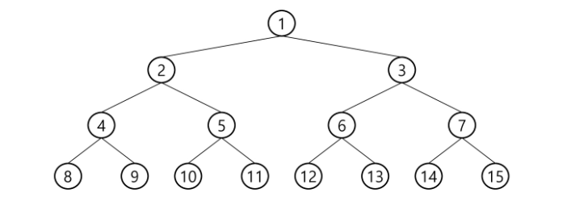
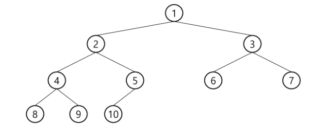
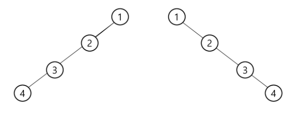
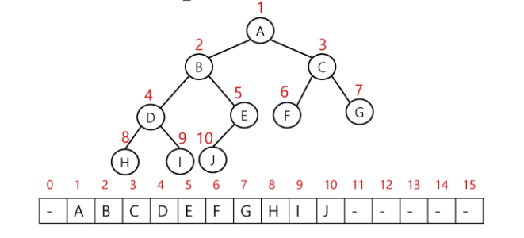
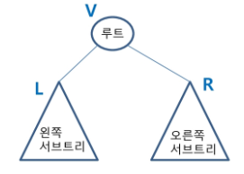
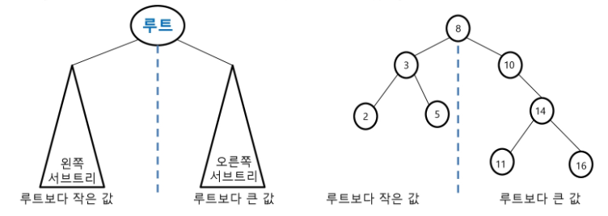
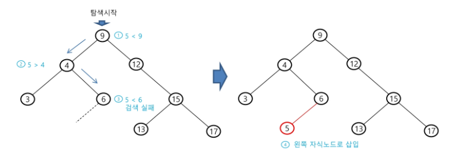
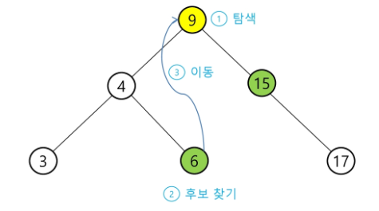
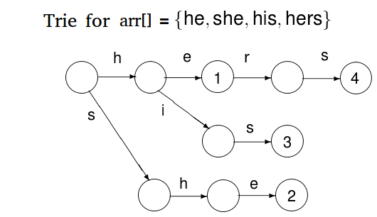
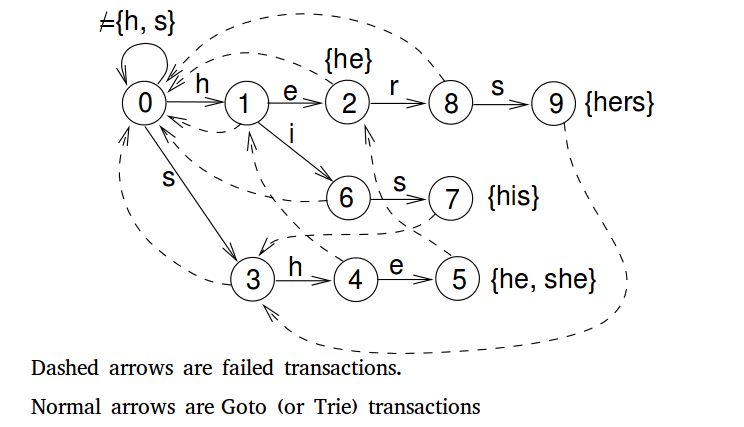

SSAFY Algorithm (191010)

## 트리

**트리는 싸이클이 없는 무향 연결 그래프이다.**

- 두 노드 사이에는 유일한 경로가 존재한다.
- 각 노드는 최대 하나의 부모 노드가 존재할 수 있다.
- 각 노드는 자식 노드가 없거나 하나 이상이 존재할 수 있다.


**비선형 구조**

- 원소들 간에 1:n 관계를 가지는 자료구조
- 원소들 간에 계층관계를 가지는 계층형 자료구조


**트리 정의**

- 한 개 이상의 노드로 이루어진 유한 집합이며 다음 조건을 만족한다.
  1. 노드 중 부모가 없는 노드를 root라 한다.
  2. 나머지 노드들은 n(>=0)개의 분리 집합 T1, ... , TN으로 분리될 수 있다.
- 이들 T1, ... , TN은 각각 하나의 트리가 되며(재귀적 정의) 루트의 서브 트리(subtree)라 한다.


**트리 용어**

- 노드(node): 트리의 원소이고 정점(vertex)라고도 하낟.
- 간선(edge): 노드를 연결하는 선
- root: 시작 노드
- 형제(Sibling): 같은 부모 노드의 자식 노드들
- 조상: 간선을 따라 root까지 이르는 경로에 있는 모든 노드들
- Subtree: 부모 노드와 연결된 간선을 끊었을 때 생기는 트리
- 자손: 서브 트리에 있는 하위 레벨의 노드들
- 차수(degree)
  - 노드의 차수: 노드에 **연결된 자식 노드**의 수
  - 트리의 차수: 트리에 있는 노드의 차수 중에서 가장 큰 값
  - 단말 노드(leaf): 차수가 0인 노드(자식이 없음)
- 높이(height)
  - 노드의 높이: 루트에서 노드에 이르는 **간선의 수** (노드의 레벨)
  - 트리의 높이: 트리에 있는 노드의 높이 중에서 가장 큰 값 (최대 레벨)

---

### 이진 트리 (Binary Tree)

- 모든 노드들이 최대 2개의 서브 트리를 갖는 형태의 트리
- 각 노드가 **자식 노드를 최대한 2개까지만** 가질 수 있다.
- 레벨 i에서의 노드의 최대 개수는 2^i개
- 높이가 h인 이진 트리가 가질 수 있는 노드의 최소 개수는 (h+1)개가 되며, 최대 개수는 (2^(h+1) - 1)개가 된다.


**포화 이진 트리(Full Binary Tree)**

- 모든 레벨에 노드가 포화상태로 채워져 있는 이진 트리
- 높이가 h일 때, 최대 노드 개수인 2^(h+1) - 1의 노드를 가진 이진 트리
- 루트를 1번으로 하여 2^(h+1) - 1까지 정해진 위치에 대한 노드 번호를 가짐




**완전 이진 트리(Complete Binary Tree)**

- 높이가 h이고 노드 수가 n개일 때, 포화 이진 트리의 노드 번호 1번부터 n번까지 빈 자리가 없는 이진 트리




**편향 이진 트리(Skewed Bianary Tree)**

- 높이 h에 대한 최소 개수의 노드를 가지면서 한쪽 방향의 자식 노드만을 가진 이진 트리




**배열을 이용한 이진 트리의 표현**

- 노드 번호를 배열의 인덱스로 사용
- 높이가 h인 이진 트리를 위한 배열의 크기는 2^(h+1) - 1 (레벨 i의 최대 노드 수는 2^i)



- 단점
  - 편향 이진 트리의 경우에 사용하지 않는 배열 원소에 대한 메모리 공간 낭비 발생
  - 트리의 중간에 새로운 노드를 삽입하거나 기존의 노드를 삭제할 경우 배열의 크기 변경 어려워 비효율적


**연결리스트를 이용한 이진 트리의 표현**

- 배열을 이용하여 표현할 때의 단점 보완
- 왼쪽 자식 노드, 오른쪽 자식 노드 각각을 가리키는 링크를 노드가 보유한다.


**이진 트리 순회(Traversal)**

- 순회란 트리의 각 노드를 중복되지 않게 전부 방문하는 것을 의미
- 트리는 비 선형 구조이기 때문에 선형구조에서와 같이 선후 연결 관계를 알 수 없다.

- 3가지 기본적인 순회 방법

  - 전위 순회(preorder traversal) : VLR

    자손 노드보다 현재 노드를 먼저 방문한다.

  - 중위 순회(inorder traversal) : LVR

    왼쪽 자손 노드, 현재 노드, 오른쪽 자손 노드 순으로 방문한다.

  - 후위 순회(postorder traversal) : LRV

    현재 노드보다 자손 노드를 먼저 방문한다.

    

    

---

### 이진 탐색 트리

- 탐색작업을 효율적으로 하기 위한 자료구조
- 모든 원소는 서로 다른 유일한 키를 갖는다.
- key(왼쪽 서브 트리) < key(루트 노드) < key(오른쪽 서브 트리)
- 왼쪽 서브 트리와 오른쪽 서브 트리도 이진 탐색 트리다.
- **중위 순회하면 오름차순으로 정렬**된 값을 얻을 수 있다.



**탐색연산**

- 루트에서 탐색 시작
- 탐색할 키 값 x를 루트 노드의 키 값 k와 비교
  - x == k : 탐색 성공
  - x < k : 루트 노드의 왼쪽 서브 트리에 대해서 탐색연산 수행
  - x > k : 루트 노드의 오른쪽 서브 트리에 대해서 탐색연산 수행
- 서브 트리에 대해 순환적으로 탐색 연산을 반복
- 탐색 수행할 서브 트리가 없으며 탐색 실패


**삽입연산**

1. 우선 탐색 연산을 수행

   삽입할 원소가 이미 트리에 있으면 삽입 불가능.

   탐색에서 탐색 실패가 결정되는 위치가 삽입 위치가 된다.

2. 탐색 실패한 위치에 원소를 삽입한다.



**삭제연산**




**이진 탐색 트리 성능**

- 탐색, 삽입, 삭제 시간은 트리의 높이만큼 시간이 걸린다. O(h)
- 이진 트리가 균형적으로 생성되어 있는 경우 O(logn)
- 편향 이진 트리의 경우(최악) O(n)

---

### 힙 (heap) = priority queue의 구현 모델

완전 이진 트리에 있는 노드 중에서 키 값이 가장 큰 노드나 키 값이 가장 작은 노드를 찾기 위해 만든 자료구조

**최대 힙**

- 키 값이 가장 큰 노드를 찾기 위한 **완전 이진 트리**
- 부모 노드의 키 값 > 자식 노드의 키 값
- 루트 : 키 값이 가장 큰 노드

**최소 힙**

- 키 값이 가장 작은 노드를 찾기 위한 **완전 이진 트리**
- 부모 노드의 키 값 < 자식 노드의 키 값
- 루트 : 키 값이 가장 작은 노드


**삽입**

부모와 비교했을 때, 크기를 비교해서 balancing이 맞을 때까지 올림


**삭제**

- 힙에서는 **루트 노드**의 원소만을 삭제할 수 있다.

1. 루트 노드의 원소 삭제
2. 마지막 노드 삭제하여 루트로 이동
3. 자리 바꾸기
4. 자리 확정


**힙을 활용하는 대표적인 2가지 예는 priority queue와 정렬이다. Linked list보다는 배열로 구현하는게 쉽다.**


**우선순위 큐를 구현하는 가장 효율적인 방법**

- 노드 하나의 추가/삭제가 시간 복잡도가 O(logN)이고, 최대값/최소값을 O(1)에 구할 수 있다.
- 완전 정렬보다 관리 비용이 적다.


**배열을 통해 트리 형태를 쉽게 구현할 수 있다.**

- 부모나 자식 노드를 O(1)연산으로 쉽게 찾을 수 있다.
- n위치에 있는 노드의 자식은 2^n과 2^(n+1)에 위치한다.
- 완전 이진 트리의 특성에 의해 추가/삭제의 위치는 자료의 시작과 끝 인덱스로 쉽게 판단할 수 있다.


**힙 정렬**

- 정렬을 위한 2단계
  1. 하나의 값을 힙에 삽입한다. (반복)
  2. 힙에서 순차적(오름차순)으로 값을 하나씩 제거한다.
- 시간 복잡도
  - N개의 노드 삽입 연산 + N개의 노드 삭제 연산
  - 삽입과 삭제 연산은 각각 O(logN)이다.
  - 따라서, 전체 정렬은 O(NlogN)이다.

힙 정렬은 배열에 저장된 자료를 정렬하기에 유용하다.

---

### 허프만 트리

**"빈도수 많은 거에 짧은 코드를 부여하겠다."**

- 상향식 이진트리
- Greedy algorithm
- 완전이진트리

**성능**

- 허프만 트리를 만드는데 드는 시간 + 길이 m인 텍스트의 실제 인코딩 시간

  O(nlogn) + O(m) = O(nlogn + m)

---

### Trie

- 문자열의 집합을 표현하는 트리

- 문자열 최대 길이가 M이라고 할 때, 문자열 검색을 O(M)의 시간 안에 가능하게 해준다.

**Compressed Trie**

- 노드의 개수를 압축시킨 트라이

**Suffix Trie**

- 문자열 X의 suffix trie는 X의 모든 접미어(suffix)들의 compressed trie이다.
- Suffix array는 [뭐지?](https://blog.myungwoo.kr/57)

---

### 아호 코라식 트리 (Aho-Corasick)

[링크](http://www.learn4master.com/algorithms/aho-corasick-algorithm)

KMP를 k번 돌리는 것 말고... 문자열을 한번 만 읽고 모든 답을 찾을 수 없나?

- failure link를 사용하여, 탐색에 실패했을 때 바로 직전 분기점으로 돌아간다.
- Unix 커맨드 fgrep의 기반 알고리즘
  - O(m+n)
  - grep 명령의 경우 *Commentz-Walter algorithm*, O(mn)





위와 같이 트리(사전)을 만들어 놓고, 문자열을 읽으면서 해당하는 단어가 있는지 검색

- fail link는 어떻게 그리는거지?

  *모든 패턴을 차례로 Keyword Tree에 넣은 이 후에는 이 Tree에 실패 링크(Failure link)를 추가해주게 된다. 루트에서 거리가 1인 정점들의 Failure link는 루트로 초기화한다. 그리고 거리가 2 이상인 정점들에 대해서 거리를 키워가면서 바로 앞 정점의 Failure link를 따라 가서 앞 정점과 해당 정점 사이의 간선에 해당하는 글자와 Failure link를 따라 간 정점의 글자가 같으면 그 정점으로 Failure link를 저장하게 되고 아니면 계속 Failure link를 따라가면서 처리하고 만약 루트가 나오면 해당 글자와 같은 거리가 1인 정점이 존재하면 거기로 Failure link를 저장하고 아니면 루트로 저장하게 된다. 위와 같은 방법으로 하게 되면 모든 패턴들의 길이의 합의 시간 복잡도 안에 모든 Failure link를 만들 수 있게 된다.* (출처: [위키](https://ko.wikipedia.org/wiki/아호_코라식_알고리즘))

---

### 인덱스 트리(Segment Tree/인터벌 트리/구간트리)

- [링크](http://isukorea.com/blog/home/waylight3/216)

- 이진 트리의 한 종류(full binary tree), 구간 합을 구하는 데 쓰이는 자료구조

- A배열의 부분 합을 구할 때 A 배열이 계속해서 바뀔 수 있다고 할 때, 부분 합을 트리구조에 저장함으로서 O(logN)의 속도로 A 배열의 부분 합을 빠르게 구할 수 있게 한다.

```python
#구간합 구하기
def lg_sum(a,b):
    sum = 0
    while a<b:	#a,b: 부분합을 구하고자 하는 인덱스 범위(a~b)
        if a%2 == 1: sum += IDT[a]; a += 1
        if b%2 == 0: sum += IDT[b]; b += 1
        a >>= 1; b >>= 1	#인덱스//2 -> 부모 노드
        
    if a == b: sum += IDT[a]
    return sum
```

구간합/구간 최소값 구하기 -> RMQ(Range Minimum Query) 문제

**"DP의 이진트리화"**라고 할 수 있다. 이것을 Binary 버전으로 가져간게 펜윅 트리


**펜윅 트리(binary)랑 뭐가 다르지?** (Binary Indexed Tree)

- [링크](https://www.geeksforgeeks.org/binary-indexed-tree-or-fenwick-tree-2/)