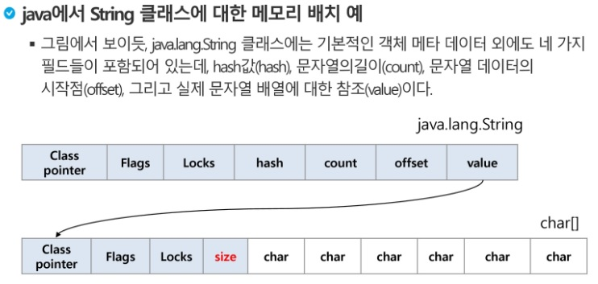
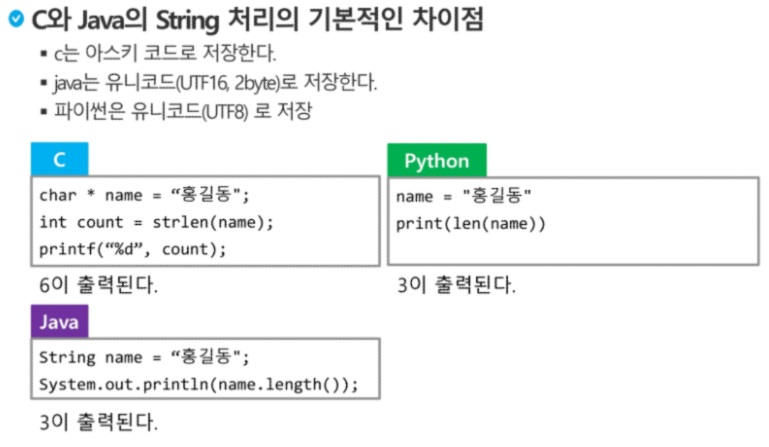

# SSAFY Algorithm (190808)

## String

- 특정한 글자는 특정한 숫자에 mapping되어 저장되어 있음.

  000000 -> 'a' / 000001 -> 'b'

  이러한 mapping 체계를 code system(코드체계)이라고 한다.

- 네트워크가 발전함에 따라, 서로 다른 코드체계간에 정보를 주고받을 때 정보를 달리 해석한다는 문제가 발생.
- 미국 내 코드체계의 통일 (America Standard Code for Information Interchange: ASCII)
- ASCII는 7bit 인코딩으로 128문자를 표현하며 33개의 출력 불가능한 제어문자들과 공백을 비롯한 95개의 출력 가능한 문자들로 이루어져 있다.

- 확장 아스키는 표준 문자 이외의 악센트문자, 도형문자, 특수문자, 특수기호 등 부가적인 문자를 128개 추가할 수 있게 하는 부호이다.(표준 아스키: 7bit, 확장 아스키: 1B 내의 8bit를 모두 사용)


- 미국은 표준이 정립되었는데... 외국은?

  - 국제적인 표준을 만들자...

  - 유니코드(4byte)의 등장: 현존하는 국가의 언어, 상형문자, 고대어 등 모두 포함

- 한글은 조합형, 완성형 코드체계 2가지가 존재했음. 프로그래밍에 적합한 것은 완성형 코드체계
- 유니코드도 character set에 따라 분류됨에 따라 (UCS-2, UCS-4), 적당한 외부 인코딩이 필요하게 되었다.
- 유니코드 인코딩
  - UTF-8 (in web)
    - Min: 8bit, Max: 32bit(1byte * 4)
  - UTF-16 (in windows, java) : 어지간한 언어는 16bit 안에 다 들어간다.
    - Min: 16bit, Max: 32bit(2byte * 2)
  - UTF-32 (in UNIX)
    - Min: 32bit, Max: 32bit(4byte * 1)

- Big endian, Little endian

  주소값의 큰 값이 먼저 오는가, 작은 값이 먼저 오는가?

  아키텍쳐 입장에서의 효율성을 위한 것 (내 생각: locality를 극대화하기 위해. 주소 값에서 자주 바뀌는 부분은 낮은 자릿수일 것이라는 공간 지역성)

  

#### 문자열의 분류

fixed length vs variable length(가변 길이)

가변 길이 문자열도 2가지로 나누어진다.

- length controlled: JAVA
- delimited: C




- Python의 문자열

  - char 타입 없음

  - 텍스트 데이터의 취급방법이 통일되어 있음

  - 문자열 기호

    - ', ", ''', """
    - +: concatenation
    - *: 반복

  - 문자열은 시퀀스 자료형으로 분류되고, 시퀀스 자료형에서 사용할 수 있는 인덱싱, 슬라이싱 연산들을 사용할 수 있음

  - **문자열이 튜플과 같이 요소값을 변경할 수 없음(immutable)** (C와 차이)

    



#### 문자열 비교

C: `strcmp()` 함수

JAVA: `equals()` 메소드

python: `==`, `is` 연산자 사용 가능. (`==` 연산자는 내부적으로 `__eq__()` 호출)


#### 문자열 -> 정수 변환

C: atoi() 함수 (itoa()는 역함수)

JAVA: Integer.pareseInt(String) 메소드 (toString()는 역함수)

python: int(str), str(int)


#### 패턴 매칭 알고리즘 비교

- brute-force : O(NM)

- KMP: O(M+N)

- 보이어-무어 알고리즘: 일반적으로 $\theta$(N) 미만 기대, 최악 $\theta$(MN)

  

#### 연습

##### slice, reverse 사용하지 않고 문자열 뒤집기

```python
s = 'Reverse this strings'
rs = ''
for i in range(len(s)-1,-1,-1):
    rs += s[i]
print(rs)
```

##### str() 함수를 사용하지 않고, 양의 정수를 문자열로 변환하는 함수

```python
def itoa(x):
    sr = ''
    while True:
        r = x % 10
        sr = sr + chr(r+ord('0'))
        x //= 10
        if x == 0: break

    s = ''
    for i in range(len(sr)-1, -1, -1):
        s = s + sr[i]

    return s

print(itoa(1234))
```


#### 문자열 암호화

- 단일 치환
- bit열 암호화 (XOR 연산 사용)


#### 문자열 압축

가로로 압축할 때와 세로로 압축할 때의 압축률이 다르다.