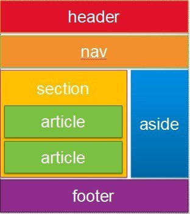

# 웹 프로그래밍 기초

## 1. Web 개발의 이해 (FE/BE)

### 웹의 동작 (HTTP 프로토콜)

**HTTP(Hypertext Transer Protocol)이란?**

- 서버와 클라이언트가 인터넷사에서 데이터를 주고받기 위한 프로토콜
- 현재 HTTP/2 버전까지 공개가 되었다.

**HTTP의 장단점**

- 기본적으로 서버/클라이언트 모델을 따른다.
- 장점
  - 불특정 다수를 대상으로 하는 서비스에 적합
  - *연결*이 지속되는 형태가 아니기에 서버가 처리할 수 있는 최대 연결 수보다 훨씬 많은 요청과 응답을 처리할 수 있다.
- 단점
  - *연결*이 끊어지기 때문에, 클라이언트의 이전 상황을 알 수가 없다. (Connectionless/Stateless)
  - 이로 인해 Cookie, Session과 같은 기술이 등장한다.

**URL (Uniform Resource Locator)**

- 인터넷 상에서 자원의 위치
- 특정 웹 서버의 특정 파일에 접근하기 위한 경로(주소)

**HTTP 키워드들**

- 요청 메서드: GET, PUT, POST, OPTIONS 등
- 요청 URI: 요청하는 자원의 위치를 명시
- 각각의 메서드는 다음과 같은 의미를 가진다.
  - GET: 정보를 요청하기 (SELECT)
  - POST: 정보를 밀어넣기 (INSERT)
  - PUT: 정보를 업데이트 (UPDATE)
  - DELETE: 정보를 삭제 (DELETE)
  - HEAD: Http 헤더 정보만을 요청. (헤더가 존재하는지 혹은 서버의 문제 유무를 확인하기 위한 용도)
  - OPTIONS: 웹서버가 지원하는 메서드의 종류를 요청
  - TRACE: 클라이언트의 요청을 그대로 반환. (echo 서비스로 서버 상태를 확인하기 위한 목적으로 주로 사용)

**HTTPs 란?**

- HTTP에 SSL(Secure Socket Layer) 계층을 추가한 모드. 보안이 강화된다.
- 보안이 강화되었음에도, HTTP보다 오히려 빠르기도 하다.


### 웹 FE와 BE

**Front-End?**

- 사용자에게 웹을 통해 다양한 콘텐츠(문서, 동영상, 사진 등)을 제공.
- 사용자의 요청에 반응해서 동작

**FE의 역할**

- 콘텐츠를 잘 보여주기 위한 구조 생성 (HTML)
- 적절한 배치와 일관된 디자인 (CSS)
- 사용자의 요청을 잘 반영 (Javascript)

**Back-End?**

- 정보를 처리하고 저장하며, 요청에 따라 정보를 내려주는 역할을 한다.

**BE 개발자가 알아야 할 것들**

- 프로그래밍 언어 (JAVA, Python, ...)
- 웹의 기본 동작 원리
- 알고리즘, 자료구조, 운영체제, 네트워크 등 CS 지식
- 프레임워크에 대한 이해
- DBMS에 대한 이해


### Browser의 동작

**브라우저란?**

브라우저는 WWW의 정보를 검색, 표현하고 탐색하기 위한 *소프트웨어*이다.

- 특정 정보로 이동할 수 있는 주소 입력창, 서버와 HTTP로 정보를 주고받을 수 있는 네트워크 모듈을 포함한다.
- 서버에서 받은 문서 (HTML, CSS, JS)를 해석하고 실행하여 화면에 표현하기 위한 해석기(Parser)를 포함한다.
- 브라우저마다 다른 엔진을 포함한다.

**브라우저의 동작과정**

- HTML을 해석하여 DOM Tree를 만들고, CSS를 해석해서 CSS Tree(CSS Object Model)를 만든다. 이 과정에서 Parsing이 필요하며, 토큰 단위로 해석되는 방식은 일반적인 소스코드의 컴파일 과정이라고 보면 된다.
- DOM Tree와 CSS Tree는 서로 연관되어 있으므로, Render Tree로 다시 조합된다. 조합된 결과는 화면에 어떠한 노드를 어떻게 배치할 것인지 정보(크기와 위치)를 담고 있다.
- Render Tree를 통해서 화면의 어떤 부분에 어떻게 렌더링할 것인지 Painting하는 과정을 거친다.


### 웹서버

**웹 서버란?**

- 소프트웨어 / 웹 서버 소프트웨어가 동작하는 컴퓨터
- 웹 서버는 클라이언트가 요청하는 각종 리소스를 전달할 수 있어야 한다.
- 요청되는 리소스는 컴퓨터에 저장되어 있는 정적 데이터이거나, 동적인 결과가 될 수 있다.

**웹 서버 소프트웨어의 종류**

- 대표적 예시로는 Apache, Nginx, Microsoft IIS가 있다.
- Apache 웹 서버는 Apache Software Foundation의 오픈소스 소프트웨어로, 대부분의 OS에서 사용 가능하다.
- Nginx는 적은 자원으로 빠르게 데이터를 서비스하는 것을 목적으로 만들어진 오픈소스 소프트웨어다.


### WAS

**미들웨어란?**

클라이언트 측에 비즈니스 로직이 많을 경우, 클라이언트 관리(베포 등)로 인해 비용이 많이 발생할 수 있다. 이 비즈니스 로직을 클라이언트와 DBMS 사이의 **미들웨어 서버**에서 동작하도록 한다면 클라잉너트는 입/출력만 담당하면된다.

**WAS (Web Application Server)란?**

일종의 미들웨어로, 웹 클라이언트(브라우저)의 요청 중 웹 어플리케이션이 동작하도록 지원한다.

**웹 서버 vs WAS**

- WAS도 보통 자체적으로 웹 서버 기능을 내장한다.
- 규모가 커질수록 WAS와 웹 서버를 분리한다.
- 자원 이용의 효율성 및 장애 극복, 배포 및 유지보수의 편의성을 위해 웹서버와 WAS를 분리하는 것이 일반적이다.


## 2. HTML - FE

### HTML tags

기억해야 할 태그들

- 링크 / 이미지 / 목록 / 제목
- anchor / img / ul / li / heading / p
- div (block element)

### HTML Layout tags

레이아웃을 구성하는 태그는 의미에 따라 아래와 같이 나누어진다.

- header
- section
- nav
- footer
- aside



### class와 id 속성

**id**

- *고유한 속성*으로 한 HTML 문서에 하나만 사용 가능하다.
- 고유한 id값이 있으면 하나하나에 특별한 제어를 할 수 있으며, 검색에 용이하다.


**class**

- 하나의 HTML 문서 안에서 *중복*해서 사용 가능하다.
- 하나의 태그에 여러 개의 다른 class 이름을 공백을 기준으로 나열 가능하다.
- 홈페이지 전체적인 스타일을 일관성 있게 지정하기 위해서는 class의 사용이 필수적이다.

(회사에 따라서, convention을 만들어 id와 class를 사용하기도 한다.)


## 3. CSS - FE

### CSS의 구성

```css
span {
    color: red;
}
```

- span: selector(선택자)
- color: property
- red: value


### style을 HTML페이지에 적용하는 3가지 방법

**a. inline**

HTML 태그 안에서 사용하는 방법

다른 CSS 파일에 적용한 것 보다 *먼저 적용한다.*

```html
<p style="border:1px solid gray; color:red; font-size:2em;">
```

**b.internal**

style 태그를 사용하는 방법

전체 구조와 섞이게 되어 유지보수가 어렵다.

별도의 CSS파일을 관리하지 않아도 되며 서버에 CSS 파일을 부르기 위해 별도의 요청을 브라우저가 보낼 필요가 없다.

```html
<head>
    <style>
        p {
            font-sze: 2em;
            border: 1px solid gray;
        }
    </style>
</head>
```

**c.external**

외부 CSS 파일을 사용하는 방법

가급적 권장하는 방법. 여러 개의 CSS 파일을 분리하여 개발한 뒤 합쳐서 서비스에 사용하기도 한다.

`link`태그를 사용해 추가해주면 된다.

```html
<html>
	<head>
		<link rel="stylesheet" href="style.css">
...
```

**우선순위**

inline은 별도의 우선순위를 가지지만, internal과 external은 우선순위가 동일하다. 따라서 겹치는 선언이 있을 경우 *나중에 선언한 속성이 반영*된다.


### 상속과 우선순위 결정

상위에서 적용한 스타일은 하위에도 적용된다. 하지만 상속되지 않아야 하는 속성들, 즉 box-model이라고 불리는 속성들(width, height, margin, padding, border)과 같이 크기와 배치에 관련된 속성들은 하위 엘리먼트로 상속되지 않는다.

```html
<head>
    <style> div { color: red; } </style>
    <link rel="stylesheet" href="css.css">
</head>
```

위 코드의 css.css에서 div color를 blue로 주었다면, 나중에 선언된 external 방식의 css내용이 반영된다. (blue가 적용된다.) 즉, internal과 external은 같은 우선순위로 결정된다. CSS는 여러 스타일정보를 기반으로 최종적으로 '경쟁'에 의해서 적절한 스타일이 반영된다.

```html
<div id="a" class="b">
	text...
</div>
```

```css
#a {
    color: red;
}

.b {
    color: blue;
}

div {
    color: green;
}
```

위 코드에서 id, class, element 순으로 우선순위를 가진다. **( id > class > element)** 위 코드에서는 최종적으로 red가 적용된다. CSS의 이런 성질을 "Cascading"이라 부른다.


### CSS Selector

HTML의 요소를 tag, id, html 태그 속성 등을 통해 쉽게 찾아주는 방법

**element에 style 지정을 위한 3가지 기본 선택자**

- tag로 지정하기

```html
<style>
    span {
        color: red;
    }
</style>
```

- id로 지정하기

```html
<style>
    #spantag {
        color: red;
    }
</style>

<body>
    <span id="spantag">aa</span>
</body>
```

- class로 지정하기

```html
<style>
    .spanClass {
        color:red;
    }
</style>

<body>
    <span class="spanClass">Hello World!</span>
</body>
```

**CSS Selector의 활용**

- id, class 요소 선택자와 함께 사용

```css
#myid { color: red }
div.myclassname { color: red }
```

- 그룹 선택 (여러 개 셀렉터에 같은 style을 적용해야 할 때)

```css
h1, span, div { color: red }
h1, span, div#id {color: red }
h1.span, div.classname { color: red }
```

- 요소 선택 (공백): 자손요소
- 아래 모든 span 태그에 red 색상이 적용됨

```html
<div id="kuhn">
    <div>
        <span> span tag 1</span>
    </div>
    <span> span tag 2</span>
</div>
```

```css
#kuhn span { color: red }
```

- 자식 선택 (>) : 자식은 바로 하위엘리먼트랄 가리킨다.
- 아래 코드는 span tag 2만 red 색상이 적용된다.

```html
<div id="kuhn">
    <div>
        <span> span tag 1</span>
    </div>
    <span> span tag 2</span>
</div>
```

```css
#kuhn > span { color: red }
```

- n번째 자식요소를 선택합니다. (nth-child)
- 아래 코드는 첫 번째 단락에만 red 색상이 적용된다.

```html
<div id="kuhn">
	<h2>단락 선택</h2>
    <p>첫 번째 단락</p>
    <p>두 번째 단락</p>
</div>
```

```css
#kuhn > p:nth-child(2) { color: red }
```


### CSS 기본 Style 변경하기

**font 색상 변경**

- `color: red;`
- `color: rgba(255, 0, 0, 0.5);`
- `color: #ff0000;`

**font 사이즈 변경**

- `font-size: 16px;`
- `font-size: 1em;`

**배경색**

- `background-clor: #ff0;`
- `background-image`, `background-position`, `background-repeat`
- `background: #0000ff url(".../gif") no-repeat center top;`

**글씨체/글꼴**

- `font-family: "Gulim";`

- `font-family: monospace;`


### CSS layout (Element 배치)

엘리먼트를 화면에 **배치**하는 것을 'layout 작업' 혹은 'rendering 과정'이라고 한다.

기본 엘리먼트는 위에서 아래로 배치된다.

이를 다양한 속성을 통해 배치를 다양하게 바꿀 수 있다.

주요 속성들은 다음과 같다.

```css
display(block, inline, inline-block)
position(static, absolute, relative, fixed)
float(left, right)
```

**display:block**

- display 속성이 `block` 혹은 `inline-block`인 경우 그 엘리먼트는 벽돌을 쌓듯 블록을 쌓아간다.

**display:inline**

- display 속성이 `inline`인 경우 우측으로, 그리고 아래쪽으로 빈자리를 차지하며 흐른다.
- *높이와 넓이를 지정해도 반영되지 않는다.*

**position:static, relative, absolute**

position 속성을 사용해 상대적/절대적 위치를 지정할 수 있다.

- position 속성으로 특별한 배치를 할 수 있다.

  position 속성은 기본적으로 `static`이다. 순서대로 배치된다.

- `absolute`는 기준점에 따라서 특별한 위치에 위치한다.

  `top` / `left` / `right` / `bottom` 으로 설정할 수 있다.

  기준점을 상위엘리먼트로 단계적으로 찾아가는데 *`static`이 아닌 position*이 기준점이다.

- `relative`는 원래 자신이 위치해야 할 곳을 기준으로 이동한다.

  `top` / `left` / `right` / `bottom` 으로 설정한다.

- `fixed`는 viewport(전체화면) 좌측, 맨 위를 기준으로 동작한다.

**margin:10px**

margin으로 배치가 달라질 수 있다.

margin은 위 / 아래 / 좌 / 우 엘리먼트와 본인 간의 간격이다. 따라서, 그 간격만큼 위치가 달라진다.

**float:left**

`float` 속성으로 원래 flow에서 벗어나 둥둥 떠다닐 수 있다. 따라서 뒤에 block 엘리먼트가 float된 엘리먼트를 의식하지 못하고 중첩되게 배치된다.

**box-model**

블록 엘리먼트의 경우 box의 크기와 간격에 관한 속성으로 배치를 추가 결정한다. `margin`, `padding`, `border`, `outline`으로 구성된다.

`box-shadow` 속성(`border` 바깥 테두리를 그릴 수 있는 영역)도 box-model에 포함해 설명할 수 있다. 

**엘리먼트의 크기**

block 엘리먼트의 크기는 기본적으로 부모의 크기만큼을 가진다. `width:100%`는 부모의 크기만큼을 가짐을 의미한다.

**box-sizing과 padding**

`padding`속성으로 엘리먼트의 크기가 달리즐 수 있으며, `box-sizing` 속성으로 이를 컨트롤 할 수 있다. `box-sizing` 속성을 `border-box`로 설정하면 엘리먼트의 크기를 고정하면서 padding값만 늘릴 수 있다.


## 개발환경 설정 - BE

