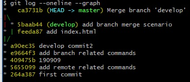

# Git

`git log --oneline`

`git checkout 264a387` : head가 264a387인 커밋 순간을 확인

`git checkout master` : 원상복구


## branch

**"Branch는 일회용품이다!"**

`git branch` : 현재 가지고 있는 branch들의 정보들을 알려줌. (초록 글씨 + '*' -> 현재 내가 있는 branch)

`git branch [브랜치이름]` : 새로운 branch 생성

`git checkout [브랜치이름]` : 다른 브랜치로 이동

`git switch [브랜치이름]` : 다른 브랜치로 이동 (최신버전)

`git branch -d [브랜치이름]` : 브랜치 삭제

`git checkout -b [브랜치이름]` : 브랜치 만들면서 이동

`git switch -c [브랜치이름]` : 브랜치 만들면서 이동

- 새로 만든 branch에서 commit을 찍는 순간, 평행세계가 만들어짐


- `git switch master`를 통해 master branch로 이동할 경우, 마지막에 develop branch에서 커밋한 내용이 사라지는 것을 확인할 수 있다. (다시 `git switch develop`할 경우 복구됨)

`git merge [브랜치이름]` : **현재 Branch**에서 특정 Branch를 병합 (지금 내가 어느 Branch에 있는지 알고 있는 것이 중요하다. 합병의 주인이 누구인지를 항상 remind하자)


- git 시각화 툴 

  https://git-school.github.io/visualizing-git/
  
  https://learngitbranching.js.org/


### 병합의 3가지 시나리오

1. fast forward merge

   분기되기 전 새로운 커밋이 없을 때 (줄기~ 가지 구분이 없을 때, 전부다 줄기라고 퉁치자)

   master에서 develop을 branch해서 develop branch에만 커밋을 해 왔을 때, (master의 내용은 변화가 없음) master의 head를 develop의 head로 옮기는 병합과정


병합 전


병합 후


2. auto merge

   master, 분기된 branch 각각 커밋이 있을 때. master에서 작업한 작업물과 branch의 작업물을 그대로 합쳐도 아무런 충돌(conflict)이 발생하지 않을 때 하는 병합.


병합 전


병합 후




3. merge with conflict

   master에서 작업한 작업물과 branch의 작업물에 충돌이 발생할 때


- vscode가 지원하는 기능을 이용하여 변경사항을 적용할 수 있지만, 아래와 같이 텍스트 편집기로 직접 열어 필요한 내용만 남길 수 도 있다.


- conflict 해결 후 `add`, `commit` 하면 merge 완료


---

- merge [브랜치이름] : [브랜치이름]을 병합한다.
- rebase [브랜치이름] : ~를 [브랜치이름]에 갖다붙인다.


## Pull Request scenario (Fork & Pull request)

1. A가 repository 생성, 프로젝트 push
2. B가 A의 repository fork
3. fork한 repository를 B의 local에 clone
4. B가 clone한 프로젝트를 수정하여 fork했던 repository에 push
5. B : github > [fork한 repository] > [New pull request]
6. A : pull request 승인


- 수정된 프로젝트를 B가 받아가는 방법

  ```bash
  git remote -v
  git remote add upstream https://github.com/sspy21/nhaeng.git
  git remote -v #upstream 추가된 것 확인
  git fetch upstream
  git merge upstream/master
  
  git add .
  git commit -m "fix merge conflict"
  ```


## Branching & Pull request

- 현실 협업 모델
- contributor들이 각각 clone한 뒤, branch를 만들어 프로젝트를 수정.
- 수정된 프로젝트를 push ` git push origin kuhnhee`
- 내가 수정한 branch에 대한 pull request 요청
- reviewer들이 pull request를 검증


- merge된 master를 나의 local로 받아오기 (**반드시 master에서 해야한다.**)

  ```bash
  git checkout master
  git pull
  git branch -d kuhnhee
  ```

- 다시 내 이름으로 branch를 깐 뒤, 프로젝트 작업

  ```bash
  git checkout -b kuhnhee
  ```

  


---


