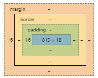
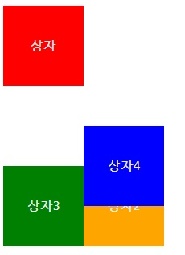

# Web (190730)

## CSS

- HTML은 정보의 구조화
- CSS는 styling 정의


### CSS의 기본 사용법

key-value와 유사하게, **property-value** 관계로 이루어져 있다.

in-line styling, embedding, link file. 총 3 가지 방법이 존재한다. 세 번째 방법(css파일을 분리하여 컴포넌트화 하는 것)이 효과적이다.

```css
/*style.css*/
h1{
    color:blue;
    font-size:15px;
}
```

```html
<!-- index.html -->
<head>
    ...
    <link rel="stylesheet" href="style.css">	<!-- python imprt개념 -->
</head>
```


### 프로퍼티 값의 단위

키워드 or 크기단위(픽셀) or 색상

- em : 배수 단위(상대 단위)  지정된 사이즈에 상대적인 사이즈를 설정
- rem : em은 상속의 영향으로 값이 변경될 수 있음. rem은 최상의 요소(html)의 사이즈를 기준으로 삼는다.
- viewport : bootstrap 때 다시 볼 것.


### html BOX model

html 문서는 모든 것이 Box다.



- Content: 실제 내용이 위치
- Border: 테두리 영역
- Padding: 테두리 안쪽의 내부 여백 (**배경색, 이미지 적용 가능**)
- Margin: 테두리 바깥의 외부 여백 (**배경색을 지정할 수 없다.**)


- margin collapsing: margin이 겹쳐지게 될 경우 발생하게 되는 문제. 이 때문에 `<p>` 태그 대신 `<div>` 태그를 쓴다.

- 위아래만 margin을 16px 주고, 양옆은 margin을 안주고 싶을 경우, 다음과 같이 표현할 수 있다.

  ```css
  div {
    margin:16px 0px;
  }
  ```

- 위, 오른쪽,아래, 왼쪽 margin을 다음과 같이 각각 설정할 수도 있다.

  ```css
  div {
    margin:16px 20px 30px 40px;
  }
  ```

- margin을 이용해 다음과 같이 정렬할 수도 있다.

  ```css
  div {
    margin-left:auto;
  }
  ```

- 위와 비슷하게 상,하,좌,우를 각각 내가 원하는 대로 속성값을 바꿀 수 있다.

  ```css
  div {
    margin:20px;
    padding:5px;
    border-width: 2px 4px 6px 8px;
    border-style: solid dotted dashed double;
    border-color: black pink skyblue aquamarine;
  }
  ```

- border width/style/color는 다음과 같이 줄일 수 있다. style값은 반드시 넣어줘야 한다.

  ```css
  div {
    border: 2px solid black
  }
  ```


### display 속성

#### 1. block

- 항상 새로운 라인에서 시작한다.
- 화면 크기 전체의 가로폭을 차지한다. (width:100%) 소위 길막.
- block 레벨 요소 내에 inline 레벨 요소를 포함할 수 있다.
  
- inline 레벨 요소가 더 적으므로, 무엇무엇이 속해있는지 암기해 놓자.
  
- 너비가 정해지면 나머지를 margin으로 채운다. (디폴트: margin-right:auto)

  아래와 같이 하면 컨텐츠를 오른쪽으로 밀어버린다.

  ```css
  div {
    margin-left:auto;
    height: 100px;
    width: 100px;
  }
  ```

  위 코드를 응용하여,  가운데 정렬을 할 수 있다.

  ```css
  div {
    margin-left:auto;
    margin-right:auto;
    height: 100px;
    width: 100px;
  }
  ```

  위에 적은 내용을 다 무시하고, inline으로 보이게 할 수 있다. (디폴트: display:block)

  ```css
  div {
    margin-left:auto;
    margin-right:auto;
    height: 100px;
    width: 100px;
    display: inline;
  }
  ```

- 컨텐츠 중간에 삽입될 수 있는 태그들을 inline(예: 링크)이라고 한다. block 레벨 요소들은 inline 레벨 요소들을 포함할 수 있다.

#### 2. inline

- 새로운 라인에서 시작하지 않는다.
- 문장의 중간에 들어갈 수 있다.
- **content의 너비만큼 가로폭을 차지한다.**
- width, height, margin 프로퍼티를 지정할 수 없다. **상 하 여백은 line-height로 지정한다.** (+ 좌, 우 margin은 가능하다. padding도 가능하다.)
- **span, a, strong, img, br, input, select, textarea, button**


##### CSS Class, id

엘레멘트를 구분하기 위한 분류표의 역할. id는 유니크한 라벨을 붙이고 싶을 때 사용.

```css
<!-- index.html -->
  <div id="zero">
	공간0
  </div>
  <div class="odd">
    공간1
  </div>
  <div>
    공간2
  </div>
  <div class="odd">
    공간3
  </div>
  <div>
    공간4
  </div>
```

```css
/*css sheet*/
.odd{
  background-color: aqua;
}
#zero{
    background-color: red;
}
```

#### 3. inline-block

- block과 inline 레벨 요소의 특징을 모두 갖는다.

- inline 레벨 요소처럼 한 줄에 표시 되면서 block에서의 width, height, margin(top, bottom) 속성을 모두 지정할 수 있다.

  ```css
  .inline-block {
    display:inline-block;
    margin:10px;
    height:100px;
    width:100px;
  }
  ```

  ```html
  <div class="inline-block"> 
    인라인-브록
  </div>
  ```

#### 4. None

- 동적으로 어떠한 것을 없애고 싶을 때 사용하는 것.

- **공간까지 사라진다. (visibility 속성의 hidden과 차이)**

  ```css
  .none {
    display:none;
  }
  ```

  ```html
  <div class="none">
      얘는 없어진다..
  </div>
  ```


### Visibility 속성

#### 1.visible

#### 2.hidden

```css
.hidden{
  visibility:hidden;
}
```

```html
<div class="hidden">
    얘는 안 보일 뿐이에요..
</div>
```


### Font&Text

- 가운데정렬

  `text-align:center;`

- 세로정렬(텍스트)

  `line-height: ??px` 혹은 FLEX 사용

- 자간

  `letter-spacing: ??px`


### Position

#### 1.Static

- 기본적인 요소의 배치 순서에 따라 위에서 아래로, 왼쪽에서 오른쪽으로 순서에 따라 배치되며 부모 요소 내에 자식 요소로서 존재할 때는 **부모 요소의 위치를 기준**으로 배치된다.


#### 2.Relative

- 아래와 같이 복수의 class를 한 tag에 적용할 수 있다.

- 자기가 **원래 있던 위치로부터 상대적인 이동을 할 수 있다.**

  ```css
  ...
  .relative{
    position:relative;
    top: 100px;
    left:100px;
  }
  ...
  ```

  ```html
  <div class="box1">
      상자
  </div>
  <div class="box2 relative">
      상자2
  </div>
  ```

- 보이는 위치와는 별개로, 원래 있던 위치를 동시에 차지하고 있는 것으로 프로그램은 인식한다.

- 

- ```html
  <div class="box1">
      상자
  </div>
  <div class="box2 relative">
      상자2
  </div>
  <div class="box3">
      상자3
  </div>
  ```


#### 3.Absolute

- 부모 요소 또는 가까이 있는 조상 요소(static 제외)를 기준으로 좌표 프로퍼티(top, bottom, left, right)만큼 이동한다. 즉, relative, absolute, fixed 프로퍼티가 선언되어 있는 부모 또는 조상 요소를 기준으로 위치가 결정된다.

- 아래 예는 **html margin의 좌측 위 끝 지점을 기준으로 움직인다.** (body는 static)

  ```html
    <div class="box4 absolute">
      상자4
    </div>
  ```

  ```css
  .absolute{
    position: absolute;
    left:108px;	/*body의 margin값 8px을 고려*/
    top:158px;
  }
  ```

- 

##### html z index (배치 순서 결정)

`z-index:???;` 속성값을 주어 화면 출력 우선순위를 결정해줄 수 있다.


#### 4.Fixed

- 부모 요소와 관계없이 브라우저의 viewport를 기준으로 좌표 프로퍼티(top, bottom, left, right)을 사용하여 위치를 이동시킨다. 스크롤이 되더라도 화면에서 사라지지 않고 항상 같은 곳에 위치한다.

  ```css
  .fixed{
    position:fixed;
    /* left:200px;
    top:100px; */
    bottom:0px;
    right:0px;
  }
  ```

  ```html
  <div class="box5 fixed">
      상자5
  </div>
  ```


---


### Bootstrap

CDN(Contents Delivery Network)을 활용하여 static file(css)을 가져올 수 있다. (https://getbootstrap.com/docs/4.3/getting-started/introduction/)

`<link>` 태그와 3개의 `<script>`태그를 가져와 추가해놓은 뒤, Documentation > Components 추가하고자 하는 내용을 `<body>`에 추가.

##### 우리는 startbootstrap 이용하여 포트폴리오 페이지를 꾸밀 것.


---


### 가상환경 만들기

```shell
mkdir ~/python-virtualenv
python -m venv ~/python-virtualenv/3.7.3
source ~/python-virtualenv/3.7.3/scripts/activate #3.7.3버전 가상환경 실행
deactivate	#가상환경 종료
```

alias로 축약

```
# .bashrc
alias jn='jupyter notebook'
alias venv='source ~/python-virtualenv/3.7.3/scripts/activate'

source ~/.bashrc #리로드
```

venv라고 치기만 해도 3.7.3버전 가상환경 실행 가능

```
venv
deactivate
```


