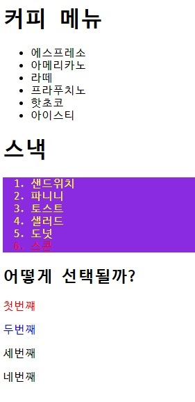
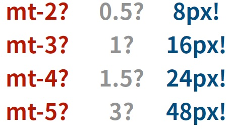
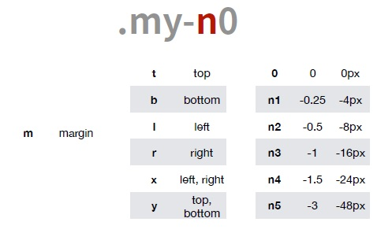

# Web (190805)

## CSS

### 후손, 자식

- html 문서는 tree 구조이기 때문에, 특정 태그만을 타겟팅해서 프로퍼티를 설정할 수 있다.

```css
ol{
  background: blueviolet;
}

ol > li{
  color: yellow;
}

ol > li:nth-child(6){
  color:red;
}

#ssafy > p:nth-child(2){
  color:red;
}

#ssafy > p:nth-of-type(2){
  color:blue;
}
```



- '후손'과 '자식'의 구분

  ```css
  div span {
    color: burlywood;
  }
  
  div > span{
    color: burlywood;
  }
  ```

- 모든 태그의 선택 : asterisk 사용

  ```css
  * {
  	margin:0;
  	padding:0;
  }
  ```


### 복합선택자

- a 태그와 **형제인, 단 하나**의 ul tag 속성을 주고자 할 때, 다음과 같이 한다.

  ```css
  a + ul{
    background-color: gold;
  }
  ```

- a태그와 **형제인, 모든** ul 태그에 속성을 주고자 할 때, 다음과 같이 한다.

  ```css
  a ~ ul {
    background-color: gold;
  }
  ```

  

### 속성셀렉터

- p.s) a 태그의 **target 속성값에 "_blank"값**을 주면, 링크를 클릭했을 시 새 탭에서 열린다.

- a 태그 중, target값이 _blank인 애들만 찾아서 속성값을 바꾸고 싶을 때, 아래와 같이 한다.

  ```css
  a[target="_blank"] {
    border:solid 2px black;
    border-radius: 1px;
    padding: 5px;
  }
  ```

- class 값을 가진 애들만 선택하고 싶을 때, 아래와 같이 할 수 있다.

  ```css
  ul[class] {
      
  }
  ```

- img 태그의 alt 값에 "TYPE"이 들어가는지 확인하는 방법 (정규표현식 활용)

  ```css
  img[alt|="TYPE"]{
    
  }
  /*
  img[alt|="TYPE"]{
  }
  img[alt$="TYPE"]{
  }
  img[alt~="TYPE"]{
  }
  img[alt^="TYPE"]{
  }
  */
  ```

---


## Bootstrap

- CDN 방식을 사용한 bootstrap 활용

- bootstrap > get started > css tag, script tag 4개를 가져와 head 태그에 추가.
  - **bootstrap > get started > Starter template 복붙하는 것을 추천.**
- bootstrap > download > compiled css and js > css 파일 내의 stylesheet 파일들을 가져와 /bootstrap 디렉토리에 복사


- 일반적인 html 태그의 스타일 요소와 다르다. (h1태그만 하더라도 margin, 폰트 등이 다르다.)


### CDN(content delivery(distribution) network)

- 컨텐츠(CSS, js, image, text)를 효율적으로 전달하기 위해 여러 노드에 가진 네트워크에 데이터를 제공하는 시스템.

- 개별 end-user의 가까운 서버를 통해 빠르게 전달 가능. 외부 서버의 활용으로 본인 서버의 부하 감소. 적절한 수준의 캐시 설정으로 빠르게 로딩 가능 (브라우저가 해주는 영역)


### CSS reset

html의 기본 스타일 설정을 덮어씌우는 과정. bootstrap-reboot.css에 작성되어 있다.


### bootstrap classes

- https://getbootstrap.com/docs/4.3/utilities/

#### Spacing

- class 이름으로 스타일을 지정하는 것 또한 가능하다. "mt-5" => margin top 5 의미

  ```css
    <h1 class="mt-5">이건 h1인가!</h1>
  ```

- `!important`가 붙은 속성은 무조건 최상위 우선순위를 가지게 된다.

  class로 m-0을 줄 경우, 무조건 margin값을 0으로 바꾼다.

  ```css
  .m-0 {
    margin: 0 !important;
  }
  ```

- "mx-0" 클래스는 좌우(x축) margin 값을 0으로 만는다.

- "py-0" 클래스는 위아래(y축) padding값을 0으로 만든다.

- mt 값의 pixel 단위는 불규칙하다.

  

- 음수 값 또한 사용 가능하다.



- "mx-auto"를 사용하여 중앙정렬 또한 가능하다.(좌우 marign을 동일하게)
- "text-center"를 사용하여 text의 중앙정렬이 가능하다.
- 

#### Color

- color concept keyword들이 존재한다.

  - primary, secondary, success, info, warning, danger, light, dark

  

#### Border

- (생략)


#### Display

- ".d-block" 으로 block 요소로 만들 수 있다.
- ".d-none" 으로 없앨 수 있다.
- ".d-sm-none" 혹은 ".d-md-none" 혹은 ".d-lg-none"으로 디바이스의 크기에 따라 나타날지 안나타날지 결정할 수 있다.(SMall:모바일, MeDium:타블렛, LarGe:모니터, XLarge:와이드모니터)


#### Position

- position:static -> ".position-static" 클래스


#### Text

- text-align:center -> ".text-center" 클래스
- font-weight:bold -> ".font-weight-bold" 클래스


#### Components

- https://getbootstrap.com/docs/4.3/components/
- 핵심: Alerts, Breadcrumb, Button, Card, <u>Carousel(중요)</u>, Dropdowns, Collapse, <u>Forms(중요)</u>, Media object, Modal, Navs&Navbar, Pagination(여러 페이지 처리), <u>Progress(중요, 진행 척도를 알려주는 bar)</u>
  - 최근 dropdowns, modal은 좋은 UI가 아니라는게 추세 (스마트폰에서 잘 깨짐)


#### Grid

- https://www.w3schools.com/bootstrap4/bootstrap_grid_system.asp
- 기본적으로 **12개의 column**으로 구성
- 정사각형 모니터를 고려하여, 대부분의 웹 사이트는 메인 컨텐츠를 1100px 안에 넣는다.
  - bootstrap도 마찬가지이기 때문에, 기본적으로 container를 사용할 경우 좌우 여백이 생긴다.
  - 끝까지 채우고 싶은 경우, "container-fluid"를 사용하면 된다.
  - 웹페이지의 간판은 "container-fluid"로, 메인 컨텐츠는 "container"로 하는게 일반적

- 한 row 안에, 12개까지 column을 배치할 수 있다.
  - 12개가 아니더라도, 균등하게 공간을 배분한다.


```css
<div class="container-fluid bg-secondary vh-20">
    <div class="row">
      <div class="col bg-primary">
        칼럼
      </div>
      ...
      <div class="col bg-info">
        칼럼
      </div>
    </div>
</div>
```

- 균등하지 않게 공간을 배분할 수 도 있다.


```css
  <div class="container-fluid bg-secondary vh-20">
    <div class="row">
      <div class="col-2 bg-primary">
        칼럼
      </div>
      <div class="col-8 bg-info">
        칼럼
      </div>
      <div class="col-2 bg-primary">
        칼럼
      </div>
    </div>
  </div>
```

- 사이사이 빈 공간을 두고 싶은 경우, padding을 활용해 컨텐츠 블록을 줄여야 한다. (grid로 할 경우, collision 발생 가능)

- ".col-sm-4" : 4개의 column을 차지하고 있다가, small device에 해당하는 화면 크기에 도달하는 순간 grid를 풀고, 한 row에 한 column만 사용하도록 컨텐츠를 세로방향으로 쌓아준다.(반응형으로!)

   

  ```css
    <div class="container-fluid bg-secondary vh-20">
      <div class="row">
        <div class="col-sm-4 bg-primary">
          칼럼
        </div>
        <div class="col-sm-4 bg-info">
          칼럼
        </div>
        <div class="col-sm-4 bg-primary">
          칼럼
        </div>
      </div>
    </div>
  ```

- **여러 개의 breakpoint**를 주어 화면이 반응하도록 할 수 있다.

  - row당 4개 -> 2개 -> 1개로 단계적으로 줄도록 만들기
  - large device 전 까지는 3 column, medium device 전 까지는 6 column을 차지

```css
  <div class="container-fluid bg-secondary vh-20">
    <div class="row">
      <div class="col-lg-3 col-md-6 bg-primary">
        칼럼
      </div>
      <div class="col-lg-3 col-md-6 bg-info">
        칼럼
      </div>
      <div class="col-lg-3 col-md-6 bg-primary">
        칼럼
      </div>
      <div class="col-lg-3 col-md-6 bg-info">
        칼럼
      </div>
    </div>
  </div>
```