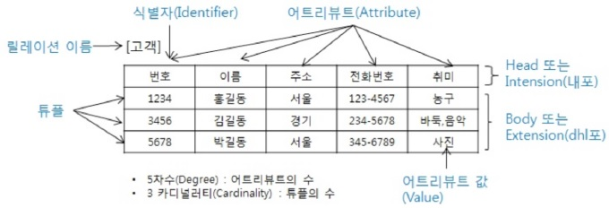
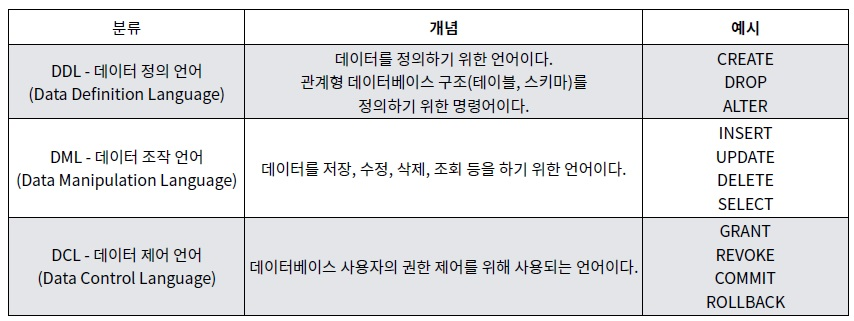
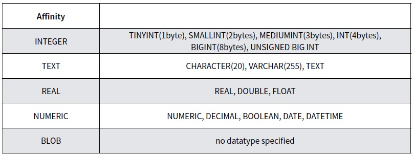
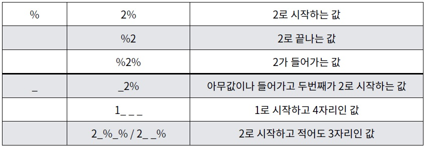

# Database (190923)

## Database

- 데이터베이스는 **체계화된 데이터의 모임**이다.
- 여러 사람이 공유하고 사용할 목적으로 통합 관리되는 정보의 집합이다.
- 논리적으로 연관된 하나 이상의 자료의 모음으로 그 내용을 고도로 구조화함으로써 검색과 갱신의 효율화를 꾀한 것이다.
- **몇 개의 파일을 조직적으로 통합**하여 자료 항목의 중복을 없애고 자료를 구조화하여 기억시켜 놓은 자료의 집합체


### RDBMS

- 관계형 모델을 기반으로 하는 데이터베이스 관리시스템. 대표적으로 MySQL, SQLite, PostgreSQL, ORACLE, MS SQL 등이 존재.
- 관계(relation)를 표현하기 위해 2차원의 표를 사용




### SQL

- RDBMS의 데이터를 관리하기 위해 설계된 **특수 목적의 프로그래밍 언어**이다. (데이터를 다룰 때 표준이 된다고 볼 수 있는 언어)
- 


#### sqlite3

- `sqlite3 db.sqlite3` 커맨드로 sqlite 콘솔 시행 (DB 실행)

- 시스템 함수를 호출하기 위해서는, 앞에 ' . '을 붙여줘야 한다. ex) `.exit`
- `.databases`  : 현재 열려있는 DB 확인
- `.tables` : table 목록 확인

- 열고자하는 DB가 존재하지 않을 경우, 새로 만들어준다.

  `sqlite3 tutorial.sqlite3` -> tutorial.sqlite3 파일 생성

- csv파일 넣기

  `.mode csv` : csv 들어갈 준비

  `.import hellodb.csv examples` : examples에 csv파일 import

  `SELECT * FROM examples` 하기 전, 아래 명령어를 통해 더 깔끔하게 테이블 출력이 가능하다.

  ```shell
  .headers on
  .mode column
  ```


##### Table 생성 (**CREATE**)

```
CREATE TABLE classmates (
    id INTEGER PRIMARY KEY,
    name TEXT
);
```

- Datatype

  SQLite은 동적 데이터 타입으로, 기본적으로 유연하게 데이터가 들어간다. BOOLEAN은 정수 0, 1으로 저장된다.

  

- `.schema table` : 특정 table 스키마 조회

- **schema를 정의한 뒤에, csv 파일을 넣어야 한다.** 그렇지 않으면, id, age같은 값들이 text로 정해질 수 있다.
- `DROP TABLE table;` : 특정 table 삭제


##### Data 추가 (**INSERT**)

```sql
INSERT INTO classmates (name, age) VALUES ('홍길동', 23);
```

모든 column들에 대한 데이터를 넣을거라면, column 부분을 생략 가능하다.

```sql
INSERT INTO classmates VALUES ('홍길동', 23, '서울');
```

- **id를 포함**하여 출력할 수 있다.

  ```sql
  SELECT rowid, * FROM classmates;
  ```

- **PRIMARY KEY는 반드시 INTEGER만 사용 가능하다.**

- 좀 더 빡빡하게 schema를 작성해보자 (primary key 지정, 빈값 허용 X)

  ```sql
  CREATE TABLE classmates (
  	id INT PRIMARY KEY,
      name TEXT NOT NULL,
      age INT NOT NULL,
      address TEXT NOT NULL
  );
  ```

  primary key의 경우, `INSERT`할 때 values로 넘겨주지 않아도 된다. (auto increment 지원됨)

  ```sql
  INSRT INTO classmates (name, age, address) VALUES ('이삼성', 50, '수원')
  ```

- PK 칼럼은 직접 작성하기보다, **SQLite가 만들어주는 rowid를 사용하는 것이 좋다.** 

  **But, Django ORM에서는 PK 칼럼을 직접 만들어서 쓴다.**

  

##### Data 조회 (**SELECT**)

- `LIMIT num` : num 개수 만큼 보는 것을 제한하겠다.

  ```SQL
  SELECT rowid, name FROM classmates LIMIT 3;
  ```

- 특정 위치에서부터 몇 개만 가져오기 (ex. 게시판에 보여지는 게시글 수 제한)

  ```SQL
  SELECT rowid, name FROM classmates LIMIt 3 OFFSET 5;
  ```

- 특정한 값만 가져오기

  ```sql
  SELECT rowid, name FROM classmates WHERE address='서울';
  ```

- 중복 없이 가져오기

  ```sql
  SELECT DISTINCT age FROM classmates;
  ```

  

##### Data 삭제 (**DELETE**)

```sql
DELETE FROM classmates where address='서울';
```

- 조건을 만족하는 값이 여러개인 경우, 중복되는 모든 튜플들이 삭제된다.
  - Primary key가 아닌 값을 기준으로 삭제하는건 조심해야 한다.
  - 중복이 불가능한 (unique) 값인 **rowid**를 기준으로 하자!
- SQLite는 기본적으로 일부 행을 삭제하고 새 행을 삽입하면 삭제 된 행의 값을 재사용하려고 시도한다.

- 이전에 삭제 된 행의 값을 재사용하지 않고 사용하지 않은 다음 행 값으로 사용하게 하려면?

  - **AUTOINCREMENT** 사용

- AUTOINCREMENT를 적용한 table 생성 (지워진 id를 새로 입력된 데이터가 차지하지 않도록...)

  ```sql
  CREATE TABLE tests (
  	id INTEGER PRIMARY KEY AUTOINCREMENT,
      name TEXT NOT NULL
  );
  
  INSERT INTO test (id, name) VALUES (1, '홍길동'), (2, '김철수');
  ```


##### Data 수정 (**UPDATE**)

```sql
UPDATE classmates SET name='재용', address='제주' WHERE id=6;
```

- 조건을 만족하는 값이 여러개인 경우, 중복되는 모든 튜플들이 수정된다.


##### WHERE 구문

- users에서 age가 30 이상인 사람만 가져온다면?

  ```sql
  SELECT * FROM users WHERE age>=30;
  ```

- users에서 age가 30 이상이고 성이 김인 사람의 성과 나이만 가져온다면?

  ```sql
  SELECT age, last_name FROM users WHERE age>=30 AND last_name='김';
  ```

- 레코드의 개수를 반환하기

  ```sql
  SELECT COUNT(*) FROM users;
  ```

- 숫자값을 대상으로 한 표현식

  **AVG(column), SUM(..), MIN(..), MAX(..)**

  - users에서 30살 이상인 사람들의 평균나이는?

    ```sql
    SELECT AVG(age) FROM users WHERE age>=30;
    ```

  - users에서 계좌 잔액이 가장 높은 사람과 액수는?

    ```sql
    SELECT first_name, MAX(balance) FROM users;
    ```


##### LIKE (wild cards)

- 정확한 값에 대한 비교가 아닌, 패턴을 확인하여 해당하는 값을 반환한다.

  1. `_` : 반드시 이 자리에 **한 개**의 문자가 존재해야 한다.
  2. `%` : 이 자리에 문자열이 있을수도, 없을수도 있다.

- users에서 20대인 사람은?

  ```sql
  SELECT * FROM users WHERE age LIKE '2%';
  ```

- users에서 지역번호가 02인 사람만?

  ```sql
  SELECT * FROM users WHERE phone LIKE '02-%';
  ```




##### 정렬 (ORDER)

```sql
SELECT columns FROM table ORDER BY column1, column2 ASC|DESC;
```

- ASC: 오름차순(default)

- DESC: 내림차순

- users에서 나이순으로 오름차순 정렬하여 상위 10개 출력

  ```sql
  SELECT * FROM users ORDER BY age ASC LIMIT 10;
  ```

- users에서 나이순, 성 순으로 오름차순 정렬하여 상위 10개 출력

  ```sql
  SELECT * FROM users ORDER BY age, last_name ASC LIMIT 10;
  ```

- users에서 계좌잔액순으로 내림차순 정렬하여 해당하는 사람의 성과 이름을 10개만 뽑아보면?

  ```sql
  SELECT first_name, last_name FROM users ORDER BY balance DESC LIMIT 10;
  ```


##### ALTER

- 테이블 명 변경

  ```sql
  ALTER TABLE articles RENAME TO news;
  ```

- 새로운 컬럼 추가

  ```sql
  ALTER TABLE classmates ADD COLUMN col_name DATATYPE;
  ```

  - 새로운 컬럼 created_at를 추가하기

    ```sql
    ALTER TABLE news ADD COLUMN created_at DATETIME NOT NULL;
    ```

    NOT NULL 조건으로 인해 기존 데이터에 NULL 값으로 새로운 컬럼이 추가될 수 없으므로 아래와 같은 에러가 발생한다. NOT NULL 조건을 없애거나 **default value를 지정해준다.**

  - DEFAULT 값을 넣어서 추가하기

    ```sql
    ALTER TABLE news ADD COLUMN subtitle TEXT NOT NULL DEFAULT 1;
    ```


