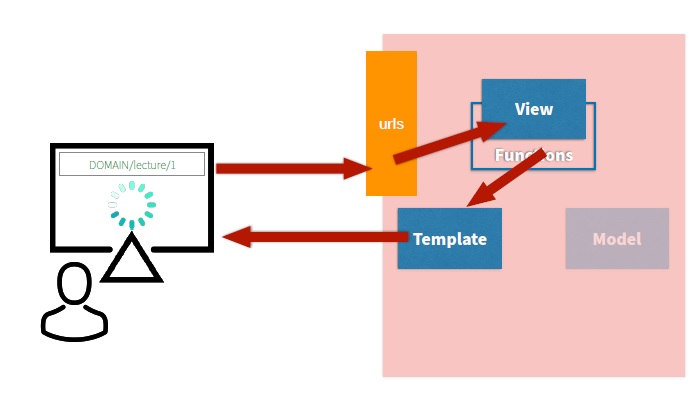

# django (190812)

1. Versatile
2. Secure
3. Scalable
4. Complete
5. Maintainable
6. Portable


- django의 성격
  - Opinionated(독선적) : framework가 만들어놓은 규칙들을 따라가야 함
  - Unopinionated(관용적) : 사용자의 재량이 많은 부분 허용됨
  - **장고는 독선적!** 초반에는 규칙들을 많이 배워나갈 필요가 있음


- Dynamic web(web APP)을 만들자, 상황마다 유저마다 다른 서비스를 제공할 수 있도록 하자.
- Request - Response 패턴이 기본 (flask와 동일)
- flask의 웹 개발 방식은 대규모 사이트에 적합하지 않음 (반복되는 요소들이 너무 많이 발생, 유지관리가 너무 어려워진다.)
- 웹 개발을 위한 가장 유명한 패턴은 **MVC 패턴**. django는 **MTV 패턴** 채택. (MVC와 유사함)


### MTV 패턴

- Model : 데이터를 관리
- Template : 사용자가 보는 화면
- View : 중간 관리자 ( 제일 중요 )

```shell
$ mkdir FIRST_APP
```

FIRST_APP 폴더 내에 들어가서 아래 명령어 실행. 대문자 폴더 내에 같은 이름의 소문자 폴더 들어가는게 관례

```shell
$ django-admin startproject first_app .
$ python manage.py runserver
```

서버 구동 후 http://localhost:8000/ 접속 가능

- 당분간 settings.py 와 urls.py를 위주로 다룰 것. manage.py는 건들일 일 없다고 생각하면 된다. wsgi.py는 나중에 다룰 것.
- **urls.py는 django의 문지기** 같은 역할을 한다.

- django는 project 내에 세부적인 app들 (app1, app2, app3...)을 만들어서 logic 구현이 이루어짐. (예를 들어, app1은 게시판, app2는 회원관리, app3은 영화 평점 앱.... 등등 logic별로 app을 구별해서 사용한다.)


- app을 생성해보자

```shell
$ python manage.py startapp [앱이름]
```

- [앱이름] (pages) 폴더가 생성된다.
- 당분간 models.py, views.py 만 다룰 것.
- 설치한 앱은 settings.py에 추가한다.

```python
#settings.py
INSTALLED_APPS = [
    'pages',
    'django.contrib.admin',
    'django.contrib.auth',
    'django.contrib.contenttypes',
    'django.contrib.sessions',
    'django.contrib.messages',
    'django.contrib.staticfiles',
]
```

- pages의 views를 urls.py에 import해줘야 한다.

```python
#urls.py
from pages import views

urlpatterns = [
    # path()
    # 첫번째 인자 : 주문서(url 경로)
    # 두번째 인자 : view 함수의 위치
    path('admin/', admin.site.urls),
    path('index/', views.index),
]
```

- [pages] > views.py 파일의 index 함수 작성

```python
#views.py, 'request'는 반드시 들어가야 함.
def index(request):
    #flask : return render_template('index.html')
    return render(request, 'index.html')
```

- [pages] > [templates] 폴더 생성

- [templates] > index.html 작성
- '/home'이라고 하는 url도 추가해보자
- 이 때, 데이터를 해당 html로 전달해보자 (dictionary 형태로 넘겨줘야 한다.)

```python
#urls.py
urlpatterns = [
    # path()
    # 첫번째 인자 : 주문서(url 경로)
    # 두번째 인자 : view 함수의 위치
    path('admin/', admin.site.urls),
    path('index/', views.index),
    path('home/', views.home)
]
```

```python
#views.py
from django.http import HttpResponse
#...
def home(request):
    name = '강동주'
    data = ['강동주', '김지수', '정의진']
    context = {
        'name': name,
        'data' : data,
    }
    return render(request, 'home.html', context)

```

```html
#home.html
...
<body>
    <h1>
      <h2>{{name}}</h2>
      <h2>{{data}}</h2>
    </h1>
</body>
```

- 가져온 iterable한 데이터에 대해, 반복문을 사용할 수 있다.

```html
<body>
  
    {{item}}
  
</body>
```

- 간단한 비교연산이 가능하다.

```html
<body>
    <h1>DTL 조건문</h1>
    
    	<p>이건 10이야</p>
    
</body>
```


### DTL (Django Template Language)

1. for문
2. if문
3. helper, filter
4. 

```html
<body>
  <h2>데이터를 넘겨 받는 법</h2>
  <p>{{name}}<p>
  <p>{{data}}</p>
  
  <p>{{item}}</p>
  

  <h2>for문 활용법</h2>
  <h3>데이터가 없을 때,</h3>
  
  <p>{{ movie }}</p>
  <p>{{ forloop.counter }} : {{ movie }}</p>
  
  <p>영화 데이터가 없습니다.</p>
  

  <h3>2중 for문</h3>
  
  
  <p>{{ num }}</p>
  
  

  <h2>다양한 helper / filter</h2>
  <h3>helper(built-in tag)</h3>
  <p></p>

  <h3>filter</h3>
  <h4>str 관련</h4>
  
    {{ movie|length }} <!--길이 출력-->
    {{ movie|truncatechars:3 }} <!--단어가 5개 이상이라면 '...' 처리-->
  
  <h4>int, numeric 관련</h4>
  {{ number|add:10 }}

  <h4>datetime</h4>
   <!--formating 가능-->
  
</body>
```


### url을 통해 데이터를 입력받기

```python
#urls.py
urlpatterns = [
    # path()
    # 첫번째 인자 : 주문서(url 경로)
    # 두번째 인자 : view 함수의 위치

    # path('cube/<num>/', views.cube)
    path('cube/<int:num>/', views.cube) #입력값을 int로 받음
]
```

```python
#[pages] > views.py
def cube(request, num):
    context = {
        'num': num**3,
    }
    return render(request, 'cube.html', context)
```

```html
<!--[pages] > [templates] > cube.html-->
<body>
  <p>{{num}}</p>
</body>
```


### input과 form을 사용해 입력받기 (GET 방식)

- 입력받은 값은 request의 querydict에 저장되어 있음.

```html
<!--index.html-->
<body>
  <form action="/match/" method="GET">
    당신의 이름: <input type="text" name="me">
    당신이 좋아하는 분의 이름: <input type="text" name="you">
    <button type="submit">제출</button>
  </form>
</body>
```

```python
#views.py
def match(request):
    import random
    goonghap = random.randint(50, 100)

    me = request.GET.get('me')
    you = request.GET.get('you')
    # https://docs.djangoproject.com/en/2.2/ref/request-response/
    context = {
        'me': me,
        'you': you,
        'goonghap': goonghap,
    }
    return render(request, 'match.html', context)
```

```html
<!-- match.html -->
<body>
  <h1>{{me}}님과 {{you}}님의 궁합은 {{goonghap}}%입니다.</h1>
</body>
```


### django에서의 post 요청 (위와 동일한 기능)

```html
<!--index.html-->
<form action="/match/" method="POST">
    
    당신의 이름: <input type="text" name="me">
    당신이 좋아하는 분의 이름: <input type="text" name="you">
    <button type="submit">제출</button>
  </form>
```

- `` 을 삽입하면 임의의 토큰을 생성해주어 중간에 프록시에 의한 탈취를 방지할 수 있음. ( 이 토큰으로 보내지 않은 거는 받지 않도록)

```python
#views.py
def match(request):
    import random
    goonghap = random.randint(50, 100)

    me = request.POST.get('me')
    you = request.POST.get('you')
    # https://docs.djangoproject.com/en/2.2/ref/request-response/
    context = {
        'me': me,
        'you': you,
        'goonghap': goonghap,
    }
    return render(request, 'match.html', context)
```


---


오늘 다룬 것은 client의 요청이 urls.py - View - Templates - client 순서를 따르는 패턴



- django는 trailing comma를 쓰는게 convention( [1,2,3,] )
- F1 ->  select interpreter -> python 3.7.3(virtualenv) 클릭하여 빨간 줄들 제거
- django는 dtl 이라는 template engine 사용 (flask는 jinja)