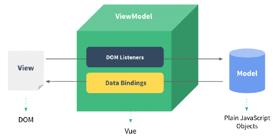

# Vue.js

우리가 JS를 쓰는 이유?

- **Client Side Rendering**을 하기 위한 것
  - 클라이언트는 Browser라는 프로그램을 통해서 서버에 접근을 한다. Rendering의 주체가 Django가 아닌, 클라이언트의 Browser가 되도록 하자. (우리가 지금까지 해온 방식은 Server Side Rendering, Django가 rendering 해왔다. 요청&응답이 있는 구조였다.)
  - Page load가 없이 (새로운 요청을 보내지 않고), 클라이언트 측에서 화면이 바뀌도록 하기 위해. (좋아요, 팔로우, 댓글, 글쓰기 ... )
  - *사용자의 경험을 향상시키자!* 가 목적


Vue.js와 같은 FE framework를 쓰는 이유?

- 어플리케이션을 만들기가 **쉬워지기 때문**
- 공식문서 [링크](https://kr.vuejs.org/v2/guide/) 


## RECAP

문서(html)을 객체로 다룰 수 있도록 하는 것이 DOM. 각각의 태그가 오브젝트화 되어있다. 이 오브젝트들을 조작하는게 JS.

JS의 `this`는 JAVA의 `this`와 다르다. `addEventListner`의 콜백 함수로 arrow function을 쓰지 않는 이유. (arrow function이 `this`의 context를 바꾼다.)


**검색창 밑에 검색값 보여주기**

`input` 이벤트는 입력값이 입력되는 순간 바로 발생

```html
<body>
  <h1>댓글달기</h1>
  <input id="userInput" type="text">
  <p id="inputArea"></p>

  <script>
    const userInput = document.querySelector('#userInput')
    const inputArea = document.querySelector('#inputArea')
    
    userInput.addEventListener('input', function(event) {
      inputArea.innerText = event.target.value
    })
  </script>
</body>
```

좋아요 갯수 카운트(단순 카운터)

```html
<body>
  <h1>댓글달기</h1>
  <input id="userInput" type="text">
  <p id="inputArea"></p>

  <h2>좋아요</h2>
  <p id="likeCountArea">좋아요 갯수:</p>
  <button id="likeButton">좋아요</button>

  <script>
    const userInput = document.querySelector('#userInput')
    const inputArea = document.querySelector('#inputArea')
    const likeButton = document.querySelector('#likeButton')
    const likeCountArea = document.querySelector('#likeCountArea')
    let likeCount = 0 //좋아요 카운트
    
    userInput.addEventListener('input', function(event) {
      inputArea.innerText = event.target.value
    })

    likeButton.addEventListener('click', function(event) {
      // 좋아요 갯수를 한 개 중가시킴
      likeCount++
      // p태그의 값을 변경시킴
      likeCountArea.innerText = `좋아요 갯수: ${likeCount}`
    })
  </script>
```

기능을 추가할 때마다 object를 잡아주고, event를 핸들링해주고, 코드가 너무 복잡해지고 길어진다. 이를 정리하기 위해서 (maintain을 용이하게 하기 위해) 등장한게 JS framework들.


**위의 코드를 vue.js로 작성할 경우**

1. vue 객체 생성
   - `el`: 이 객체가 실행될 위치 지정
   - `data`: 이 객체가 사용할 데이터들 (정적 데이터) 정의
   - `methods`: 이 객체가 사용할 함수들 정의
2. 선언한 vue 객체가 역할을 수행할 영역 생성 (아래 코드에서는 `<div id='app'>`)
3. Vue directive를 사용해 Vue 객체가 할 행위를 지정(바인딩, 이벤트 핸들링 등). Mustache `{{ }}` 문법을 사용해 값 전달.

```html
<body>
  <!-- vue instance를 마운트할 위치 -->
  <div id='app'>
    <h1>댓글달기</h1>
    <!-- vue directive 사용해서 실시간으로 연결 -->
    <input type="text" v-model="msg">
    <p>{{ msg }}</p>
      
    <h2>좋아요</h2>
    <p>좋아요 갯수: {{ likeCount }}</p>
    <button v-on:click="like()">좋아요</button> <!-- v-on: button이 ~를 하면~ -->
  </div>

  <script>
    // rendering은 vue 너가 해~ 난 어떻게 할지만 알려줄게!
    // vue 객체 생성
    const app = new Vue({
      el: '#app', // ~에서 하면 돼! 라고 위치를 알려주는 것
      data: { // vue 인스턴스가 사용할 데이터들. Django에서 render때의 context와 동일한 역할
        msg: '와 vuejs 시작했다!',
      },
      methods: {
        like: function() {
          this.likeCount++
        }
      },
    }) 
  </script>
</body>
```

- `v-model="msg"` : 폼 입력 바인딩
- `v-on:click="like"` : 클릭 이벤트 발생시 `app`의 `like` 함수 실행. 추후 배우겠지만`@click="like"`와 동일. (short hand expression)

- Django에서 app들을 쪼개놓듯이, Vue에서는 componnt별로(검색창, 내비게이터, ...) 객체를 분리해(각각의 용도를 위한 vue 객체를 생성해) 관리한다.
- vue.js는 선언적 프로그래밍 패러다임
  - = Discriptive Programming (묘사를 한다!)
  - 명령적으로 프로그래밍하는 것보다 훨씬 명시적으로 할 수 있다.


## Vue.js

### SPA(Single Page Application)

- 페이지 로드 없이, 한 번에 한 페이지 안에서 모든걸 할 수 있는 어플리케이션
  - 이를 위해서는 JS를 통해 Client Side Rendering을 할 수 밖에 없다.


위의 MVC(MTV) 패턴에서 아래의 형태로 변화




### 시작하기

VScode extension 'Vetur', 'Vue VSCode Snippets' 설치.

Chrome extension 'Vue.js devtools' 설치. (Vue가 사용되는 page에 들어가면 초록색으로 변한다. 또, 개발자 도구 창에 Vue 항목 생긴다.)


bootstrap에서의 Responsive(반응형)과 JS에서의 Reactive(반응형)은 다른 의미

- Reactive: 데이터의 변화에 반응형. **자동 적용(반영)**
- Responsive: Device의 화면크기에 반응형. 


**CDN 추가**

```html
<script src="https://cdn.jsdelivr.net/npm/vue/dist/vue.js"></script>
```


**Vue 인스턴스 mount 위치 지정**

```html
<div id="app"></div>

<script>
    const app = new Vue({
        el: '#app'
    })
</script>
```


**Data 선언 및 전달**

 Mustache 문법 (`{{ }}`) 사용

선언 시 `$` 혹은 `_`은 어지간해서는 쓰지 않는다. (시스템이 예약어로 사용하고 있는 경우가 많아)

```html
<div id="app">
    <p>{{ message }}</p>
    <p>{{ name }}</p>
</div>

<script>
    const app = new Vue({
        el: '#app',
        data: {
            message: '안녕 Vue.js',
            name: '건희',
        },
    })
</script>
```


**Vue 객체에 선언된 함수를 통해, Data를 입력되는 값으로 변경하기**

```javascript
const app = new Vue({
    el: '#app',
    data: {
        message: '안녕 Vue.js',
        name: '건희',
    },
    methods: {
        changeName(input) { //축약형. 원래는 changeName: function() {}
            this.name = input
        }
    }
})
```


### ToDo 리스트 만들기

**Vue 객체의 data에 배열을 만들 수 있다.**

```javascript
const app = new Vue({
    el: '#app',
    data: {
        todos: [
            '꽃 사서 배달시키기',
            'IR 자료 만들기',
            '과목평가 문제 검토하기',
            '프로젝트 명세 검토하기',
        ],
    },
    methods: {
    }
})
```

**리스트 순회하면서 출력하기**

`todos`에 있는 값들 하나 하나를 `todo`로 접근한다.

```html
<div id="app">
    <h1>Vue ToDo</h1>
    <ul>
        <li v-for="todo in todos">{{ todo }}</li>
    </ul>
</div>
```

할 일을 완료했을 때 항목이 지워질 수 있도록, Vue 인스턴스의 데이터 수정

```javascript
const app = new Vue({
    el: '#app',
    data: {
        todos: [
            { content: '꽃 사서 배달시키기', complete: false },
            { content: 'IR 자료 만들기', completed: false },
            { content: '과목평가 문제 검토하기', completed: false },
            { content: '프로젝트 명세 검토하기', completed: false },
        ],
    },
    methods: {
    }
})
```

`v-if`를 사용해 `completed`가 `true`인 경우 보이지 않도록 html 파일 수정

```html
<div id="app">
    <h1>Vue ToDo</h1>
    <ul>
        <li v-for="todo in todos" v-if="!todo.completed">
            {{ todo.content }}
        </li>
    </ul>
</div>
```

`v-else`를 사용해 완료된 경우 "완료" 메세지가 출력되기만 하도록 html 파일 수정

```html
<li v-else>[완료!]</li>
```

`v-else-if`도 있으니 기억해두자.

`v-on`을 사용해 클릭 되었을때 `completed`가 `true`가 될 수 있도록 수정.

`v-on:click="todo.completed=true"`와 같이 `v-on:click` 다음에 바로 식을 써줄 수도 있다. 아래는 vue 객체에 함수를 추가하는 방식으로 구현한 코드이다.

```html
<li v-for="todo in todos" v-if="!todo.completed" v-on:click="check(todo)">
```

```javascript
// vue 객체
methods: {
    check(todo) {
        todo.completed = true
    }
}
```

완료 후 재 클릭시 다시 `completed`가 `false`가 될 수 있도록 수정.

```html
<ul>
    <li v-for="todo in todos" v-if="!todo.completed" v-on:click="check(todo)">
        {{ todo.content }}
    </li>
    <li v-else v-on:click="check(todo)">[완료!]</li>
</ul>
```

```javascript
// vue 객체
methods: {
    check(todo) {
        todo.completed = !todo.completed
    },
}
```


**이미지 추가하기(속성 바인딩) & 약어**

`v-bind`를 사용하여 이미 url 삽입하면 html 속성(src)에 속성값을 넣을 수 있다. 단, 이 때는 mustache 문법을 사용하지 않는다.

```javascript
data: {
        imgSrc: "https://joshua1988.github.io/images/posts/web/vuejs/logo.png",
        height: 300,
        width: 300,
        red: "red",
        yellow: "yellow",
},
```

```html

```

`height`, `width` 속성값에도 마찬가지로 binding할 수 있다.

```html

```

- `v-bind`의 약어로 `:`를 사용할 수 있다.

  ```html
  
  ```

- `v-on`은 약어로`@`를 사용할 수 있다.

  ```html
  <li v-for="todo in todos" v-if="!todo.completed" @:click="check(todo)">
  ```

`class` 속성값도 마찬가지로, `:class="MyClass"`와 같이 식별자 바인딩이 가능하다. **(동적으로 class를 바꿀 수 있다.)** => **Class Name Active Binding**


**입력값 바인딩**

`v-model`을 사용하여 입력되는 값과 vue 인스턴스의 값을 바인딩한다.

```html
<input type="text" v-model="newTodo">
<p>{{ newTodo }}</p>
```

`Enter`키가 눌리는 이벤트를 기다리기 위한 directive `@` (`v-on`) 추가.

```html
<input type="text" v-model="newTodo" @keyup.enter="addTodo">
<p>{{ newTodo }}</p>
```

새로운 함수 `addTodo` 정의. `todos` 리스트에 새로운 javascript object를 push한다.

```javascript
// vue 객체
addTodo() {
    this.todos.push({
        content: this.newTodo,
        completed: false,
    })
    this.newTodo = '' // 입력창 비움
},
```

`button`을 눌러도 동일한 일이 일어나도록 하자.

```html
<button @click="addTodo"> + </button>
```


**완료된 목록 삭제하기 (array filter method 사용)**

`button` 생성

```html
<button @click="deleteCompleted">완료 목록 전체 삭제</button>
```

함수 `deleteCompleted` 정의

```javascript
// vue 객체
deleteCompleted() {
    this.todos = this.todos.filter(function(todo){
        return todo.completed === false
    })
},
```


**Checkbox 만들기**

```html
<ul>
    <li :class="red" v-for="todo in todos" v-if="!todo.completed" @click="check(todo)">
        <input type="checkbox" v-model="todo.completed">
        {{ todo.content }}
    </li>
    <li v-else v-on:click="check(todo)">
        <input type="checkbox" v-model="todo.completed">
        [완료!]
    </li>
</ul>
```


**완료된 항목들에는 줄긋기**

`style`속성 바인딩 시에는 CSS와 문법이 살짝 달라진다. `font-size`는 `fontSize`로 쓰는 등, camel case로 쓴다.

```html
<div :style="{ color: activeColor, fontSize: fontSize}">
    html 스타일링 테스트
</div>
```

`activeColor`, `fontSize`값을 vue 객체의 data 내에서 선언해준다.

```javascript
const app = new Vue({
    el: '#app',
    data: {
        activeColor: 'magenta',
        fontSize: '30px',
    },
    ...
```

toggle class 활용하여 깔끔하게 만들기 (flag를 사용하여 class를 적용할지, 안할지 결정 가능)

```html
<style>
    .completed {
        text-decoration: line-through;
    }
</style>
```

```html
<ul>
    <li :class="{completed: todo.completed}" v-for="todo in todos">
        <input type="checkbox" v-model="todo.completed">
        {{ todo.content }}
    </li>
</ul>
```


**파티션 나누기**

상태를 나타내는 `status` 변수값 추가해서, `status`값에 맞게 필터링 된 값을 보여준다.

```javascript
const app = new Vue({
    el: '#app',
    data: {
        status: 'all', //all:다 보여주기, complete, active
    },
```

상태에 따라 동작을 달리하는 `todoByStatus`함수 선언

```javascript
// vue 객체
todoByStatus() {
    // 진행 중인 일(active)
    if (this.status === 'active') {
        return this.todos.filter(function(todo){
            return !todo.completed
        })
    }

    // 완료된 일(completed)
    if (this.status === 'completed') {
        return this.todos.filter(function(todos){
            return todo.completed
        })
    }

    return this.todos
}
```

위 함수에서 반환되는 값들만 출력하기

```html
<ul>
    <li :class="{completed: todo.completed}" v-for="todo in todoByStatus()">
		...
```

어떤 모드로 볼지 결정하는 `select`태그

```html
<select v-model="status">
    <option value="all" selected>전체보기</option> <!--초기값 지정-->
    <option value="active">진행중</option>
    <option value="completed">완료</option>
</select>
```


**빈 리스트는 들어오지 못하게 막자**

```javascript
// vue 객체
addTodo() {
    if (this.newTodo.length != 0){
        this.todos.push({
            id: Date.now(),
            content: this.newTodo,
            completed: false,
        })
    }
    this.newTodo = '' // 입력창 비움
},
```


**Bug fix**

여기까지 했을 때 문제: 진행중 리스트를 띄운 상태에서 체크박스에 체크를 하면 이상하게 동작함

- 렌더를 F/W에게 맞기다 보니, 조건부 분류를 할 때 정확하게 매핑 못하는 문제. 정확히 `key`값을 지정해서 수정할 수 있다.

- 각각의 `todo`에 id를 지정해서 정확하게 다룰 수 있도록 해야 한다.

  ```html
  <li ... :key="todo.id">
  ```

- ```javascript
      const app = new Vue({
        el: '#app',
        data: {
          todos: [
            { id:1, content: '꽃 사서 배달시키기', completed: false },
            { id:2, content: 'IR 자료 만들기', completed: false },
            { id:3, content: '과목평가 문제 검토하기', completed: false },
            { id:4, content: '프로젝트 명세 검토하기', completed: false },
          ],
        ...
  ```

- data listing할 때 반드시 id값을 제공해 주도록 하자.


여전히 버기한 부분 존재: 새로운 todo 항목을 추가할 때, id auto incrementing이 어렵다. unique한 값으로 손쉽게 넣어줄만한게 없을까?

- **시간**을 id로 사용한다.

- 새로 추가되는 todo는 id값을 시간으로 사용한다.

  ```javascript
  addTodo() {
      this.todos.push({
          id: Date.now(),
          content: this.newTodo,
          completed: false,
      })
      this.newTodo = '' // 입력창 비움
  },
  ```

향후 DB 연결시, 위와 같이 id값을 지정해줄 필요 없이 DB 내의 pk값을 사용하면 된다.


