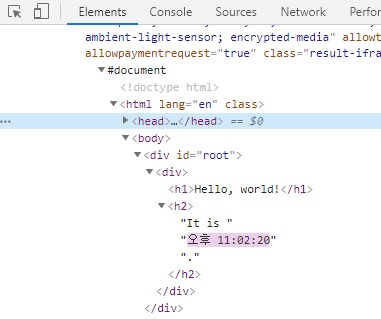

# React

## 시작하기

- [공식문서](https://ko.reactjs.org/docs/getting-started.html)
  - [실용적인 자습서](https://ko.reactjs.org/tutorial/tutorial.html)
  - [주요 개넘 가이드(문서)](https://ko.reactjs.org/docs/hello-world.html)

**Requirements**

- npm 5.2.0 이상 버전이 있다면 `npx` 명령어를 사용해 react app을 생성할 수 있다.
- `npx`는 package runner tool이다.

1. React app 생성하기

   ```bash
   $ npx create-react-app <appName>
   ```

2. 해당 app 실행하기

   ```bash
   $ cd <appName>
   $ npm start
   ```

**Hello World 시작하기**

```react
ReactDOM.render(
  <h1>Hello, world!</h1>,
  document.getElementById('root')
);
```

위 코드는 페이지 헤더에 "Hello, world!"를 렌더링한다. 향후 **요소, 컴포넌트**와 같은 React 앱의 구성 블록들을 학습할 것이며, 이들을 활용해 **재사용 가능한** 조각들로 복잡한 앱을 만들 수 있다.


## JSX

```jsx
const element = <h1>Hello, world!</h1>;
```

위와 같은 태그 문법은 문자열도, HTML도 아니다. JSX라 불리는 문법으로, 자바스크립트 문법의 확장(extension)이다. React와 함께 사용하여 **UI가 어떻게 보여질지 묘사**하는데 사용하길 권장한다. 템플릿 언어와 유사해 보일 수 있지만, 자바스크립트를 기반으로 하고 있다.

JSX는 React의 "요소(element)"를 만드며, 이와 같은 [요소 렌더링]()은 하단에서 자세히 설명한다.

### 왜 JSX인가?

React는 렌더링 로직이 다른 UI 로직과 본질적으로 결합되어 있다. 예를 들어, 이벤트 핸들링이 어떻게 이루어지는지, 시간에 따라 state가 어떻게 변화하는지, 디스플레이를 위한 데이터가 어떻게 준비되는 과정이 있다.

`markup(HTML)`과 `logic(JS)`을 별도의 파일로 두어 `기술`을 인위적으로 분리하는 대신에, 둘 다 포함하는 `컴포넌트`라고 불리는 느슨하게 연결된 유닛으로 `관심사`를 분리한다. ([참고영상](https://www.youtube.com/watch?v=x7cQ3mrcKaY))

React는 JSX의 사용을 강제하진 않는다. 하지만 다수의 사람들이 자바스크립트 코드 안에서 UI를 작업할 때 시각적으로 더 도움이 된다고 여긴다. 또한 React가 도움이 되는 에러 및 경고 메세지를 표시해주는 것 또한 가능하다.

### JSX에 표현식(expression) 포함하기

JSX 안에 자바스크립트 표현식을 `중괄호`로 묶어서 포함시킬 수 있다. 아래는 그 예시이다. 자동 세미콜론 삽입을 방지하기 위해 마크업을 괄호로 감싸주는 것이 좋다.

```jsx
function formatName(user) {
  return user.firstName + ' ' + user.lastName;
}

const user = {
  firstName: 'Harper',
  lastName: 'Perez'
};

const element = (
  <h1>
    Hello, {formatName(user)}! <!-- 여기! -->
  </h1>
);

ReactDOM.render(
  element,
  document.getElementById('root')
);
```

### JSX 또한 표현식이다.

컴파일 이후, JSX 표현식은 정규 자바스크립트 함수 호출이 되며, 자바스크립트 객체로 인식된다. 즉, `if`문이나 `for`문 내에서 JSX를 사용할 수 있으며, 변수에 할당하거나 매개 변수로 전달하거나 함수에서 반환할 수 있음을 의미한다.

```jsx
function getGreeting(user) {
  if (user) {
    return <h1>Hello, {formatName(user)}!</h1>;
  }
  return <h1>Hello, Stranger.</h1>;
}
```

### JSX 속성 정의

속성에 `따옴표`를 이용해 문자열 리터럴을 정의할 수 있다.

```jsx
const element = <div tabIndex="0"></div>;
```

속성에 `중괄호`를 이용해 자바스크립트 표현식을 포함시킬 수 있다.

```jsx
const element = </img>
```

이 때, `따옴표` 혹은 `중괄호` 중 하나를 사용해야 하며, 둘 다 같은 속성에 사용할 수 있는게 아니다.

> JSX는 HTML보다는 자바스크립트에 가깝기 때문에, React DOM은 HTML 속성 이름 대신 `camelCase` 속성 이름 컨벤션을 사용한다.
>
> 예를 들어, JSX에서 `class`는 `className`이 되며, `tabindex`는 `tabIndex`가 된다.

### JSX 자식 정의

만약 태그가 비어있다면, XML처럼 `/>`를 이용해 닫아줘야 한다.

```jsx
const element = 
```

JSX 태그는 자식을 가질 수 있다.

```jsx
const element = (
  <div>
    <h1>Hello!</h1>
    <h2>Good to see you here.</h2>
  </div>
);
```

### 인젝션 공격 예방

유저 입력값을 삽입해도 안전하다.

```jsx
const title = response.potentiallyMaliciousInput;
// This is safe:
const element = <h1>{title}</h1>;
```

React DOM은 렌더링 되기 전에 JSX 내에 포함된 모든 값을 [`이스케이프`](https://stackoverflow.com/questions/7381974/which-characters-need-to-be-escaped-in-html)한다. 따라서 어플리케이션 내에서 명시적으로 작성되지 않은 내용은 절대 삽입할 수 없다. 모든 것이 렌더링 되기 이전에 문자열로 변환되므로, XSS(cross-site-scripting) 공격을 막을 수 있다.

### JSX 객체 표현

Babel은 JSX를 `React.createElement()` 호출로 컴파일한다. 아래 두 예제는 동일한 코드다.

```jsx
const element = (
  <h1 className="greeting">
    Hello, world!
  </h1>
);
```

```jsx
const element = React.createElement(
  'h1',
  {className: 'greeting'},
  'Hello, world!'
);
```

`React.createElement()`는 버그 없는 코드를 작성할 수 있도록 몇 가지 확인과정을 거쳐주지만, 기본적으로는 아래와 같은 객체를 생성한다.

```jsx
// Note: this structure is simplified
const element = {
  type: 'h1',
  props: {
    className: 'greeting',
    children: 'Hello, world'
  }
};
```

이 객체는 "React elements"라고 불리우며, 화면에서 보여지는 내용에 대한 설명이라 생각할 수 있다. React는 **이 객체를 읽어들이고 이를 사용하여 DOM을 구성하고 최신 상태로 유지한다.**

> ES6 및 JSX 코드가 올바르게 표시되도록 편집기에서 "Babel" 언어 설정을 사용하는 것이 좋다.
>
> [참고링크](https://babeljs.io/docs/en/editors/)
>
> **Babel이 뭐지??**
>
> - 자바스크립트 컴파일러
> - JSX 문법을 해석할 수 있다.


## 엘리먼트 렌더링

> 엘리먼트는 React 앱의 가장 작은 단위이며, 화면에 표시할 내용을 기술한다.

```react
const element = <h1>Hello, world</h1>;
```

브라우저의 DOM 엘리먼트와 달리 React 엘레먼트는 일반 객체이며(plain object) 쉽게 생성할 수 있다. React DOM은 React 엘리먼트와 일치하도록 DOM을 업데이트한다.

> "컴퍼넌트"개념과 "엘리먼트"개념을 혼동할 수 있다.  엘리먼트는 **컴퍼넌트의 구성 요소**이므로, 컴퍼넌트에 대한 자세한 설명은 후술한다.

### DOM에 엘리먼트 렌더링하기

HTML 파일 어딘가에 `<div>` 태그가 있다고 가정한 뒤 아래 코드를 본다.

```html
<div id="root">
    
</div>
```

이 안에 들어가는 모든 엘리먼트를 React DOM에서 관리하게 되므로, 이 `<div>` 태그를 "Root DOM Node"라고 부른다. 

React로 구현된 애플리케이션은 일반적으로 하나의 루트 DOM 노드가 있다. 단, 기존 앱에 React를 통합하려는 경우 많은 수의 독립된 루트 DOM 노드가 존재할 수 있다.

React 엘리먼트를 root DOM 노드로 렌더링하고자 한다면, 아래와 같이 둘 다 `ReactDOM.render()`로 전달하면 된다.

```react
const element = <h1>Hello, world</h1>;
ReactDOM.render(element, document.getElementById('root'));
```

### 렌더링 된 엘리먼트 업데이트하기

React 엘리먼트는 `immutable`하다. 즉, 엘리먼트가 생성된 뒤 해당 엘리먼트의 자식이나 속성을 변경할 수 없다. 엘리먼트는 영화에서 하나의 프레임과 같이 특정 시점의 UI를 보여준다.

UI를 업데이트하기 위해서는 새로운 엘리먼트를 생성하고 `ReactDOM.render()`로 전달해주는 방법이 있다. 아래는 그 예시로, 시간을 알려주는 시계다. ([codepen에서 실행하기](https://ko.reactjs.org/redirect-to-codepen/rendering-elements/update-rendered-element))

```react
function tick() {
    const element = (
    <div>
        <h1>Hello, world!</h1>
        <h2>It is {new Date().toLocaleTimeString()}.</h2>
    </div>
    );
    ReactDOM.render(element, document.getElementById('root'));
}

setInterval(tick, 1000);
```

위 함수는 `setInterval()`콜백을 이용해 매 초(1000ms)마다 `ReactDOM.render()`를 호출한다.

> 실제 대부분의 React 앱은 `ReactDOM.render()`를 한 번만 호출한다. 그러한 코드들이 어떻게 stateful 컴포넌트로 캡슐화 되는지는 후술한다.

### 변경된 부분만 업데이트하기

React DOM은 해당 엘리먼트와 그 자식 엘리먼트를 이전의 엘리먼트와 비교하고 DOM을 원하는 상태로 만드는데 필요한 경우에만 DOM을 업데이트한다.



위의 예제 코드를 개발자 도구로 확인해보면, 매초 전체 UI가 다시 그려지도록 엘리먼트가 만들어졌지만 React DOM은 내용이 변경된 텍스트 노드만 업데이트한다.