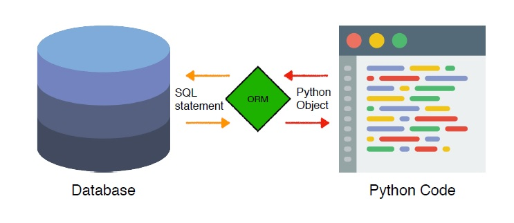

# DB basic (190819)

### django에서 객체를 활용하여 데이터를 저장하기 (비영구적)

```python
#[BLOG] > [articles] > views.py
from datetime import datetime

blogs = []

class Article:
    def __init__(self, title, content, created_at):
        self.title = title
        self.content = content
        self.created_at = created_at

    def __str__(self):
        return f'제목:{self.title} 내용:{self.content} 작성시간:{self.created_at}'
    
def new(requests):
    return render(requests,'new.html')

def create(requests):
    title = requests.GET.get('title')
    content = requests.GET.get('content')
    created_at = datetime.now
    blogs.append(Article(title, content, created_at))
    context = {
        'title': title,
        'content': content,
        'created_at': created_at
    }
    return render(requests,'create.html', context)
    
def index(requests):
    context = {
        'blogs': blogs,
    }
    return render(requests, 'index.html', context)
```

```html
<!--[BLOG] > [articles] > [templates] > index.html-->
<body>
  <h1>당신이 여지껏 작성한 내용들입니다.</h1>
  <hr>
  
    제목: {{item.title}} <br>
    내용: {{item.content}} <br>
    작성시간: {{item.created_at}}

    <br>
    {{item}}
    <hr>
  
</body>
```


#### 영구적인 데이터 저장을 위해 DB를 활용할 필요가 있다.

- 자료의 구조화 (체계화된 형태로 자료를 관리)
- 현재 지배적인 DB는 RDBMS


## RDBMS

- 엑셀과 같이, 행과 열로 이루어진 데이터 구조
- 대표적으로 MySQL, SQLite, PostgreSQL, ORACLE, MS SQL
- Django는 기본적으로 SQLite를 사용. 


### 용어 정리

##### 스키마(scheme) 

- 데이터베이스에서 자료의 구조, 표현방법, 관계등을 정의한 구조

##### 테이블(Table)

- **열(컬럼/필드)**과 **행(레코드/값)**의 모델을 사용해 조직된 데이터 요소들의 집합. (SQL DB에서는 테이블을 관계 라고도 한다.)

##### 기본키(Primary Key)

- 각 행의 고유값으로, 반드시 설정되어야 한다. ex) 한국사람의 기본키는 주민등록번호


### SQL (Structured Query Language)

- RDBMS의 데이터를 관리하기 위해 설계된 **특수 목적의 프로그래밍 언어**

#### 데이터와 관련된 모든 operation은 C.R.U.D로 정리된다. 

- READ: SELECT
- CREATE: INSERT INTO
- UPDATE: UPDATE
- DELETE: DELETE


## ORM (Object - Relational Mapping)

- 파이썬 코드를 통해 데이터를 조작하자.
- DB를 직접 다루지 않고, ORM을 통해서 SQL문이 생성되어 데이터를 조작하게 된다.



- 호환되지 않는 유형의 시스템간에 (Django-SQL) 데이터를 변환하는 프로그래밍 기술. 프로그래밍 언어에서 사용할 수 있는 '가상 데이터베이스'를 만들어 사용한다.
- 데이터베이스에 최적화된 SQL 코드를 자동적으로 생성해준다. (JAVA, ruby 모두 ORM 존재)


1. [app 폴더] > models.py 내에 데이터 구조를 정의하면 Django ORM에 의해 SQLite와 자동으로 연동될 것이다.

```python
#models.py
from django.db import models

# Create your models here.
class Article(models.Model):
    #각각의 컬럼들이 어떤 값을 가지는지를 상세하게 알려준다.
    title = models.TextField() #제목
    content = models.TextField() #내용
    created_at = models.DateTimeField(auto_now_add=True) #작성시간
```


2. [app폴더] > migrations > 상세 설계도 생성 (우리가 다룰 article이라고 하는 테이블은 이렇게 생겼을 거야~)

```shell
$ python manage.py makemigrations
```

3. 설계도를 이식시킨다.

```shell
$ python manage.py migrate
```


SQLite viwer를 사용해 데이터베이스 내용을 확인할 수 있다.

- https://inloop.github.io/sqlite-viewer/


#### Column 추가하기

1. models.py 수정

   ```python
   from django.db import models
   
   # Create your models here.
   class Article(models.Model):
       #각각의 컬럼들이 어떤 값을 가지는지를 상세하게 알려준다.
       title = models.TextField() #제목
       content = models.TextField() #내용
       created_at = models.DateTimeField(auto_now_add=True) #작성시간
       image_url = models.TextField()
   ```

2. 기존에 있던 데이터들은 새로 추가되는 열에 대해 어떻게 반응할 것인지 결정 (default로 NULL 값을 너어줌)

   ```shell
   $ python manage.py makemigrations
   ```

   1, exit 입력 -> NULL 입력

   1, '' 입력 -> 빈 string 입력

3. [migrations] > 추가된 column에 대한 설계도 생성됨 (데이터베이스가 어떻게 변경되어 왔는지도 확인 가능)

4. 설계도 적용

   ```shell
   $ python manage.py migrate
   ```


(추가) 설계도가 sql문으로 어떻게 바뀔지도 확인 가능하다.

```shell
$ python manage.py sqlmigrate articles 0001
$ python manage.py sqlmigrate articles 0002
```


#### 데이터 다루기

manage.py에 Article class import 시키고, 데이터 다루기

```bash
$ python manage.py shell
>>> from articles.models import Article
```

- Article에 들어간 object 전부 가져오기

  ```bash
  >>> Article.objects.all()
  ```

- Article 객체 만들기 (새로운 데이터를 생성)

  ```bash
  >>> article = Article()
  ```

- 데이터 넣기

  ```bash
  >>> article.title = "첫번째 글입니다."
  >>> article.content = "이건 내용입니다."
  ```

- 데이터 저장 (DB에 들어가게 되어 조회가 가능해짐)

  ```bash
  >>> article.save()
  ```

- 데이터 불러오기 (list와 비슷한 queryset 리턴)

  ```bash
  >>> Article.objects.all()
  ```

- 데이터 갯수 확인, 0번째 인덱스 접근

  ```bash
  >>> len(Article.objects.all())
  >>> Article.objects.all()[0]
  ```

- 데이터 불러오기2

  ```bash
  >>> first_article = Article.objects.first()
  >>> first_article.title
  >>> first_article.content
  >>> first_article.image_url
  >>> first_article.created_at #저장된 값이 없을 경우, 자동으로 현재 시간을 리턴하도록 위에 지정되어 있음. (models.py 참조)
  ```

- 객체 만들기2 & 저장

  ```bash
  article_two = Article(title="두번째글", content="이건 생성자로 만든 데이터")
  article_two.save()
  ```

- models.py에 `__str__`를 정의하여 출력 형태를 바꿀 수 있다.

  ```python
  from django.db import models
  
  # Create your models here.
  class Article(models.Model):
      #각각의 컬럼들이 어떤 값을 가지는지를 상세하게 알려준다.
      title = models.TextField() #제목
      content = models.TextField() #내용
      created_at = models.DateTimeField(auto_now_add=True) #작성시간
      image_url = models.TextField()
  
      def __str__(self):
          return f'{self.id} | {self.title}'
  ```

  

views.py 에서 데이터 다루기

```python
#views.py
from django.shortcuts import render
from .models import Article
#중략
def index(requests):
    
    articles = Article.objects.all()

    context = {
        'articles': articles,
    }
    return render(requests, 'index.html', context)
```

```html
<!--index.html-->
<body>
  <h1>당신이 여지껏 작성한 내용들입니다.</h1>
  <hr>
  
    제목: {{article.title}} <br>
    내용: {{article.content}} <br>
     <br>
    작성시간: {{article.created_at}}
    <hr>
  
</body>
```


create()의 결과를 index.html(root)로 redirect 하기

```python
#views.py
def create(requests):
    title = requests.GET.get('title')
    content = requests.GET.get('content')
    img_url = requests.GET.get('img_url')

    #DB에 저장하기
    article = Article()
    article.title = title
    article.content = content
    article.img_url = img_url
    article.save()

    return redirect('index') #index라는 이름의 페이지로 보내라...

#[blog] > urls.py (main)
urlpatterns = [
    path('admin/', admin.site.urls),
    path('articles/', include('articles.urls')),
    path('', views.index, name='index')
]
```


#### admin 계정 만들기

```shell
python manage.py createsuperuser
```

http://localhost:8000/admin/ 이동

우리가 만든 Article 등록해주기 (admin에서 쓰기 위해서는 등록해줘야 함)

[articles] > admin.py

```python
#admin.py
from django.contrib import admin
from .models import Article

# Register your models here.
admin.site.register(Article)
```

