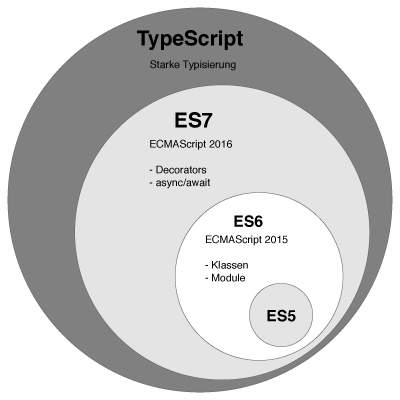

# Typescript

*다음 [링크1](https://mygumi.tistory.com/210), [링크2](https://typescript-kr.github.io/)의 글을 참고하여 정리한 내용입니다.*

MS에서 만든 JavaScript의 상위 언어(JS의 Superset). JS를 대체하는 것이 목적이 아니라, 보완하는 것이 목적. JS는 동적 타입인 반면, TS는 정적 타입을 지원한다.

Typescript를 쓰는 이유 3가지

1. 타입 체크
   - TDD를 이용하는 편이 효율적일 수도 있다.
2. OOP(확장성, 편리성, 생산성 Up)
3. Third-party 개발 시 유용성 (선언 파일 d.ts을 통해)

