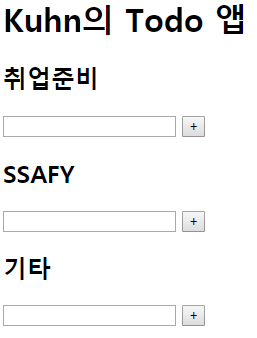

**Vue 인스턴스**

```javascript
const app = new Vue({
    //Vue 인스턴스 (=ViewModel)가 어떤 HTML 요소에 마운트될지(적용될지)
    el: '#app',
    
    //Vue 인스턴스가 사용할 data
    data: {
        자료이름(identifier): 값
    },
    	
    //Vue 인스턴스가 사용할 메소드들
    methods: {
        함수정의: {}
    }
    
    //'미리' 계산된 값을 반환 -> 캐싱. 성능상의 이슈때문에 쓰는 경우가 많음.
    computed: {}
                    
    //Vue 인스턴스의 data 변경을 관찰하고 이에 반응
    watch: {
    	지켜볼 data: {
        	handler 메소드 정의 -> 지켜볼 data가 변경되었을 때 실행할 함수            
        }                
    }
})
```


**Vue Directive**

```html
<p v-for></p>

<p v-if v-else v-else-if></p>

<p v-model></p>

<p v-on:이벤트></p> <p @이벤트></p>

<p v-bind:속성=값></p> <p :속성=값></p>

<p v-html></p>

<p v-text></p>

<p v-shows></p>
```


앞서 했던 `00_vue_start.html`의 vue 인스턴스에 아래와 같은 `computed` 함수를 추가한다. Input으로 들어오는 값의 역순 문자열을 캐싱하게 된다.

```javascript
computed: {
    reverseNewTodo() {
        return this.newTodo.split('').reverse().join('')
    }
}
```

```html
...
<p>{{ reverseNewTodo }}</p>
```

이전에 작성한 `todoByStatus()`함수도 `computed`로 옮길 예정이다. 원본 데이터를 바꾸지 않고, 필터링만 하는 행위는 매번 함수가 불러질 때마다 계산할 필요가 없다. 저장된 **값**을 불러오는 것이기 때문에, 호출할 때 `()`를 붙여주지 않는다.

`methods`에 정의된 함수는 호출이 반복적으로 이루어짐. 이를 `computed`로 만들어 두면, 한 번 계산된 것을 반복적으로 할 필요가 없다.


현재 시간을 호출해주는 함수를 `methods`와 `computed` 두 가지 방식으로 부른 다음 토글링을 할 경우, `method`로 부른 값은 계속 재호출되는 반면, `computed`값은 변화가 발생하지 않는다.

```html
<div id="app">
    <button @click="visible = !visible">method는 재호출, computed는 저장된 값</button>
    <ul v-if="visible">
        <li>method로 불렸을때: {{ dateMethod() }}</li>
        <li>computed로 불렸을때: {{ dateComputed }}</li>
    </ul>
</div>

<script src='https://cdn.jsdelivr.net/npm/vue/dist/vue.js'></script>
<script>
    const app = new Vue({
        el: '#app',
        data: {
            visible: true,
        },
        methods: {
            dateMethod() {
                return new Date() //현재 시간 리턴(method)
            }
        },
        computed: {
            dateComputed() {
                return new Date() //현재 시간 리턴(computed)
            }
        }
    })
</script>
```


## Local Storage(Browser)

개발자도구 > Application

Chrome browser의 local storage(key-value)를 사용해 데이터를 지속시켜보자.

브라우저가 켜져있는 동안 지속되는 데이터는 session storage에 저장 (ex. 로그인 정보)

브라우저가 꺼져도 지속되는 데이터는 local storage에 저장


**localStorage API**

```javascript
// creation
localStorage.setItem('key', 'value')

// read
localStorage.getItem('key')

// delete
localStorage.removeItem('key')

// count
localStorage.length
```

`localStorage`는 string값만 입력 가능하기 때문에, 아래와같이 todos라는 오브젝트 배열을 value로 넣기 위해서는 `stringify`해줘야한다.

```javascript
todos = [
    {id: 1, content: '첫번째 투두', completed: false}
]

localStorage.setItem('vue-todos', JSON.stringify(todos))
```


`00_vue_start.html`에 localStorage 적용하기 위해 저장소 객체와 함수를 선언.

```javascript
// chrome localStorage
const STORAGE_KEY = 'vue-todos'
const todoStorage = {
    fetch() {
        //string형태로 리턴된 값을 JSON형태로 파싱 해줘야 한다.
        return JSON.parse(localStorage.getItem(STORAGE_KEY))
    },
    save(todos) {
        // localStorage에 데이터를 저장. JSON을 string형태로 바꿔서 넣는다.
        return localStorage.setItem(STORAGE_KEY, JSON.stringify(todos))
    },
}
```

그럼, 우리가 만든 앱에서 *어느 순간에 `save`동작을 하는게 좋을까?*

- 여기서 등장한게 vue 객체의 `watch`: localStorage를 수정해야하는 시점을 정의해준다.

  ```javascript
  watch: {
      todos: { //todos를 지켜봐... 그러다가 변경되면 handler()실행
          handler(todos) { //handler() 메소드 이름 지켜줘야 한다.
              // todos가 변경될 때마다 localStorage에 save()
              todoStorage.save(todos)
          },
          deep: true, //한 단만 복사하지 말고,끝까지 넣어주렴(python의 deepcopy 개념)
      }
  }
  ```

- 다시 로드하는 시점에, 저장된 값들을 fetch하도록 하자

  ```javascript
  const app = new Vue({
      el: '#app',
      data: {
          todos: todoStorage.fetch(),
          ...
  ```

  저장된 값이 아무것도 없을 때에는 적어도 빈 array가 들어가 있도록 error handling을 해줘야 한다.

  ```javascript
  // chrome localStorage
  const STORAGE_KEY = 'vue-todos'
  const todoStorage = {
      fetch() {
          //string형태로 리턴된 값을 JSON형태로 파싱 해줘야 한다.
          return JSON.parse(localStorage.getItem(STORAGE_KEY)) || [] 
          //or 연산으로 if-else문 생략
      },
      save(todos) {
          // localStorage에 데이터를 저장. JSON을 string형태로 바꿔서 넣는다.
          return localStorage.setItem(STORAGE_KEY, JSON.stringify(todos))
      },
  }
  ```

  

## 컴퍼넌트

재사용성 향상. 반복적인 요소를 모듈화

지금까지 단일 컴퍼넌트(vue 객체를 하나만 마들어서)로 해온 것

이제는 부모 컴퍼넌트를 만든 뒤, 여기저기 상속받아서 사용하자.


**컴퍼넌트 등록**

```html
<script>
    //Vue에게 component를 등록. component(컴퍼넌트 이름, {컴퍼넌트 속성}))
    Vue.component('todo-list', {}) 
</script>
```

컴퍼넌트의 속성 중 `template`을 통해 html 코드를 삽입할 수 있다. (양 끝에 `div` 태그 달아야 독립적으로 사용 가능하다.)

```html
<div id="app">
    <h1>Kuhn의 Todo 앱</h1>
    <todo-list></todo-list>
    <todo-list></todo-list>
    <todo-list></todo-list>
</div>

<script src="https://cdn.jsdelivr.net/npm/vue/dist/vue.js"></script>
<script>
    //Vue에게 component를 등록. component(컴퍼넌트 이름, {컴퍼넌트 속성}))
    //<todo-list> 위치에 아래 템플릿을 삽입
    Vue.component('todo-list', {
        template: `
          <div>
            <input v-model="newTodo" type="text" @keyup.enter="addTodo">
            <button @click="addTodo">+</button>
            <li v-for="todo in todos" :key="todo.id">
              <span>{{ todo.content }}</span>
              <button @click="removeTodo(todo.id)">x</button>
            </li>
          </div>
    	`
    }) 
</script>

<script>
    const app = new Vue({
        el: '#app',
    })
</script>
```

컴퍼넌트 각각의 data를 관리할 수 있도록 하기 위해 컴퍼넌트 내에서 data를 함수화해서 작성한다.

```javascript
data: function(){
    return {
        todos: [],
        newTodo: '',
    }
},
```

`<todo-list>` 각각의 부모(root)는 `app`

`<todo-list>`각각에게 주어진 공간(방)은 있지만, 그 구조를 마음대로 바꿀 순 없다. 자식들이 부모로부터 어떤 데이터를 받을 때에는 `props` (부모가 모든 통제권을 가지고, 일방적인 관계)를 통해서 이루어지고, 자식이 부모에게 데이터를 전달해야 할 때에는 `$emit`을 발생시켜서 전달한다.

**props**

여러 개의 데이터를 `array`로 전달받아 쓸 수 있다. 아래 예제는 'category'라고 하는 데이터 공간을 할당해준 것이다.

```javascript
	props: ['category'], //'category' 라고 하는 방을 할당받음
    data: function(){
        return {
            todos: [],
            newTodo: '',
        }
    },
```

`template`을 통해 `category`를 출력해보자

```html
    Vue.component('todo-list', {
      template: `
      <div>
        <h2>{{ category }}</h2>
        <input v-model="newTodo" type="text" @keyup.enter="addTodo">
        <button @click="addTodo">+</button>
        <li v-for="todo in todos" :key="todo.id">
          <span>{{ todo.content }}</span>
          <button @click="removeTodo(todo.id)">x</button>
        </li>
      </div>
      `,
```

`<todo-list>`: 어? 빈 방이네? 내가 써야지~

```html
  <div id="app">
    <h1>Kuhn의 Todo 앱</h1>
    <todo-list category="취업준비"></todo-list>
    <todo-list category="SSAFY"></todo-list>
    <todo-list category="기타"></todo-list>
  </div>
```



나중에 부모가 다시 이 방을 빼앗아서 쓸 수 있다.

시스템이 복잡해지면 `<todo-list>` 안에 들어가있는 데이터가 누구 것인지 알기 어려워져

- **flux architecture의 등장**


props를 넘겨줄 때, validation을 걸어줄 수 있다. (component가 복잡해졌을 때 에러가 발생하는것을 방지하기 위해 type을 strict하게 관리하는게 좋다. 자료형을 확인하는 유효성 검사를 할 수 있다. -> 개발자를 위한 기능) 이 때, props를 `object`형태로 받아 사용할 수 도 있다.

```javascript
      props: {
        category: String,
      }
      data: function(){
        return {
          todos: [],
          newTodo: '',
        }
      },
```

- props 나타내는 방법

  ```javascript
  // 1. Array로 표현
  props: ['category']
  
  // 2. Key-value로 자료형 표현
  props: {
      category: String,
  }
  
  // 3. Object로 옵션 추가 (django의 model을 정의하는 것처럼 복잡한 구조)
  props: {
      category: {
          type: String,
          required: true, //값이 없으면 에러발생 (django의 null False 혹은 blank False)
          validator: function(value){
              if (value.length !== 0){
                  return true
              } else {
                  return false
              }
          }
      }
  }
  ```


내일 배울 것: Single File Component (파일 하나에 하나의 컴퍼넌트)

- Vue cli가 제공하는 라이브러리를 이용해서 편리하게 할 것