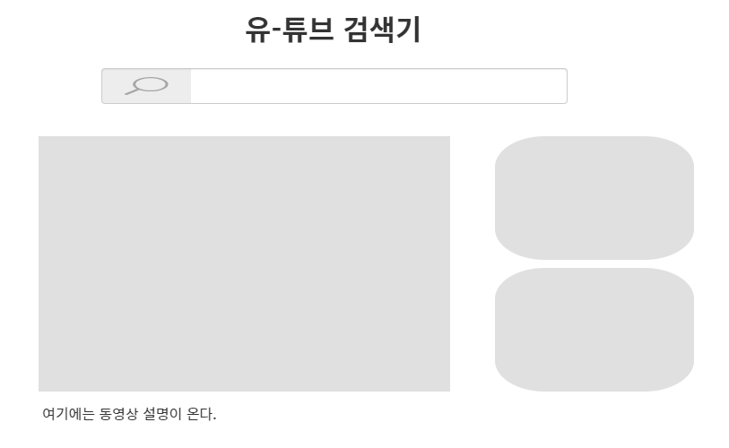

# Vue CLI

## Single File Component

한 컴퍼넌트는 하나의 파일에 (`.vue` 파일)

`Vue-cli`: 커맨드 라인에서 vue 프로젝트를 빠르게, 원할하게 만들기 위해 만들어진 프로그램

- django에서 `django-admin startproject MyProject .` 하듯이, Vue도 쉽게 만들자


**하기에 앞서서**

1. `node.js` 설치 및 버전 확인

2. `npm` 버전 확인 (`pip`같은 역할)

   - `pip` : 파이썬이 영향을 주는 모든 영역(전역)에 설치된다는 문제점 -> 가상환경 사용했었음
   - `npm` : 프로젝트별 패키지 관리가 가능하다. (글로벌&로컬(프로젝트) 단위 모두 가능)
     - Default는 프로젝트 단위 설치
     - `npm install --global` 혹은 `npm install -g` 명령어로 전역 설치 가능

3. `vue-cli` 전역에 설치 (이전엔 CDN으로 vue를 썼지만, 이제 그렇게 안해도 된다.)

   ```shell
   npm install -g @vue/cli
   ```


현재 폴더에 Vue 프로젝트 생성

```bash
vue create todo-vue-cli
```


`babel.config.js`

- IE는 Javascript Classes / Promise 기능을 지원하지 않는다. 우리가 작성한 코드를 IE 유저는 사용할 수 없다는 문제 발생. 
  - 구형 브라우저도 알아들을 수 있도록, 구형 코드로 번역해주는 번역가가 필요해짐 
  - `babel`의 등장

`package.json`

- 외부 패키지들을 `"dependencies"`에 추가하여 사용할 수 있다.

`node_modules`

- `vue-cli`가 vue 프로젝트에 필요한 여러 패키지들을(의존성) 설치해준 위치

- github에 올릴 때 불필요한 패키지들이 같이 올라가지 않도록, `.gitignore`도 제공됨
- github에서 코드를 받을 때에는, `npm install`을 통해 필요한 패키지들을 설치한 다음부터 사용해야 한다.


서버 실행하기

```shell
npm run serve
```

http://localhost:8080/ 가 default 주소


**`.Vue` 파일의 3가지 요소**

```html
<template></template>
<script></script>
<style></style>
```

ctrl shift p > preferences open settings.json에서 indent 2space로 변경

```json
{
    "workbench.startupEditor": "newUntitledFile",
    "terminal.integrated.shell.windows": "C:\\Program Files\\Git\\bin\\bash.exe",

    "[html]":{
        "editor.tabSize": 2,
        "editor.defaultFormatter": "HookyQR.beautify"
    },
    "[css]":{
        "editor.tabSize": 2
    },
    "[vue]": {
        "editor.tabsize": 2
    },
    "python.dataScience.sendSelectionToInteractiveWindow": true,
    "liveServer.settings.donotShowInfoMsg": true,
    "liveServer.settings.donotVerifyTags": true,
    "files.associations": {
        "*.html": "html"
    }
}
```

앞서 작성했었던 todolist component를 Vue 파일로 작성해보자


**자식 컴퍼넌트 (TodoList.vue)**

```html
<template>
    <div class="todo-list">
    <h2>{{ category }}</h2>
    <input v-model="newTodo" type="text" @keyup.enter="addTodo">
    <button @click="addTodo">+</button>
    <li v-for="todo in todos" :key="todo.id">
      <span>{{ todo.content }}</span>
      <button @click="removeTodo(todo.id)">x</button>
    </li>
  </div>
</template>

<script>
export default {
  props: {
    category: String,
  },
  
  data: function(){
    return {
      todos: [],
      newTodo: '',
    }
  },

  methods: {
    addTodo: function () {
      if (this.newTodo.length != 0) {
        this.todos.push({
          id: Date.now(),
          content: this.newTodo,
          completed: false,
        })
      this.newTodo = ''
      }
    },
    removeTodo: function (todoId) {
      this.todos = this.todos.filter((todo) =>{
        return todo.id !== todoId
      })
    },
  }
}
</script>

<style scoped>

</style>
```


**부모 컴퍼넌트(App.vue)**

`templates` 내 노드 최상단에 반드시 root 컴퍼넌트가 하나 있어야 병렬적으로 템플릿 사용 가능. 보통 `div` 사용

```html
<template>
  <div>
    <h1>Kuhn의 Todo 앱</h1>
    <TodoList category="취업준비" />
    <TodoList category="SSAFY" />
    <TodoList category="기타" />
  </div>
</template>
```


부모 노드에게 자식 컴퍼넌트를 지정

자식 컴퍼넌트 삽입 (`import`, `require`). 경로를 string으로 넣어야 하는 것 유의.

```javascript
import TodoList from './components/TodoList.vue'
```

TodoList 라는 이름으로 TodoList.vue를 사용할 경우, 두가지 방법으로 작성 가능하다. `TodoList: TodoList`와 `TodoList`는 동일한 코드다.  (ES6에서 추가된 문법으로, key와 value이름이 동일한 경우 이처럼 생략할 수 있다.)

```html
<script>
export default {
  components: {
    TodoList, 
    //TodoList: TodoList
  }
}
</script>
```

- 여기서 `export default`는 뭐지??


## Youtube searcher

**[Oven](https://ovenapp.io/) 혹은 Adboe XD 혹은 Sketch(mac) 로 목업 디자인 가능**



- 전체를 감싸는 App 컴퍼넌트
  - 검색창 컴퍼넌트
  - 영상&설명 컴퍼넌트
  - 우측 영상추천 리스트 컴퍼넌트
    - 개별 항목별 컴퍼넌트

위와 같은 컴퍼넌트들로 구성되도록 설계


프로젝트 생성

```shell
vue create youtube-searcher
```


vue파일 기본골격 shortcut  : vue + tab

main APP.vue 작성

```html
<template>
  <div>
    <h1>Youtube Searcher</h1>
  </div>
</template>

<script>
export default {
  name: 'App' //너의 이름은 App이야~
}
</script>

<style>
</style>
```


**컴퍼넌트 생성**

SearchBar.vue

```html
<template>
  <div>
    <input @input="onInput" type="text">
  </div>
</template>

<script>
export default {
  name: 'SearchBar',
  methods: {
    onInput(event) {
      console.log(event.target.value)
    }
  }
}
</script>

<style>

</style>
```

생성한 컴퍼넌트를 App.vue에 등록

```html
<template>
  <div>
    <h1>Youtube Searcher</h1>
    <SearchBar />
  </div>
</template>

<script>
import SearchBar from './components/SearchBar'

export default {
  name: 'App', //너의 이름은 App이야~
  components: {
    SearchBar,
  }
}
</script>
```


vue에서 console을 쓰기 위해서는 예외처리를 해주어야 함. (`package.json`에서 "eslintConfig" > "rules" > no-console: off )

```json
  "eslintConfig": {
    "root": true,
    "env": {
      "node": true
    },
    "extends": [
      "plugin:vue/essential",
      "eslint:recommended"
    ],
    "rules": {
      "no-console": "off"
    },
    "parserOptions": {
      "parser": "babel-eslint"
    }
  },
```


Vue 구조에서 데이터의 저장은 자식들 내부에 하는 것이 아니라, 누구든 접근할 수 있는 공용 공간에 저장한다.

부모는 자식에게 props를 통해 데이터를 쉽게 전달 가능. 자식이 부모에게 데이터를 저장하기 위해서는 $emit 이벤트를 발생시켜야 한다(복잡하다). (**Oberserver pattern**)

부모의 데이터를 자식이 함부로 볼 순 없어. props로 내려줬을 때에만 자식들이 볼 수 있다.

`this.$emit('이벤트이름', 보낼 데이터)`

```html
<script>
export default {
  name: 'SearchBar',
  methods: {
    onInput(event) {
      console.log(event.target.value)
      // $emit 메소드는 자식 컴포넌트 -> 부모 컴포넌트로 data를 올려줄때,
      this.$emit('inputChange', event.target.value)
    },
  }
}
</script>
```

inputChange 이벤트가 발생했을 때, OnInputChange 함수를 호출하도록 App.vue 수정. 자식이 전달한 데이터를 부모가 사용할 수 있게된다.

```html
<template>
  <div>
    <h1>Youtube Searcher</h1>
    <SearchBar @inputChange="OnInputChange" />
  </div>
</template>

<script>
import SearchBar from './components/SearchBar'

export default {
  name: 'App', //너의 이름은 App이야~
  components: {
    SearchBar,
  },
  methods: {
    OnInputChange(inputValue) { //자식이 emit한 데이터가 전달됨
      console.log(inputValue)
    }
  }
}
</script>
```

구글 youtube api를사용한다. [문서](https://developers.google.com/youtube/v3/docs/search?hl=ko) 

요청/응답을 위해 axios 설치

```shell
npm install axios
```

App.vue에 axios 추가

```html
<script>
import axios from 'axios' // const axios = require('axios') 와 동일한 문법
</script>
```

API_KEY는 `.env.local`에 잘 숨겨두자

```
VUE_APP_YOUTUBE_API_KEY=...
```

App.vue에서 API_KEY를 가져오자

```javascript
const API_KEY = process.env.VUE_APP_YOUTUBE_API_KEY
```

입력창에 값이 입력될 때마다 App.vue의 OnInputChange에서 request 전달.

axios는 object 형태로 parameter들을 api url로 넘겨줄 수 있어. 이 때 axios.get 함수는 promise 객체를 리턴함을 기억하자. 

```javascript
methods: {

    OnInputChange(inputValue) {
      console.log(inputValue)
      axios.get(API_URL, {
        params: {
          key: API_KEY,
          type: 'video',
          part: 'snippet',
          q: inputValue,
        }
      }).then(res => {
        console.log(res)
        // console.log(res.data.items)
      })
    } //end of OnInputChange
    
}
```


작동 Flow

1. onInputChange 메서드 호출
2. Youtube API 요청
3. Youtube 응답 받고
4. Youtube Response 비디오 리스트 App Component의 data로 저장
5. data가 업데이트되면, 컴퍼넌트가 템플릿을 다시 렌더링을 함 (Vue가 해줌)
6. VideoList에서 변경된 결과를 보여줌


비디오 리스트 출력을 위한 컴포넌트 `VideoList.vue` 생성

App Component 내에서 비디오 리스트 저장

```javascript
OnInputChange(inputValue) {
    console.log(inputValue)
    axios.get(API_URL, {
        params: {
            key: API_KEY,
            type: 'video',
            part: 'snippet',
            q: inputValue,
        }
    }).then(res => {
        this.videos = res.data.items //저장
    })
} //end of OnInputChange
```

`videos` data를 `videos`라는 이름에 bind시키자. (부모(App)가 자식(VideoList)에게 자료를 내려보내줌)

```html
<template>
  <div>
    <h1>Youtube Searcher</h1>
    <SearchBar @inputChange="OnInputChange" />
    <VideoList :videos="videos"/>
  </div>
</template>
```

이 데이터는 자식의 props 안에서 확인 가능하다.

```html
<script>
export default {
  name: 'VideoList',
  props: {
    'videos': Array,
  }
}
</script>
```

props를 통해 받은 데이터는 마치 자신의 데이터인 마냥 `template`에서 사용 가능하다.

```html
<template>
<div>
  <h2>VideoList</h2>
  <ul>
    {{ videos[0].snippet.thumbnails.default.url }}
  </ul>
</div>
</template>
```


---

(11/18 추가)

axios를 쓸 때에는 아래와 같이 `catch`구문을 통해 error를 핸들링 해주는게 좋다.

```javascript
axios.get(API_URL, {
    params: {
        key: API_KEY,
        type: 'video',
        part: 'snippet',
        q: inputValue,
    }
}).then(res => {
    this.videos = res.data.items
}).catch(err => { // error handling
    console.log(err)
})
```


현재 component에만 적용되는 `style` 태그를 정의하고 싶을 경우. `scoped` 키워드를 사용한다.

> `SearchBar.vue`의 `style` 태그
>
> ```html
> <template>
>   <div class="bg-color-search-bar">
>     <input @change="onInput" type="text">
>   </div>
> </template>
> 
> ...
> 
> <style scoped>
>   .div {
>     background-color: bisque;
>   }
> </style>
> ```
>
> 현재 컴퍼넌트의 `div`태그에만 영향을 주는 `style`태그.


`VideoList`를 구성하는 `VideoListItem` component 정의. (`VideoList` 컴포넌트의 자식)

`VideoList`로부터 props를 통해 `video`를 전달받는다.

```javascript
export default {
  name: 'VideoListItem',
  props: {
    video: {
      type: Object,
      required: true,
    }
  },
}
```

`VideoListItem`의 `template`은 `img`태그를 갖는다.

```html
<template>
  <div>
    
  </div>
</template>
```

`VideoList`의 `template`은 `video-list-time` 컴퍼넌트를 불러와 출력한다.

```html
<video-list-item v-for="video in videos" :video="video" :key="video.id.videoId">

</video-list-item>
```


선택한 영화의 상세보기를 위한 `VideoDetail` 컴포넌트 정의. (`App` 컴포넌트의 자식)

`App` 컴포넌트의 template에서 `VideoDetail` 컴포넌트 등록 및 호출

```html
<template>
  <div class="bg-app">
	...
    <VideoDetail/>
	...
  </div>
</template>

<script>
...
import VideoDetail from './components/VideoDetail'

export default {
  name: 'App', //너의 이름은 App이야~
  components: {
    SearchBar,
    VideoList,
    VideoDetail,
  }, //end of components
```

`VideoListItem` 컴포넌트를 클릭 시 `VideoDetail` 컴포넌트에서 변화가 발생해야 함.

(`VideoListItem` > `VideoList` > `App` > `VideoDetail` 순으로 데이터가 전달되어야 한다.)

`VideoListItem`을 다음과 같이 수정하여 선택한 `video`의 데이터를 부모에게 전달한다.

```html
<template>
  <div>
    <li @click="onSelect">
      
    </li>
  </div>
</template>
...
<script>
...
  methods: {
    onSelect() {
      this.$emit('videoSelect', this.video) //선택된 데이터를 부모에게 전달
    }
  }
...
</script>
```

`videoSelect`라는 이벤트를 부모 컴포넌트인 `VideoList`에서 받은 뒤, 이 데이터를 다시 `App`에게 전달.

```html
<video-list-item v-for="video in videos" :video="video" :key="video.id.videoId" @videoSelect="onVideoSelect"/>

..

<script>
    methods: {
        onVideoSelect(video) {
            this.$emit('onVideoSelect', video)
        }
    }
</script>
```

`App` 컴포넌트에서 `video`를 전달받은 뒤, binding(props)을 사용해 자식인 `VideoDetail` 컴포넌트에게 전달.

```html
...
    <VideoDetail :video="selectedVideo"/>
    <VideoList v-bind:videos="videos" @selectedVideo="renderVideo"/>
...
```

```javascript
renderVideo(video){
    console.log(video)
    this.selectedVideo = video
}, //end of renderVideo
```

`VideoDetail`에서는 전달받은 video의 id를 사용해, `iframe` 태그 안에 넣어 출력한다. 이 때, url값을 반환해주는 `computed` 함수를 사용하여 연산을 효율적으로 한다.

```html
<template>
  <div class="bg-detail">
    <h2>Video Detail</h2>
    <iframe :src="iframeURL" frameborder="0"></iframe>
    <h3>상세내용</h3>
    <p>{{ video.snippet.description }}</p>
  </div>
</template>

<script>
export default {
  name: 'VideoDetail',
  props: {
    video: {
      type: Object,
    },
  },
  computed: {
    iframeURL() {
      const videoId = this.video.id.videoId
      return `https://www.youtube.com/embed/${videoId}`
    },
  },
}
</script>
```

