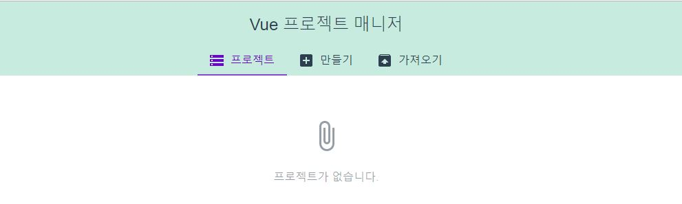
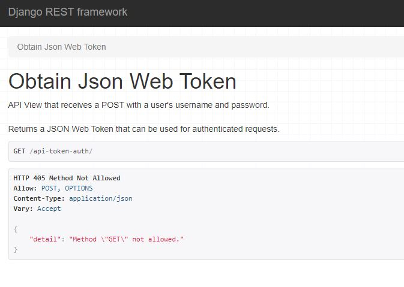

# Vue & DRF

**등장 키워드**

- Vue router
- Vuex
- JWT
- DRF


Vuejs 서버가 들어갈 `todo-front`, backend 서버가 들어갈 `todo-back` 폴더를 생성

```bash
vue create todo-front
mkdir todo-back
```

`todo-front`에 들어간 다음, `vue ui`를 콘솔창에 입력시 아래와 같은 창을 볼 수 있다.



[가져오기]에서 플러그인, 의존성 등을 확인할 수 있다. 플러그인에서 `vue router`와 `vuex`를 추가한다. (`npm install vue-router`를 콘솔에 입력해 수동으로 설치할 수도 있다.)

이후 `todo-front` > `src` > `router` > `index.js` 파일을 확인해보면, Django의 `urlpatterns`와 동일한 역할을 하는 파일이 생성되었음을 알 수 있다. 

왜 이런 기능을 추가하는 걸까? **SPA의 약점** 때문.

1. History

   SPA는 우리가 한 행위들(History, `window.history`로 확인 가능)에 대한 tracking이 안돼, "뒤로가기" 버튼을 누르면 아예 페이지를 나가버리는 수가 있어. (이전에 만든 Youtube Searcher에서 이전 검색결과를 다시 보고싶을 때, 뒤로가기를 누르면 아예 페이지를 나가버리게 되어버렸다.) 뒤로가기 버튼은 `window.history.back()`과 동일한 동작을 수행하는데, SPA에서는 이거를 못쓴다.

2. SEO (Search Engine Optimization)

   검색엔진은 주기적으로 `spyder`를 사용해 정보를 크롤링해놓음. 검색이 발생하면 해당하는 내용을 데이터베이스에서 불러와 출력. (+ Pagerank와 같은 알고리즘 적용)

   SEO는 기본적으로 HTML이 갖고있는 컨텐츠를 통해 결정된다. (구글에 `멀티캠퍼스` 검색결과와 `패스트캠퍼스` 검색결과 차이를 비교해보자)

   But, SPA를 할 경우 spyder가 접속하는 index.html에 페이지에 대한 정보가 담겨있지 않아 크롤링되지 않았다. (Vue의 컴포넌트들은 나중에 불러와져서 렌더링되기 때문에)

   - (ha)sh bang (쉬뱅)을 활용해서 history를 저장하는 개념 등장 -> 구림
   - javascript router 등장 (ex. Vue router)


아래 명령어를 통해 vue 프로젝트에 router를 추가할 수 있다.

```shell
vue add router
```


`router` > `index.js` 둘러보기

- `export default`는 js 문법. 다른 파일(위치)에서 쓰고 싶은 객체가 있을 경우, 명시하면 된다.

- `main.js`에 `router`가 추가되었음을 확인 가능

- 이제 우리의 SPA에서도 뒤로가기 사용 가능


## Vue Auth

`Login.vue` 컴포넌트 생성

```html
<template>
  <h1>로그인 페이지</h1>
</template>

<script>
export default {
  
}
</script>

<style>
</style>
```

`router`>`index.js`에 login을 위한 url 지정

```javascript
...
import Login from '../views/Login.vue'

const routes = [
	...
  {
    path: '/login',
    name: 'login',
    component: Login
  }
]
```

최상위 컴포넌트인 `App`에서 `<router-link>`를 통해 링크 생성 (브라우저가 다시 로드하지 않도록 한다는 부분에서 `<a>`태그와 차이 존재. `<router-link>`는 `click` 이벤트 발생을 차단한다.) 선택한 값에 따라서, 렌더링할 위치를 정하는 태그가 `<router-view/>`

```html
<template>
  <div id="app">
    <div id="nav">
      <router-link to="/">Home</router-link> |
      <router-link to="/about">About</router-link> |
      <router-link to="/login">Login</router-link>
      <!-- <a href="/login">Login2</a> -->
    </div>
    <router-view/>
  </div>
</template>
```


### Bootstrap 붙이기

*나중에는 Vuetify 사용할 것*

[public] > `index.html`

Bootstrap의 style component만 추가할 것. JS는 충돌 가능성 있다.

```html
<link rel="stylesheet" href="https://stackpath.bootstrapcdn.com/bootstrap/4.3.1/css/bootstrap.min.css" integrity="sha384-ggOyR0iXCbMQv3Xipma34MD+dH/1fQ784/j6cY/iJTQUOhcWr7x9JvoRxT2MZw1T" crossorigin="anonymous">
```

`App.vue`에 bootstrap class 추가하기

```html
<template>
  <div id="app" class="container">
    <div id="nav">
      <router-link to="/">Home</router-link> |
      <router-link to="/login">Login</router-link>
    </div>

    <div class="row justify-content-center">
      <router-view class="col-6"/>
    </div>
  </div>
</template>
```


### views > `Home.vue` 수정

필요없는 것들 제거하자.

```html
<template>
  <div class="home">

  </div>
</template>

<script>
// @ is an alias to /src


export default {
  name: 'home',
  components: {

  }
}
</script>
```

Form 작성을 위한 컴포넌트인 `LoginForm.vue` 생성

```html
<template>
  <div>
    <div class="form-group">
      <input type="text" class="form-control" placeholder="아이디를 입력해주세요.">
    </div>
  </div>
</template>
```

이 컴포넌트를 `Login.vue`에서 받아 사용한다.

```html
<template>
  <div>
    <h1>로그인 페이지</h1>
    <LoginForm/>
  </div>
</template>

<script>
import LoginForm from '@/components/LoginForm.vue'

export default {
  name: 'Login',
  components: {
    LoginForm,
  }
}
</script>
```


*이후 로그인 과정은 추후 추가*


## Todo List

Django와 Vue를 같이 쓴 Todo List를 `Home.vue`에서 보여주자.

목록을 보여주는 `TodoList.vue`, 입력을 받는 `TodoInput.vue` 컴포넌트를 분리한 뒤 `Home.vue`의 `template`에서 출력한다.

```html
<template>
  <div class="home">
    <h1>Todo w/ Django & Vue</h1>
    <TodoInput/>
    <TodoList/>
  </div>
</template>
```

`TodoInput` 컴포넌트로부터 받은 데이터는 부모 컴포넌트인 `Home`에서 저장한다.

```javascript
export default {
  name: 'home',
  data () {
    return {
      todos: [
        {id:1, title:'Django DRF로 로그인 구현'},
        {id:2, title:'JWT 활용한 세션 구현'},
        {id:3, title:'Todo 관련 API 구현'},
        {id:4, title:'Vuex 활용한 Flux 아키텍쳐 적용'},
      ]
    }
  },
    ...
```

저장된 `todos`를 props를 통해 자식 컴포넌트인 `TodoList`에게 전달한다.

```html
<template>
  <div class="home">
	...
    <TodoList :todos="todos"/>
  </div>
</template>
```

`TodoList`에서는 props를 통해 부모인 `Home`으로부터 `todos`를 받아 출력한다.

```html
<template>
  <div class="todo-list">
    <h2>Todo 목록</h2>
    <ul v-for="todo in todos" :key="todo.id">
      <li>
        {{ todo.title }}
      </li>
    </ul>
  </div>
</template>

<script>
export default {
  name: 'TodoList',
  props: {
    todos: {
      type:Array,
    },
  },
}
</script>
```


### 데이터를 Django에 저장해보자

현재 폴더(`/drf_and_vue/todo-back`)에서 가상환경(`todo-venv`)생성 및 실행

```bash
$ python -m venv todo-venv
$ source todo-venv/Scripts/activate
```

장고 설치

```bash
$ pip install django
```

장고 프로젝트 시작(`todo-back` 폴더 내에서)

```bash
$ django-admin startproject todoback .
```

`todos` app 생성

```bash
$ python manage.py startapp todos
```

`todo-back` 폴더 git 생성 (`git init`, `.gitignore` 파일 포함 및 하단에 코드 추가)

```
# .gitignore
...
# venv
todo-venv/
```

각종 플러그인 설치 및 `settings.py`에 추가

```bash
$ pip install djangorestframework
$ pip install djangorestframework-jwt
$ pip install django-cors-headers
```

```python
INSTALLED_APPS = [
    'corsheaders',
    'rest_framework',
	...
]

MIDDLEWARE = [
    'corsheaders.middleware.CorsMiddleware',
	...
]
```

[Django restframework JWT](https://jpadilla.github.io/django-rest-framework-jwt/)(JSON web token) 를 위해, 다음과 같은 설정들도 `settings.py`에 추가해준다.

```python
REST_FRAMEWORK = {
    'DEFAULT_PERMISSION_CLASSES': (
        'rest_framework.permissions.IsAuthenticated',
    ),
    'DEFAULT_AUTHENTICATION_CLASSES': (
        'rest_framework_jwt.authentication.JSONWebTokenAuthentication',
        'rest_framework.authentication.SessionAuthentication',
        'rest_framework.authentication.BasicAuthentication',
    ),
}

JWT_AUTH = {
    'JWT_ENCODE_HANDLER':
    'rest_framework_jwt.utils.jwt_encode_handler',

    'JWT_DECODE_HANDLER':
    'rest_framework_jwt.utils.jwt_decode_handler',

    'JWT_PAYLOAD_HANDLER':
    'rest_framework_jwt.utils.jwt_payload_handler',

    'JWT_PAYLOAD_GET_USER_ID_HANDLER':
    'rest_framework_jwt.utils.jwt_get_user_id_from_payload_handler',

    'JWT_RESPONSE_PAYLOAD_HANDLER':
    'rest_framework_jwt.utils.jwt_response_payload_handler',

    'JWT_SECRET_KEY': SECRET_KEY,
    'JWT_GET_USER_SECRET_KEY': None,
    'JWT_PUBLIC_KEY': None,
    'JWT_PRIVATE_KEY': None,
    'JWT_ALGORITHM': 'HS256',
    'JWT_VERIFY': True,
    'JWT_VERIFY_EXPIRATION': True,
    'JWT_LEEWAY': 0,
    'JWT_EXPIRATION_DELTA': datetime.timedelta(seconds=300),
    'JWT_AUDIENCE': None,
    'JWT_ISSUER': None,

    'JWT_ALLOW_REFRESH': False,
    'JWT_REFRESH_EXPIRATION_DELTA': datetime.timedelta(days=7),

    'JWT_AUTH_HEADER_PREFIX': 'JWT',
    'JWT_AUTH_COOKIE': None,

}
```

Domain whitelisting을 통해, 정의된 도메인들만 통신을 허용해준다.(CORS) 예를들어, 우리의 Vue.js 서버는 우리의 Django서버로부터의 통신만 허용한다. (보안을 뛰어나게 하기 위함이 CORS의 핵심)

일단 우리는 전부 허용한 상태로 개발을 할 것이다. 아래 코드를 `settings.py`에 추가한다.

```python
CORS_ORIGIN_ALLOW_ALL = True
```


### JWT (JSON Web Token)

참고글: [링크](https://velopert.com/2389)

Django는 "session"형 인증구조였다.

- 서버 안 메모리 영역인 세션에 사용자에 관한 인증 정보가 모두 저장되어 있었다.
- 왜? HTTP는 connectionless, stateless하기 때문. 상태를 저장할 수 있는 로직을 서버상에 구축해야 했다.
- "session"을 통해 구현된 Django 서버는 "stateful" 하다.
- 장점)
  - 유저 인증을 서버를 통해서 하기 때문에 매우 빠름
  - 어떤 유저가 들어와도 구현 가능함
- 단점)
  - 서버 부하가 크다. (모든 사람의 정보를 서버에 올려놔야 한다.)
  - device의 개수가 여러개일 때, 로그인 되어있다는 상태를 share할 수 없다.
- 해결)
  - 사용자가 인증되어있는지를 서버가 판단하는게 아니라, "로그인 된 사람"이라는 정보(인증정보)를 JSON파일의 형식으로 만들어서 사람이 갖도록 한다. 요청을 할 때 이 JSON파일을 함께 전달하도록 해서 인증된 사람임을 증명하자.
    - **상태에 대한 정보를 서버가 저장할 필요가 없어진다. (다시 stateless로 돌아간다.)**
    - 인증정보가 저장되어있는 "토큰"을 클라이언트가 갖도록 한 뒤, 이 토큰을 가지고 접속을 하면 세션 조회과정을 거치지 않아도 된다. 앞으로는 **Vue가 Session을 관리할 것**.
    - 토큰을 클라이언트에게 전달하기 전, "암호화"과정 또한 필요하다. 
    - 클럽 비유: 팔찌를 가지고 있는 사람만 입구 통과 가능. (문지기가 명부를 들고있을 필요 없다.)


예시 사이트: [링크](https://jwt.io/) 

`xxxxxx.yyyyyyy.zzzzzzzzz` 형태로 구성된 token을 사용한다. 앞에서부터 순서대로 `Header`, `Payload`, `VERIFY SIGNATURE`가 저장된다. 유저에 관한 거의 모든 정보(이름, 이메일 등등)를 다 이 token 안에 넣을 수 있다.


[todoback] > `urls.py`에 아래와 같이 JWT 토큰을 내보내기 위한 url을 추가한다.

```python
from django.contrib import admin
from django.urls import path
from rest_framework.views import obtain_jwt_token

urlpatterns = [
    path('admin/', admin.site.urls),
    path('api-token-auth/', obtain_jwt_token),
]
```

[todos] >`models.py` 에 아래와 같이 User, Todo 클래스 생성

```python
from django.db import models
from django.contrib.auth.models import AbstractUser
from django.conf import settings

class User(AbstractUser):
    pass

class Todo(models.Model):
    title = models.CharField(max_length=50)
    completed = models.BooleanField(default=False)
    user = models.ForeignKey(settings.AUTH_USER_MODEL, on_delete=models.CASCADE)

    def __str__(self):
        return self.title
```

`settings.py`에 User 등록

```python
AUTH_USER_MODEL = 'todos.User'
```

migration 진행 후, admin 계정 생성 뒤 `http://localhost:8000/api-token-auth/`에 접속하면 아래와 같은 화면을 확인할 수 있다.



8000 포트에서는 Django 서버가, 8080 포트에서는 Vue 서버가 실행되는 상태.

1. Vue가 Django에게 아이디, 비밀번호 전달

   `LoginForm.vue`에서 `login()`함수 정의. axios로 DRF에게 요청을 전달한다.

   아래 코드로 axios 설치

   ```bash
   $ npm i axios
   ```

   `LoginForm.vue`

   ```javascript
   import axios from 'axios'
   
   export default {
     name: 'LoginForm',
     data() {
       return {
         credentials: {
           username: '',
           password: '',
         },
       }
     },
     methods: {
       login() {
         console.log(this.credentials)
         axios.post('http://localhost:8000/api-token-auth/', this.credentials)
       },
     },
   }
   ```

   요청에 대한 응답으로 받은 `token`값을 확인한다. (로그인 창에서 아이디, 비번을 입력해본다.)

   ```javascript
   methods: {
       login() {
           axios.post('http://localhost:8000/api-token-auth/', this.credentials)
               .then(res => {
               console.log(res.data.token)
           })
       },
   },
   ```

2. Vue에 Session 저장

   Vue Session 설치

   ```bash
   npm i vue-session
   ```

   vue session 사용 등록 (`main.js`)

   ```javascript
   import Vue from 'vue'
   import App from './App.vue'
   import router from './router'
   import store from './store'
   import VueSession from 'vue-session'
   
   Vue.config.productionTip = false
   Vue.use(VueSession)
   
   new Vue({
     router,
     store,
     render: h => h(App)
   }).$mount('#app')
   ```

   이쯤에서 한 번 commit.

   ```bash
   $ git add .
   $ git commit -m "Add login() & install vue-session"
   ```

   session을 실행하고, 토큰을 저장. 이후 `Home`으로 이동하자.

   ```javascript
   import router from '@/router'
   ...
       methods: {
           login() {
               console.log(this.credentials)
               axios.post('http://localhost:8000/api-token-auth/', this.credentials)
                   .then(res => {
                   console.log(res.data.token)
                   this.$session.start()
                   this.$session.set('jwt', res.data.token)
                   router.push('/')
               })
           },
       },
   ```

   크롬 개발자도구 > Applications > Storage > Session Storage 안에서 저장된 토큰을 확인할 수 있다.

   

### Vue Life Cycle

참고자료: [링크](https://medium.com/witinweb/vue-js-라이프사이클-이해하기-7780cdd97dd4)

로그인이 되었음을 계속 추적하고 싶어.

*Vue app이 시작하기 전*에, 로그인 되어있는 상태인지 확인하고 싶어. (화면이 나오기 전에 session에 이 사람이 있는지를 확인하자)

"생성 / 마운트 / 업데이트 / 파괴"4가지+(직전 4가지) checkpoint를 염두해 둬야 한다. 우리의 주 관심사는 '마운트'

각각의 checkpoint 혹은 직전 시점에 hook를 걸어 행위를 정의할 수 있다.

로그인 되었는지를 확인하는 함수 `loggedIn()`을 `Home.vue`에서 정의

```javascript
loggedIn() {
    this.$session.start()

    if (this.$session.set('jwt')) {
        router.push('/login')
    }
},
```

`mounted()` 되는 시점에 hook을 걸어 `loggedIn()`함수를 호출한다.

```javascript
mounted() {
    this.loggedIn()
}
```

이제 로그인된 유저가 아닐 경우 Home 창으로는 갈 수 없다.


### todos API (DRF)

[todos] > serialziers.py

```python
from rest_framework import serializers
from .models import Todo

class TodoSerialzier(serializers.ModelSerializer):
    class Meta:
        model = Todo
        fields = ('id', 'user', 'title', 'completed')
```

[todoback] > urls.py

```python
from django.contrib import admin
from django.urls import path, include
from rest_framework_jwt.views import obtain_jwt_token

urlpatterns = [
	...
    path('api/v1/', include('todos.urls'))
]
```

[todos] > urls.py

```python
from django.urls import path
from . import views

urlpatterns = [
    path('todos/', views.todo_create),
]
```

[todos] > views.py

```python
from django.shortcuts import render
from .serializers import TodoSerializer
from rest_framework.response import Response
from rest_framework.decorators import api_view

@api_view(['POST'])
def todo_create(request):
    serialzier = TodoSerializer(data=request.POST)

    if serialzier.is_valid():
        serialzier.save()
        return Response(serializer.data)
    
    return Response(status=400) #400 에러
```

post 요청시 Headers에 `Authorization` : `JWT (token값)`을 추가하면 postman을 통해 `todo` 객체를 추가할 수 있다.

