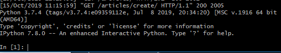

# Django Review

```python
python manage.py shell_plus
```


*이번 페이지에서는 이전에 생성한 RECAP django project를 확장한다.*


## Update, Delete 추가

delete를 위한 url을 정의한다.

```python
#urls.py
urlpatterns = [
	...
    path('<int:article_pk>/delete/', views.delete, name='delete'),
]
```

delete 동작은 get보다는 post가 안전하다.(url이 노출되지 않으니까)

```python
# views.py

# DELETE -> articles/:id/delete
def delete(request, article_pk):
    # 요청이 POST로 들어올 때만 삭제한다. GET일 경우에도 삭제하면, url을 아는 누군가에 의해 함부로 삭제될 수 있어
    article = get_object_or_404(Article, pk=article_pk)
    if request.method == 'POST':
        article.delete()
        return redirect('articles:index')
    else:
        return redirect(article)
```

```html
<!-- detail.html -->
...
  <a href="">목록보기</a>

  <form action="" method="POST">
    
    <input type="submit" value="삭제">
  </form>
...
```


**Form class를 사용한 Update 구현**

update를 위한 url 정의

```python
urlpatterns = [
	...
    path('<int:article_pk>/update/', views.update, name='update'),
]
```

Article 객체에 작성되어 있는 값을 출력해야 하므로, `initial` 파라미터를 활용한다.

`create()` 함수와 다르므로 주의해야한다.

```python
# views.py
def update(request, article_pk):
    article = get_object_or_404(Article, pk=article_pk)
    if request.method == 'POST':
        #수정된 값들이 입력되면, 이를 article 객체에 저장해준다.
        form = ArticleForm(request.POST)

        if form.is_valid():
            article.title = form.cleaned_data.get('title')
            article.content = form.cleaned_data.get('content')
            article.save()
            return redirect(article)

    #bootstrap form을 사용해 render함. 이 때, 초기값(initial)을 설정해 줄 수 있다.
    #기존에 있던 데이터들을 그대로 보여줘야 하므로, form 객체에 article 객체의 값들을 넘김
    # form.is_valid()가 false인 경우도 여기로 오게 된다.
    
    #편집 화면
    form = ArticleForm(initial={
        'title': article.title,
        'content': article.content,
        })
    context = {
        'form': form,
        'article': article,
    }
    return render(request, 'articles/update.html', context)
```

update.html에서는 article 객체의 id를 입력받아 정보를 렌더링한다.

```html
<!-- update.html -->
  <div class="container">
    <h1>글 수정</h1>
    <form action="" method='POST'>
      
      
      <button type="submit">제출</button>
    </form>
 </div>
```


`article = get_object_or_404(Article, pk=article_pk)`가 너무 자주 반복되잖아? `get_article()`함수를 선언한 뒤, decorator를 사용해 불러오는 방식으로 추상화 가능하다.


## IPython embed

`embed()`함수를 삽입한 지점에서, 실행을 잠시 중단하고 ipython shell을 켜준다. 

지금까지 실행된 모든 맥락을 포함한 shell(디버깅에 사용)

```python
def create(request):
    if request.method == "POST":
        form = ArticleForm(request.POST) # 이렇게 맡겨버리면 된다.

        embed()

        # 전송된 데이터가 유효한 값인지 검사 
        # 유효성 검사 하지 않는다면 form.save() 하면 끝이지만
        # 최대한 form의 기능을 쓰기 위해선 다음 같이 해야 한다.
        if form.is_valid():
            title = form.cleaned_data.get('title')
            content = form.cleaned_data.get('content')
            article = Article.objects.create(title=title, content=content)
            return redirect(article) # get_absolute_url을 지정하면 해당 객체만 넣어도 redirect가 된다.
        else: # 유효하지 않다면
            return redirect('articles:create')
```

서버를 실행한 뒤, 새 글을 `create`할 경우 위 line5의 `embed()` 지점에서 아래와 같이 Interative shell이 실행된다.



현재까지 생성된 form 혹은 request와 관련된 정보를 아래와 같이 출력시킬 수 있다.

```shell
request.POST
type(request.POST)
request.POST.get('title')
request.POST.get('csrfmiddlewaretoken')

form
type(form)
form.is_valid()
form.cleaned_data.get('title')
form.as_p()
form.as_table()
```


## Form 영역 구체화 (Form class)

아래와 같이 ArticleForm class의 변수값을 구체화할 수 있다.

```python
# forms.py
from django import forms

class ArticleForm(forms.Form):
    # title = forms.CharField(max_length=50)
    title = forms.CharField(
        max_length=20,
        label='제목',
        help_text='제목은 20자 이내로 써주세요.',
        widget=forms.TextInput(
            attrs={
                'class': 'form-control my-content',
                'placeholder': '제목을 입력해주세요.',
            }
        )
    )
    content = forms.CharField(
        label='내용',
        widget=forms.Textarea(
            attrs={
                'class': 'form-control my-content',
                'placeholder': '내용을 입력해주세요',
                'rows': 5,
                # 'cols': 50, #cols 지정은 따로 안바꿔주는게 좋음. grid를 따르자
            }
        )
    )
```


## ModelForm

*Form 보다 편하다! 앞으로는 이것만 쓸 것*

Form class에는 각각의 field에 대해서 어떤 형태를 가질 것인지 지정해줘야 했다. ModelForm은 Form과 Model을 자동적으로 연결하도록 Django에게 시킨다. (훨씬 간결하다)

```python
#forms.py
from django import forms
from .models import ㅁrticle

class ArticleForm(forms.ModelForm):
    class Meta:
        model = Article
        fields = '__all__' #model의 모든 field들을 가지고 오게 됨
```

`views.py`에서도 코드를 줄일 수 있다. form이 검증되면, 바로 저장하면 된다.

```python
#views.py
def create(...)
	# 중략
    form = ArticleForm(request.POST)
    if form.is_valid():
        '''
        title = form.cleaned_data.get('title') 
        content = form.cleaned_data.get('content')
        article = Article.objects.create(title=title, content=content)
        '''
        article = form.save()
        return redirect(article)
    else: # 유효하지 않다면
        return redirect('articles:create')
```

`update()`의 경우, 단순히 `article = form.save()`를 하면 수정이 되는 것이 아니라, 새로운 글이 생길 뿐이다.

수정해야 할 인스턴스가 어떠한 것인지 정확히 키워드를 지정해 줘야 한다.

(`form = ArticleForm(request.POST, instance=article)`)

```python
def update(request, article_pk):
    article = get_object_or_404(Article, pk=article_pk)
    if request.method == 'POST':
        form = ArticleForm(request.POST, instance=article) #여기!
        if form.is_valid():
            form.save()
            return redirect(article)
        
   	#편집 화면
    form = ArticleForm(instance=article) #여기!
    context = {
        'form': form,
        'article': article,
    }
    return render(request, 'articles/update.html', context)
```


## ModelForm 위젯 달기

`ArticleForm()` ModelForm에 widget을 추가한다.

```python
#forms.py
class ArticleForm(forms.ModelForm):
    class Meta:
        model = Article
        # fields = '__all__' #model의 모든 field들을 가지고 오게 됨
        field = ('title', 'content', ) 
        '''
        명시적으로 어떤 field를 사용할지 알려주자, 한 개의 field만 사용할 경우, 인자 뒤에 반드시 `,`		를 붙여줘야 한다. 어떤걸 제외하고 싶을 경우, exclude=('title',)와 같이 작성한다.
        '''

    title = forms.charField(
        max_length=20,
        label='제목',
        help_text='제목은 20자 이내로 써주세요.',
        widget=forms.TextInput(
            attrs={
                'class': 'form-control my-content',
                'placeholder': '제목을 입력해주세요.',
            }
        )
    )
    content = forms.CharField(
        label='내용',
        widget=forms.Textarea(
            attrs={
                'class': 'form-control my-content',
                'placeholder': '내용을 입력해주세요',
                'rows': 5,
                # 'cols': 50, #cols 지정은 따로 안바꿔주는게 좋음. grid를 따르자
            }
        )
    )
```

결국 각각의 field들에 대해서 customizing을 하게 되면, Form class를 쓸 때랑 비슷한 코드 길이가 된다.


## View Decorators

공식문서 [링크](https://docs.djangoproject.com/en/2.2/topics/http/decorators/)

delete 함수가 POST에만 동작하도록 하자.

```python
# views.py

# 생략
from django.views.decorators.http import require_POST #POST만 받게 하는 decorator

@require_POST
def delete(request, article_pk):
    article = get_object_or_404(Article, pk=article_pk)
    if request.method == 'POST':
        article.delete()
        return redirect('articles:index')
    else:
        return redirect(article)

```


## ModelForm 활용하여 Comment 생성 & 삭제

- 생성 POST /articles/:id/comment
- 삭제 POST /articles/:id/comments_delete/:comment_id


**Comment model, ModelForm 생성**

한 개의 Article은 여러 개의 Comment를 가질 수 있음을 유의해야 한다.

```python
#models.py
class Comment(models.Model):
    article = models.ForeignKey(Article, on_delete=models.CASCADE)
    content = models.TextField()
    
#forms.py
class CommentForm(forms.ModelForm):
    class Meta:
        model = Comment
        # fields = '__all__'
        fields = ('content',)

    content = forms.CharField(
        max_length=20,
        label='댓글',
        widget=forms.TextInput(
            attrs={
                'class': 'form-control my-content',
                'placeholder': '댓글 내용을 입력하세요',
            }
        )
    )
```


**Comment 생성, 삭제가 발생하는 url 정의**

```python
#urls.py
urlpatterns = [
    ...
    path('<int:article_pk>/comments', views.commentCreate, name='commentCreate'),
    path('<int:article_pk>/comments_delete/<int:comment_id>', views.commentDelete, name='commentDelete'),
]
```


**commentCreate 함수 정의**

comment의 `content`값만을 입력받은 form을 생성한 뒤, `commit=False`옵션을 주어 바로 DB에 저장하지 않는다. 이 때, `form`을 저장할 때 `Comment` 객체가 반환되므로, 이를 `comment` 변수에 저장한다.  최종적으로 `comment` 인스턴스의 `article`값을 지정해준 뒤, 저장한다.

```python
#views.py
@require_POST
def commentCreate(request, article_pk):

    article = get_object_or_404(Article, pk=article_pk)

    form = CommentForm(request.POST)

    if form.is_valid():
        comment = form.save(commit=False)
        comment.article = article
        comment = form.save()
    return redirect(article)
```


**commentDelete 함수 정의**

현재 `comment_id`와 동일한 id를 갖는 `Comment` 객체를 찾은 뒤, 삭제한다. 이후 상세보기 페이지로 리다이렉트.

```python
@require_POST
def commentDelete(request, article_pk, comment_id):
    
    article = get_object_or_404(Article, pk=article_pk)
    comment = get_object_or_404(Comment, pk=comment_id)
    comment.delete()

    return redirect(article)
```


**상세보기 페이지(detail.html)에 댓글 작성 `form`, 댓글 작성 버튼과 삭제 버튼을 추가한다.**

`views.py`의 `detail()`함수에서 `CommentForm()`와 현재 `article`에 속하는 `Comment`객체들을 모아  `detail.html`로 전달한다.

```python
def detail(request, article_pk):
    # article = Article.objects.get(pk=article_pk)
    article = get_object_or_404(Article, pk=article_pk)
    comments = article.comment_set.all()

    form = CommentForm()
    context = {
        'article': article,
        'form': form,
        'comments': comments,
    }
    return render(request, 'articles/detail.html', context)
```

전달받은 `CommentForm()`객체를 사용해 댓글 작성 창을 상세보기 페이지에 추가한다. 

```html
<form action="" method="POST">
    
    
    <input type="submit" value="댓글 달기">
</form>
```

전달받은 `comments`객체를 사용해 댓글들을 출력한다. 이와 동시에 댓글 삭제버튼을 생성한다. 이 버튼을 클릭 시 삭제하고자 하는 `Comment` 객체의 `id`가 `views.py`로 전달된다.

```html
<p><i>{{ comments | length }} 개의 댓글이 있습니다.</i></p>

<p>
    {{ comment.content }}({{ comment.pk }})

<form action="" method="POST">
    
    <input type="submit" value="댓글 삭제">
</form>

</p>

<p>아직 댓글이 없습니다.</p>

```

