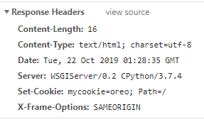
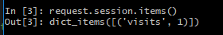
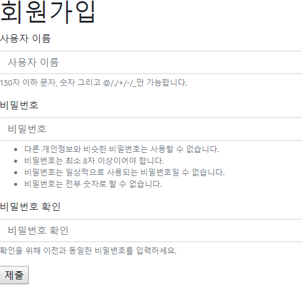
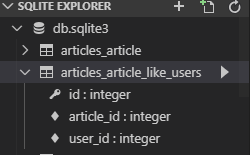
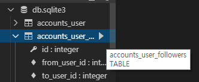
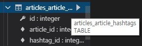

# 회원가입 / 로그인 / 권한관리(추후) / M:N

이번 주의 키워드: 모듈화(재사용성)

회원가입&로그인을 묶어서 **Authentication**이라 한다.

User model을 만든다면... 어떠한 항목들이 있을까?

- id, email, password, username, name, ...

장고 내에는 Auth module이 만들어져 있다. [공식문서 링크](https://docs.djangoproject.com/en/2.2/topics/auth/)

`settings.py`의 `INSTALLED_APPS`에 이미 `django.contrib.auth`가 추가되어 있다.

회원가입 구현은 것은 `User`라는 모델에 대한 CRUD 구현과 동일하다.

Http(프로토콜)는 stateless하다. 상태를 저장하거나 보관하지 않는다. -> '로그인' 기능 구현이 어려워진다.
어떻게 상태를 저장할 것인가? 가 로그인 파트에서 중요한 이슈. -> **쿠키**, **세션** 개념 등장

쿠키? 철수가 서버에 로그인을 시도(요청)하고, 서버가 철수의 컴퓨터에 응답을 보낸 시점에 *과자 부스러기*를 철수에게 남겨놓는다. 

보안 이슈로 인해 쿠키만을 사용한 로그인은 사용하지 않는다. 쿠키에만 의존하지 않고, IP/MAC 등 접속된 유저들에 대한 정보를 일시적으로 보관하며 사용.(**세션**)

장고 미들웨어? ORM, DTL 엔진, SHA256 비밀번호 생성 함수 등 중간에서 어떠한 역할을 대신 해주는 기능들


## 쿠키, 세션, 캐시 ([참고자료](https://jeong-pro.tistory.com/80))

**쿠키와 세션을 사용하는 이유**

**Http 프로토콜의 특징이자 약점을 보완하기 위해(중요!)**


**Http 프로토콜의 특징**

1. 비연결지향 (Connectionless)

   Http는 먼저 클라이언트가 request를 서버에 보내면, 서버는 클라이언트에게 요청에 맞는 response를 보내고 접속을 끊는 특성이 있다. (Http1.1 버전에서는 헤더에 keep-alive라는 값을 줘서 커넥션을 유지하고 재활용하는게 디폴트로 추가되었다.)

   Keep-alive는 옵션으로 두고 connectionless의 연결비용을 줄이는 것이 아직까지는 좋다고 여겨진다.

2. 상태정보유지안함 (Stateless)

   연결을 끊는 순간 클라이언트와 서버간의 통신이 끝나며, 상태 정보를 유지하지 않는다.

위 두 가지 Http 특성을 보완하기 위해 **쿠키**와 **세션**을 사용하게 되었다. **비연결지향**이라는 특성으로 인해 커넥션을 계속 유지하기 위한 리로스 낭비가 발생하지 않는다는 장점이 있지만, 통신할 때마다 새로운 커넥션을 열기 때문에 클라이언트는 자신이 누구인지 **인증**을 매번 해야 한다는 단점이 있다.


**쿠키(Cookie)**

쿠키는 클라이언트 **로컬**에 저장되는 **Key / Value** 가 들어있는 작은 데이터 파일.

쿠키에는 이름, 값, 만료날짜(쿠키 저장기간), 경로 정보가 들어있다.

쿠키는 일정시간동안 데이터를 저장할 수 있다. (로그인 상태 유지에 활용)

쿠키는 클라이언트의 상태 정보를 로컬에 저장했다가 참조한다.

- 쿠키 프로세스

  1. 브러우저에서 웹페이지 접속
  2. 클라이언트가 요청한 웹페이지를 받으면서 쿠키를 클라이언트 로컬(디스크)에 저장
  3. 클라이언트가 재 요청시 웹페이지 요청과 함께 쿠키값도 전송
  4. 지속적으로 로그인 정보를 가지고 있는 것처럼 사용

- 쿠키 사용 사례

  자동로그인, 팝업("오늘 더 이상 이 창을 보지 않음"), 쇼핑몰 장바구니

- 쿠키의 제한

  클라이언트당 300개까지 저장 가능, 하나의 도메인당 20개의 값만 가능, 하나의 쿠키값은 4KB까지.

Response Header에 Set-Cookie 속성을 사용하면 클라이언트에 쿠키를 만들 수 있다. 쿠키는 사용자가 따로 요청하지 않아도 **브라우저가** Request시에 Request Header를 넣어서 **자동으로 서버에 전송한다.**


**세션(Session)**

**일정 시간동안 같은 브라우저**에서 발생하는 일련의 Request를 하나의 상태로 보고 그 **상태를 유지하는 기술**. 즉, 웹 브라우저를 통해 웹 서버에 접속한 이후로 브라우저를 종료할 때 까지 유지되는 상태. 클라이언트가 Request를 보내면, 서버의 엔진이 클라이언트에게 유일한 ID를 부여하게 되는데 이것이 **세션 ID** 이다.

- 세션 프로세스

  1. 클라이언트가 서버에 접속시 세션 ID를 발급
  2. 서버에서는 클라이언트로 발급해준 **세션 ID를 쿠키를 이용해 저장**
  3. 클라이언트는 다시 접속할 때, 이 쿠키를 이용해서 **세션 ID값을 서버에 전달**

  즉, 세션을 구별하기 위해 ID가 필요하고, ID를 쿠키에 저장해놓는다. 쿠키에 의해 자동으로 서버에 ID가 전달되므로, 서버에서 세션 ID에 따른 처리를 할 수 있다.

- 세션 사용 사례

  로그인 정보 유지


**쿠키와 세션 차이**

저장 위치

- 쿠키는 클라이언트(브라우저)에 파일로, 세션은 서버에 저장.

보안

- 쿠키는 클라이언트에 로컬로 저장되어 변질되거나 request에서 스나이핑 당할 우려로 인해 보안 취약. 세션은 쿠키를 이용해서 세션 ID만 저장하고 그것으로 클라이언트를 구분해서 서버에서 처리하기 때문에 비교적 보안성이 좋다.

라이프 사이클

- 쿠키는 만료기간이 존재함에도, 파일 형태로 저장되기 때문에 브라우저를 종료해도 정보가 로컬에 남아있을 수 있다. 혹은 만료기간을 넉넉하게 잡아두면 쿠키삭제를 할 때 까지 유지될 수도 있다. 반면 세션도 만료기간을 정할 수 있지만 **브라우저가 종료되면 만료기간에 상관없이 삭제된다.**

속도

- 쿠키는 로컬에 정보가 있기 때문에 요청시 속도가 빠른 반면, 세션은 서버에 정보가 있기 때문에 비교적 느린 속도를 낸다.

세션과 쿠키를 굳이 같이 쓰는 이유?

- 세션은 서버의 자원을 사용하기에 무분별하게 만들 경우 서버의 메모리/속도 문제가 발생할 수 있다.

캐시랑은 뭐가 다르지?

- 캐시는 이미지(Media), css, js 파일(Static) 등이 **사용자의 브라우저에 저장이 되는 것이다.** 따라서 한 번 캐시에 저장되면 서버가 아닌 브라우저를 참조하게 된다.
- 서버에서 변경이 되어도 브라우저 상에 저장된 캐시에 의해 사용자는 변경되지 않은 걸로 보일 수 있다. 이 경우 캐시를 삭제하거나 서버에서 클라이언트로 응답을 보낼 때 header에 캐시 만료시간을 명시하는 방법이 있다.


**Django에서 쿠키를 보내보자**

```python
# [articles] > urls.py
urlpatterns = [
	...
    path('send_cookie/', views.send_cookie, name="send"),
]

#[articles] > views.py
def send_cookie(request):
    res = HttpResponse('과자 받아라')
    res.set_cookie('mycookie', 'oreo') #key, value 구조로 되어있다.
    return res
```

http://localhost:8000/articles/send_cookie/ 접속 시, 아래와 같이 Set-Cookie 옵션이 작성된걸 확인할 수 있다.




**Django에서 세션을 활용해보자** (방문자수 카운터)

본질적으로 서버에 저장된다. 서버가 종료되면 삭제된다. DB 기반 세션도 존재.

사용자의 쿠키를 기반으로, 메모리에 저장하는 lite한 방식을 쓰자. (Cookie based session) 접속되는 유저마다 가지고 있는 딕셔너리라고 이해하자.

embed로 콘솔창을 연 뒤, `request.session.items()` 명령으로 현재 생성된 세션들 확인 가능

```python
#[articles] > views.py

def index(request):
    # embed()
    visits_num = request.session.get('visits', 0) #key, value를 세션에 직접 기록
    request.session['visits'] = visits_num + 1
    request.session.modified = True
    # embed()
    articles = Article.objects.all()
    context = {
        'articles': articles,
        'visits': visits_num
    }
    return render(request, 'articles/index.html', context)
```



```html
<!--index.html-->
<p>당신의 방문 횟수: {{ visits }}</p>
```


## 회원가입

*이전 RECAP 프로젝트를 확장한다.*


회원가입을 위한 app 생성(반드시, 'accounts' 그대로 만들어라)

```bash
python manage.py startapp accounts
```

`settings.py`에 app 등록

```python
INSTALLED_APPS = [
    'articles',
    'accounts',
	...
]
```

`urls.py`에 새로운 app의 경로 추가

```python
# [recap] > urls.py
urlpatterns = [
	...
    path('accounts/', include('accounts.urls')),
]
```

`accounts` app의 `urls.py` 생성

로그인 url을 `signup/`로 정하자.

```python
# [accounts] > urls.py
from django.urls import path
from . import views

app_name = 'accounts'

urlpatterns = [
    path('signup/', views.signup, name='signup')
]
```

`views.py`에 `signup` 함수를 추가해준다.

```python
# [accounts] > urls.py
def signup(request):
    return render(request, 'accounts/signgup.html')
```

`accounts` 폴더 내에 `templates` 폴더를 만든 뒤, 이 안에 `accounts` 폴더를 만든다. 이 안에 `signup.html`을 생성한다.

```html
<!-- [accounts] > [templates] > [accounts] -->



<h1>회원가입</h1>

<form action="">
  <input type="text">
  <input type="text">
  <input type="submit">
</form>


```


*여기서 의문) 왜 model을 먼저 만들지 않앗지?*

*대답) Django가 알아서 제공해 줄 것*.


내부적으로 Django의 `User` class는 다음과 같은 상속 구조를 갖는다.

`Abstract Base User` > `Abstract User` > `User`

이용자가 customizing하는 User class를 만들고 싶은 경우, `Abstract Base User` 혹은 `Abstract User` 클래스를 상속받아 만들면 된다.


`views.py`에 Django에서 제공해주는 `modelForm` 모델을 import한다. 시험 페이지를 확인하기 위해, form을 렌더링해보자.

```python
# [accounts] > views.py
from django.contrib.auth.forms import UserCreationForm

def signup(request):
    form = UserCreationForm
    context = {
        'form': form,
    }
    return render(request, 'accounts/signup.html', context)
```


이전에 작성한 `signup.html`도 `modelform`을 렌더링하도록 바꾼다. (bootstrap을 추가하여 디자인도 개선)

```html




<h1>회원가입</h1>

<form method="POST"> <!--form 태그에서 action을 없앨 경우, 현재 URL로 리다이렉트-->
  
  
  <!-- <button class="btn btn-primary" type="submit">회원가입</button> -->
   <!--윗줄과 동치-->
</form>


```


여기까지 결과 페이지 (http://localhost:8000/accounts/signup/)




입력된 정보를 `views.py`를 통해 DB에 저장하자.

```python
from django.shortcuts import render
from django.contrib.auth.forms import UserCreationForm

# Create your views here.
def signup(request):
    if request.method == 'POST':
        #실제 DB에 유저 정보 저장
        #검증하자
        form = UserCreationForm(request.POST)
        if form.is_valid():
            form.save()
            return redirect('articles:index') #index 페이지로 리다이렉트
    else:
        form = UserCreationForm()
    context = {
        'form': form,
    }
    return render(request, 'accounts/signup.html', context)
```

`admin` 페이지에 접속하면 DB에 저장된 이용자 확인 가능. 권한 부여도 가능하다.


## 로그인

`UserCreationForm` : 회원가입을 위한 modelform (User에 대한 CRUD)

`AuthenticationForm`: 로그인을 위한 modelForm (Session에 대한 CRUD)

- Session: 접속된 유저가 누구인지에 대한 일시적인 정보(서버에 저장된)
- 사용자가 로그인 했음을 기록하는 CRUD
- 로그인 = Session Create / 로그아웃 = Session Delete / 로그인 연장 = Session Update


**로그인 창 띄우기**

`views.py`에 `login()` 함수 추가, `AuthenticationForm` import.

```python
from django.contrib.auth.forms import UserCreationForm, AuthenticationForm

def login(request):
    if request.method == 'POST':
        form = AuthenticationForm(request.POST)
        pass
    else:
        form = AuthenticationForm()
    context = {
        'form': form,
    }
    return render(request, 'accounts/login.html', context)
```

`login.html`의 코드는 `signup.html`과 동일 (템플릿 코드 재사용)

```html




<h1>로그인</h1>

<form method="POST">
  
  
  <!-- <button class="btn btn-primary" type="submit">제출</button> -->
  
</form>


```

`urls.py`에 경로 추가

```python
urlpatterns = [
	...
    path('login/', views.login, name='login'),
]
```

여기까지 했을 때 (http://localhost:8000/accounts/login/)


**인증하기**

로그인 창에 입력된 값과 저장되어있는 값을 비교하는 과정이 필요하다.

`views.py`의 `login()`을 수정한다.(구식 방식, brute-force 공격에 취약함, 이렇게 하지 마)

```python
# [accounts] > views.py
# 이렇게 하면 안좋아
def login(request):
    if request.method == 'POST':
        form = AuthenticationForm(request.POST)
        if form.is_valid():
            # 1. 입력된 이름을 가진 사람을 찾아
            username = request.POST.get('username')
            user = User.objects.get(username=username)

            # 2. User가 있으면, 입력된 비밀번호와 저장된 비밀번호를 비교
            if user:
                if user.password == request.POST.get('password'):
                    # 로그인 시킨다 == 세션을 생성한다.
                else:
                    # 비밀번호가 틀린 경우, 다시 로그인 창을 보여줌
            else:
                #해당하는 사용자 정보가 없습니다.
    else:
        form = AuthenticationForm()
    context = {
        'form': form,
    }
    return render(request, 'accounts/login.html', context)
```

요즘 방식은, 로그인이 아니기만 하면 다 실패로 보낸다.(?)

장고는 이 과정을 전부 모듈화 해놓았다.  `from django.contrib.auth import login as auth_login`

```python
# [accounts] > views.py
from django.contrib.auth import login as auth_login

def login(request):
    if request.method == 'POST':
 		# 쿠키, 세션ID, 브라우저 정보 등이 필요해서 request 전체를 전달함
        form = AuthenticationForm(request, request.POST)
        if form.is_valid():
            #form이 valid하면, 로그인 시킨다.
            auth_login(request, form.get_user()) #get_user(): 해당 유저정보를 가져와라
            return redirect('articles:index')

    else:
        form = AuthenticationForm()
    context = {
        'form': form,
    }
    return render(request, 'accounts/login.html', context)

```


**로그인이 제대로 되었는가? 확인해보자** 

`index` 상단에 현재 세션의 정보를 출력해보자. 하는 김에 login, logout 링크도 걸어주자

```html
<!--base.html-->
<body>
  <a href="">로그인</a>
  <a href="">로그아웃</a>
  <p>현재 접속된 유저 : {{ user.username }}</p>
  
  
</body>
```

`index` 페이지 상단 결과 (articles/)


**로그아웃**

`urls.py`에 logout 경로 지정

```python
urlpatterns = [
	...
    path('logout/', views.logout, name='logout'),
]
```

로그아웃을 한다는 건 세션을 지우는 것(정확히는 세션에서 유저 정보를 지우는 것)

```python
# [accounts] > views.py > logout()
def logout(request):
    # 세션을 지우기
    auth_logout(request)
    return redirect('articles:index')
```


**로그인 상태에서는 로그아웃 버튼만 보이도록, 로그아웃 상태에서는 로그인, 회원가입 버튼이 보이도록 해보자**

```html
<!--base.html-->
<body>

  
    <a href="">로그아웃</a>
    <p>현재 접속된 유저 : {{ user.username }}</p>
  
    <a href="">로그인</a>
    <a href="">회원가입</a>
  

  
  
</body>
```


**로그인이 된 유저는 로그인창을 띄우지 않고, articles/로 리다이렉트 시키자**

(로그인 버튼이 더이상 보이지는 않지만, url을 통해 주소 창으로 접근이 여전히 가능한 상황에서 accounts/login/ 혹은 accounts/signup/ 으로 접속 시 articles/로 리다이렉트 시키자.)

```shell
# embed()에서 request.user로 확인할 수 있는 것들..
dir(request.user)
request.user.username
request.user.is_authenticated
request.user.is_anonymous
request.user.is_superuser
```

`views.py`의 `login()`함수에 아래와 같은 코드를 추가한다.

```python
def signup(request):
    #만약 로그인 되어있으면, articles/로 리다이렉트
    if request.user.is_authenticated:
        return redirect('articles:index')
   	...

def login(request):
    #만약 로그인 되어있으면, articles/로 리다이렉트
    if request.user.is_authenticated:
        return redirect('articles:index')
    ...
```


**글을 쓰기 위해서는 로그인을 해야 하도록 하자**

우선, `새글쓰기` 버튼이 로그인 되어있는 상태에서만 보이도록 하자.

```html
<!-- [articles] > [templates] > [articles] > index.html -->
...

  <a href="">새글쓰기</a>

...
```

여전히 URL로 articles/create/에 접속할 수 있으므로, 이를 막아주자. (접근시 index 페이지로 리다이렉트)

```python
# [articles] > views.py
def create(request):
    if not request.user.is_authenticated:
        return redirect("articles:index")
   	...
```

*매번 이렇게 view 함수마다 추가해줘야 하나...? 좀 더 깔끔하게 해보자*

- `index`로 보내기 보다는, `login` 페이지로 보내자.

- Decorator를 사용하자. [링크](https://docs.djangoproject.com/ko/2.2/topics/auth/default/#django.contrib.auth.decorators.login_required). 위에서 작성한 불필요한 코드들 생략 가능

  ```python
  # [articles] > views.py
  from django.contrib.auth.decorators import login_required
  
  @login_required
  def create(request):
  #    if not request.user.is_authenticated:
  #       return redirect("accounts:login")
  ```

  - Decorator를 사용할 경우, `next`에 의해 자동적으로 `create` 페이지로 리다이렉트된다. (단, `next` 핸들링을 해줘야 한다.)

  - `next` 파라미터 핸들링은 다음과 같이 할 수 있다.

    ```python
    # [accounts] > views.py
    def login(request):
        #만약 로그인 되어있으면, articles/로 리다이렉트
        if request.user.is_authenticated:
            return redirect('articles:index')
    
        if request.method == 'POST':
            form = AuthenticationForm(request, request.POST)
            if form.is_valid():
                auth_login(request, form.get_user()) 
                # 'next' 파라미터가 있을 경우.... 혹은 없을 경우... 핸들링
                return redirect(request.GET.get('next') or 'articles:index')
    ```

    

- `@login_required`의 default 리다이렉트 주소가 /accounts/login/ 이다. 이걸 바꿔주고 싶을 경우, `@login_required(login_url='/accounts/log_in')`과 같이 하면 된다. 귀찮으니까 되도록이면 default값을 사용하자.

- 혹시 login url을 커스터마이징에서 썼을 경우, `settings.py`에 아래와 같이 추가해주면 default 경로 변경 가능

  ```python
  #settings.py
  LOGIN_URL = '/accounts/log_in/'
  ```

  

**게시글 수정, 삭제의 경우에도 로그인 해야만 사용 가능하도록 해보자**

```html
<!--index.html-->

<a href=""> 수정하기 </a>
<!-- <a href=""> 삭제하기 </a> -->
<form action="" method="POST">
    
    <input type="submit" value="삭제">
</form>

```

```html
<!--detail.html-->

<a href=""> 수정하기 </a>
<form action="" method="POST">
    
    <input type="submit" value="삭제">
</form>

```

```python
@login_required
def update(request, article_pk):
```

```python
@login_required
@require_POST
def delete(request, article_pk):
```

```python
@login_required
@require_POST
def commentCreate(request, article_pk):
```

```python
@login_required
@require_POST
def commentDelete(request, article_pk, comment_id):
```


검증되지 않은 유저가 삭제를 하려고 할 경우, **401** 에러를 내보내자. (함수 자체를 유저 검증으로 단단히 잠궈놓는 방법.)

```python
# [articles] > views.py
from django.http import Http404, HttpResponse

@login_required
@require_POST
def delete(request, article_pk):
    if request.user.is_authenticated:
        
        article = get_object_or_404(Article, pk=article_pk)
        if request.method == 'POST':
            article.delete()
            return redirect('articles:index')
        else:
            return redirect(article)

    return HttpResponse('검증되지 않은 유저정보', status=401)
```

 

## 회원탈퇴

```html
<!--base.html-->
<form style="display: inline;" action="" method="POST">
    
    <input type="submit" value="회원탈퇴" class="btn btn-danger">
</form>
```

```python
# [accounts] > urls.py
urlpatterns = [
	...
    path('delete/', views.delete, name='delete'),
]
```

```python
# [accounts] > views.py
@require_POST
def delete(request):
    # DB에서 user를 삭제한다.
    request.user.delete()
    return redirect('articles:index')
```


## 회원가입 & 로그인을 동시에 하도록 하자

```python
# [accounts] > urls.py
urlpatterns = [
	...
    path('update/', views.update, name='update'),
]
```

```python
# [accounts] > views.py
from django.contrib.auth.forms import UserChangeForm
def update(request):
    # 회원정보 수정 로직
    if request.method == 'POST':
        # 실제 DB에 적용
        pass
    else:
        # 편집 화면 보여줌
        form = UserChangeForm(instance=request.user) # user의 정보를 가져와라!
    context = {
        'form': form,
    }
    return render(request, 'accounts/update.html', context)
```

```html
<!--update.html-->





<h1>회원정보 수정</h1>

<form action="" method="POST">
  
  
  
</form>


```


`UserChangeForm` 말고... 우리가 직접 custom modelform을 만들어보자

```python
from django.contrib.auth.forms import UserChangeForm
from django.contrib.auth import get_user_model

class CustomUserChangeForm(UserChangeForm):
    class Meta:
        model = get_user_model()
        field = ('email', 'first_name', 'last_name', )# [accounts] > forms.py
```

이제 `views.py`에서 우리가 사용한 modelform 을 쓰자

```python
# [accounts] > views.py
from django.contrib.auth.forms import UserChangeForm
from .forms import CustomUserChangeForm

@login_required
def update(request):
    # 회원정보 수정 로직
    if request.method == 'POST':
        # 실제 DB에 적용
        pass
    else:
        # 편집 화면 보여줌
        form = CustomUserChangeForm(instance=request.user) # user의 정보를 가져와라!
    context = {
        'form': form,
    }
    return render(request, 'accounts/update.html', context)
```


**비밀번호 수정은 별도의 미들웨어가 존재함, form이 따로 존재**

```python
# [accounts] > urls.py
urlpatterns = [
	...
    path('password/', views.change_password, name='change_password'),
]
```

```python
# [accounts] > views.py
from django.contrib.auth.forms import PasswordChangeForm
from django.contrib.auth.decorators import login_required

@login_required
def change_password(request):
    if request.method == 'POST':
        #실제 비번 변경
        # UserChangeForm과 파라미터 순서 다름 주의
        form = PasswordChangeForm(request.user, request.POST) 
        if form.is_valid():
            form.save()
            return redirect('articles:index')
    else:
        # 편집 화면 보여줌(form)
        form = PasswordChangeForm(request.user) # user의 정보를 가져와라!
        context = {
            'form': form,
        }
        return render(request, 'accounts/change_password.html', context)
```

```html
<!--change_pasword.html-->





<h1>비밀번호 수정</h1>

<form action="" method="POST">
  
  
  
</form>


```

*해보니까 view 함수들이 형태가 비슷비슷해... Class Based View 활용하자* (C에 대한 view, R에 대한 view, U에 대한 view, D에 대한 view가 django에서 제공됨)


비밀번호 변경을 하게 되면, 기존의 세션 인증 정보와 일치하지 않게 돼서 로그아웃됨. 로그아웃 하지 말고 유지시킬려면 어떻게 해야할까? `update_session_auth_hash(request, form.user)`

```python
# [accounts] > views.py
from django.contrib.auth.forms import PasswordChangeForm
from django.contrib.auth.decorators import login_required
from django.contrib.auth import update_session_auth_hash

@login_required
def change_password(request):
    if request.method == 'POST':
        #실제 비번 변경
        # UserChangeForm과 파라미터 순서 다름 주의
        form = PasswordChangeForm(request.user, request.POST) 
        if form.is_valid():
            form.save()
            # session auth hash가 변경됨. 반영해주자!
            update_session_auth_hash(request, form.user)
            return redirect('articles:index')
    else:
        # 편집 화면 보여줌(form)
        form = PasswordChangeForm(request.user) # user의 정보를 가져와라!
    context = {
        'form': form,
    }
    return render(request, 'accounts/change_password.html', context)
```


## auth_form.html로 accounts의 html 파일 통일하기

url을 기준으로 조건문을 활용해 분기

```html
<!-- [accounts] > auth_form.html -->





  <h1>회원가입</h1>

  <h1>로그인</h1>

  <h1>회원정보수정</h1>

  <h1>비밀번호변경</h1>


<form action="" method="POST">
  
  
  
</form>


```


## 어떤 회원이 어떤 글을 작성했는가?

Article : Comment = 1:N

User : Article = 1 : N

User : Comment = 1 : N

- Article, Comment model에서 foreign key를 지정해주자.


**User와 Article 연결하기**

`User` 모델을 가져오는 가장 좋은 방법은 `user = models.ForeignKey(settings.AUTH_USER_MODEL)`

```python
# [articles] > models.py
from django.conf import settings

class Article(model.Model):
    user = models.ForeignKey(settings.AUTH_USER_MODEL, on_delete=models.CASCADE)
    ...
```

다른 User model을 사용하고 싶을 경우... `settings.py`에 다음과 같이 작성한다.

```python
AUTH_USER_MODEL = 'auth.User' #default
AUTH_USER_MODEL = 'models.CustomUser' #custom user
```

*이런 간접 레퍼런스를 사용하는 이유? 나중에 코드를 변경할 때 변경사항을 최소화하기 위해.*

`models.py`에서만 이 방법을 사용하고, 다른 파일에서 User 모델을 가져와야 할 때는 `get_user_model()` 쓰면 된다.

글이 작성될 때, Article 객체의 `user_id`가 저장되도록 해야한다.

```python
#[articles] > views.py
@login_required
def create(request):
    if request.method == "POST":
        form = ArticleForm(request.POST) # 이렇게 맡겨버리면 된다.
        if form.is_valid():
            article = form.save(commit=False)
            article.user = request.user
            article.save()
            return redirect(article)
       	...(생략)...
```

상세보기 페이지에서 작성자를 표출해주자

```html
#[articles] > detail.html
...
      <p>작성자: {{ article.user.first_name }}</p>
...
```


**User와 Comment 연결하기**

```python
# [articles] > models.py
class Comment(models.Model):
    user = models.ForeignKey(settings.AUTH_USER_MODEL, on_delete=models.CASCADE)
    ...
```

```python
# [articles] > views.py
...
        comment = form.save(commit=False)
        comment.user = request.user
        comment.article = article
        comment = form.save()
...
```


**작성한 사람과 현재 유저가 일치한 경우만 수정/삭제**

`detail.html`의 ``를 ``로 변경

`views.py` 레벨에서도 잘못된 유저의 접근을 차단해 줘야 한다.

```python
def update(request, article_pk):
    article = get_object_or_404(Article, pk=article_pk)

    if article.user != request.user:
        return redirect('articles:index')
```


## '좋아요' 기능 만들기

**M : N 관계**

- 수강신청
- 예약(진료, 미용, ...)
- 좋아요(follow...)


수강신청에서 학생과 강의의 관계 ('belongs_to' 개념이 존재하지 않음. 서로가 서로를 많이 가질 뿐. 'has_many'만 존재.)

M:N 관계에서는 추가적인 테이블이 필요하다. User, Article 테이블과 더불어 Like 테이블이 필요하다(Join 테이블). Like table은 user_id 컬럼과 article_id 컬럼을 갖는다. (다른 두 개 테이블의 관계를 나타냄. 동사적인 느낌)

'follow'의 경우는 조금 다름. user가 user를 follow하기 때문에 재귀적인 특성이 있다.


Django에게 User와 Article간의 M:N 관계 테이블을 만들고 관리하라고 시킬 수 있다.

```python
# [articles] > models.py
class Article(models.Model):
    like_users = models.ManyToManyField(settings.AUTH_USER_MODEL, related_name='like_articles', blank=True)
```

`python manage.py makemigrations`

`python manage.py migrate`




`ashley = User.objects.get(pk=2)`

`ashley.like_articles.add(Article.objects.get(pk=3))`

`ashley.like_articles.all()` : ashley가 좋아요 한 모든 Article들을 보여줌

`article.like_users.all()` : article에 좋아요를 누른 모든 User를 보여줌


템플릿 `detail.html` 수정

```html
<a href="">좋아요</a>
<p>좋아요: {{ article.like_users.count }}</p>
<p>좋아요 목록:</p>
<ul>
    
    <li>{{ u }}</li>
    
</ul>
```

`urls.py`에 경로 추가

```python
# [articles] > urls.py
urlpatterns = [
	...
    path('<int:article_pk>/like/', views.like, name='like'),
]
```

`views.py`에 함수 추가

```python
# [articles] > views.py
def like(request, article_pk):
    # article_pk로 넘어온 글의 like_users에 현재 접속중인 유저를 추가한다.
    # request.user.like_articles.add(Article.objects.get(pk=article_pk))
    article = Article.objects.get(pk=article_pk)
    article.like_users.add(request.user) # request.user.like_articles.add(article) 과 동일한 작업 수행
    return redirect(article)
```


**좋아요 취소 기능 추가**

현재 request를 보내는 user가 `article.like_users` 안에 있는 경우 `좋아요 취소` 버튼을 보여준다.

```html

	<a href="">좋아요 취소</a>

	<a href="">좋아요</a>

```

```python
# [articles] > views.py
def like(request, article_pk):
    article = Article.objects.get(pk=article_pk)
    # 만약 좋아요 리스트에 현재 접속중인 유저가 있다면,
    # -> 해당 유저는 좋아요 취소를 했다.
    if request.user in article.like_users.all():
        article.like_users.remove(request.user)
    #아니면,
    # -> 해당 유저는 좋아요를 했다.
    else:
        article.like_users.add(request.user)
    return redirect(article)
```

Django ORM에서 쿼리셋 내부의 특정 요소 존재여부는 아래와 같이 확인할 경우 매우 비효율적 (매번 이터레이터를 돌 때마다 쿼리를 재생성 하게된다.)

```python
for e in Entry.objects.all():
    print(e.headline)
```

`in` 말고, `exists()`와 `filter()`(조건에 맞는 결과물을 여러개 반환, `get()`는 특정 `pk`값에 해당하는 것만 찾아줌)를 사용하자.  `get()`은 찾는 결과물이 없을때 `Error` 반환, `filter()`는 찾는 결과물이 없을 때 `empty QuerySet`을 반환한다.

```python
# [articles] > views.py를 filter()와 exists()를 사용해 재작성해보자.
def like(request, article_pk):
    article = Article.objects.get(pk=article_pk)
    user = request.user
    if article.like_users.filter(pk=user.pk).exists():
        article.like_users.remove(user)
    else:
        article.like_users.add(user)
    return redirect(article)
```


**캐싱**

좋아요 목록을 출력해주는 `detail.html`의 DTL문도 아래와 같이 수정할 수 있다. `with` 사용해서 쿼리셋을 가져온 뒤, 이터레이트 한다. [공식문서](https://docs.djangoproject.com/en/2.2/ref/templates/builtins/#with)

```html
<ul>
    
        
            <li>{{ u }}</li>
        
    
</ul>
```


## 프로필 만들기

url을 통해 `username`값을 전달하도록 한다.

```python
#[recap] > urls.py
from accounts import views as accounts_views

urlpatterns = [
	...
    path('<username>/', accounts_views.profile, name='profile'),
]
```

url상에서 던져준 username을 받아 사용하는 `view` 함수 `profile()`를 만든다.

```python
#[accounts] > views.py
from django.shortcuts import render, redirect, get_object_or_404
from django.contrib.auth import get_user_model # 유저 가져오기 위한 함수

def profile(request, username):
    # DB에서 유저를 뒤져본다.
    person = get_object_or_404(get_user_model(), username=username)
    context = {
        'person': person,
    }
    return render(request, 'accounts/profile.html', context)
```

프로필 페이지 `profile.html`을 생성한다.

```html
<h2>{{ person }}가 쓴 글 목록</h2>

  
    <p>
      제목: {{ article.title }} | 
      좋아요: {{ article.like_users.count }} | 
      댓글: {{ article.comment_set.count }}
    </p>
  

```


## Follow 기능 추가하기 (M:N)

"User follows User": 재귀적. 누가 누구를 follow하는지만 추적하면 된다.

follow라는 테이블은 `from_user_id`, `to_user_id` 두 개의 컬럼만 관리하면 된다.

Follow기능을 만들기 위해서(`followers` field가 필요)는 `User` customization을 할 수 밖에 없다.

`related_name`은 역참조 값을 설정하는 것. 반대쪽에 있는 애들에게 새로 만들어진 테이블이 어떻게 불려질지 정해주는 것. `article.like_users`와 `user.like_articles`가 그 예시. (한 모델이 다른 모델에게 지칭될 때 어떻게 불릴 것인지 결정)

나를 follow 하는 사람들은 `followers`로 조회 가능, 내가 follow 하고 있는 사람들은 `followings`로 조회 가능.

```python
# [accounts] > models.py
from django.db import models
from django.contrib.auth.models import AbstractUser
from djang.conf import settings

# Create your models here.
class User(AbstractUser):
    followers = models.ManyToManyField(settings.AUTH_USER_MODEL, related_name="followings")
```

`settings.py`의 `AUTH_USER_MODEL`를 재지정 해줘야 한다.

```python
# settings.py
AUTH_USER_MODEL = 'accounts.User'
```

Binding 되어있던 모델을 교체하는 경우에는 `migration` 함부로 하면 위험하다. 저장되어있는 정보를 날린 뒤에 `migration` 하자.

1. db.sqlite 파일 삭제
2. migration 파일 0001~000X 삭제



`migrate`할 경우 column 이름에 `from`, `to` 키워드가 자동으로 붙어서 생성된다.


커스텀 `User`를 사용할 경우, 회원가입을 하고자 할 때 아래와 같은 오류가 발생한다.

```
AttributeError at /accounts/signup/
Manager isn't available; 'auth.User' has been swapped for 'accounts.User'
```

이 문제를 해결하기 위해, 커스텀 `modelform`을 생성해야 한다. (기본 User modelform의 Meta class의 Model bind가 auth.user로 고정되어 있기 때문. django.contrib.auth.forms의 UserCreationForm을 확인해보면 알 수 있다.)

```python
# [accounts] > forms.py
from django.contrib.auth.forms import UserCreationForm

class CustomUserCreationForm(UserCreationForm):
    class Meta:
        model = get_user_model()
        # 원래 field값에 email도 추가해주자.
        fields = UserCreationForm.Meta.fields + ('email',)
```

`views.py`의 `signup`함수에서도 변경사항을 반영해주자.

`UserCreationForm` -> `CustomUserCreationForm`


**프로필 페이지에 follow 버튼 추가하기**

```html
<h1>Profile page of {{ person }}</h1>
<a class="btn btn-priamry" href="">팔로우</a>
<hr>
```

팔로우를 위한 url 정의

```python
# [accounts] > urls.py
...
    path('follow/<int:person_pk>', views.follow, name='follow'),
```

`views.py`에 `follow()`함수 정의

```python
# [accounts] > views.py
def follow(request, person_pk):
    person = get_object_or_404(get_user_model(), pk=person_pk)
    user = request.user

    if person.followers.filter(pk=user.pk).exists():
        person.followers.remove(user)
    else:
        person.followers.add(user) # person의 follower로 user를 추가한다.
    return redirect('profile', person.username)
```

팔로워(팔로우) 명단 출력하기 & 팔로우 취소 버튼 표출하기

DTL의 `with` 구문에는 다수의 변수를 한꺼번에 캐싱할 수 있다.

```html

  <a class="btn btn-primary" href="">팔로우 취소</a>

  <a class="btn btn-primary" href="">팔로우</a>


<p>팔로워수: {{ person.followers.count }}</p>
<!-- <p>팔로워수: {{ person.followers.all|length }}</p> -->
<p>
  팔로워 명단:
  
    
      {{ follower }},
    
</p>

<p>팔로우수: {{ person.followings.count }}</p>
<p>
  팔로우 명단:
    
      {{ following }},
    
  
</p>
```


## 피드 만들기

kuhn이 ashley를 follow하고 있을 때, articles/에서 ashley의 글들이 표출되도록 한다.(그 외 follow 중인 모든 사람들의 글)

`filter()`의 `__in` 옵션 사용하여 현재 유저가 follow중인 유저의 글 + 내 글만 가져온다.

`articles`와 `my_articles`를 합치는데는 django의 Q object를 사용한다. (혹은 iterools의 chain 사용가능)

```python
# [articles] > views.py
...
	# itertools의 chain 사용한 방법
    followings = request.user.followings.all()
    followings = chain(followings, [request.user])
    articles = Article.objects.filter(user__in=followings)
    context = {
        'articles': articles,
        'visits': visits_num,
    }
    
    # Q object를 사용한 방법
    followings = request.user.followings.all()
    articles = Article.objects.filter(user__in=followings)
    my_articles = request.user.article_set.all()
    context = {
        'articles': articles | my_articles,
        'visits': visits_num,
    }
...
```


## 해시태그

```python
# [articles] > views.py
def explore(request):
    articles = Article.objects.all()
    context = {
        'context': articles,

    }
    return render(request, 'articles/explore.html', context)
```

```python
# [articles] > urls.py
urlpatterns = [
	...
    path('explore/', views.explore, name='explore'),
]
```

```python
# [articles] > models.py
class Hashtag(models.Model):
    content = models.TextField(unique=True)
    
    def __str__(self):
        return self.content
    
class Article(models.Model):
    ...
    hashtags = models.ManyToManyField(Hashtag, blank=True) #blank=True:비어있어도 무방
```




```python
# [articles] > admin.py
class HashtagAdmin(admin.ModelAdmin):
    list_display = ('content',)

admin.site.register(Hashtag, HashtagAdmin)
```

`views.py`의 `create` 함수에서 hashtag도 같이 생성하도록 수정하자

```python
# [articles] > views.py
def create(request):
    ...
    # hashtag 찾아서 저장하기
    for word in article.content.split():
        if word.startwith('#'):
            #가져 오던가, 없으면 만들어라. (get()과 create())
            #hashtag 결과값(객체), created(boolean): 새로 만들어진거면 True 
            hashtag, created = Hashtag.objects.get_or_create(content=word)
            article.hashtags.add(hashtag)
    ...
```

`detail.html`에서 해시태그들을 출력해보자

```html
<h2>해시태그 목록</h2>
<p>
    
        
            <strong>{{ hashtag }}</strong>
        
    
</p>
```


**해시태그들을 모아서 출력해보자**

```python
# [articles] > urls.py
    path('tags/', views.tags, name='tags'),
```

```python
# [articles] > views.py
def tags(request):
    tags = Hashtag.objects.all()
    context = {
        'tags': tags,
    }
    return render(request, 'articles/tags.html', context)
```

단, 각각의 태그를 클릭할 경우 해당 태그의 글 목록을 볼 수 있도록 링크를 단다.

```html



<h1>태그모음</h1>

<a href="">{{ tag }}</a>



```

`articles/hashtag/hashtag_id` 로 접속시 해당 해시태그의 글들이 보이도록 하자

```python
# [articles] > urls.py
    path('hashtag/<int:hashtag_pk>', views.hashtag, name='hashtag')
```

```python
# [articles] > views.py
def hashtag(request, hashtag_pk):
    hashtag = get_object_or_404(Hashtag, pk=hashtag_pk)
    # related_name을 정의하지 않았는데, 자동으로 이렇게 설정됨
    articles = hashtag.article_set.all()
    context = {
        'hashtag': hashtag,
        'articles': articles,
    }
    return render(request, 'articles/hashtag.html', context)
```

`hashtag.html`에서는 전달받은 `hashtag`에 해당하는 글 정보를 출력한다.

```html



<h1>{{ hashtag.content }}</h1>
<ul>
  
    <li>
      <p>제목: {{ article.title }}</p>
      <p>내용: {{ article.content }}</p>
      <p>좋아요: {{ article.like_users.count }}</p>
      <p>댓글: {{ article.comment_set.count }}</p>
    </li>
  
</ul>


```


*반전*

- 사실 `with` 문법을 사용자가 직접 해줄 필요가 없어. Django가 알아서 해준다.

  - 엥? `with` 안쓰면 매번 쿼리를 새로 보내서 비효율적인거 아니였어? 응 아니야~ 

- Django ORM의 **Lazy-Loading** 때문에 가능한 것.

  Django의 쿼리는 마지막까지 지연된다.

  Django는 정말 필요할 때만 알아서 호출한다.

  우리는 Heavy하게 ORM에 기대도 된다.

  