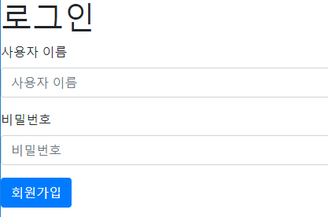
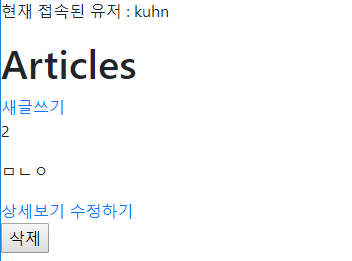

# 회원가입 / 로그인 / 권한관리(추후)

이번 주의 키워드: 모듈화(재사용성)

회원가입&로그인을 묶어서 **Authentication**이라 한다.

User model을 만든다면... 어떠한 항목들이 있을까?

- id, email, password, username, name, ...

장고 내에는 Auth module이 만들어져 있다. [공식문서 링크](https://docs.djangoproject.com/en/2.2/topics/auth/)

`settings.py`의 `INSTALLED_APPS`에 이미 `django.contrib.auth`가 추가되어 있다.

회원가입 구현은 것은 `User`라는 모델에 대한 CRUD 구현과 동일하다.

Http(프로토콜)는 stateless하다. 상태를 저장하거나 보관하지 않는다. -> '로그인' 기능 구현이 어려워진다.
어떻게 상태를 저장할 것인가? 가 로그인 파트에서 중요한 이슈. -> **쿠키**, **세션** 개념 등장

쿠키? 철수가 서버에 로그인을 시도(요청)하고, 서버가 철수의 컴퓨터에 응답을 보낸 시점에 *과자 부스러기*를 철수에게 남겨놓는다. 

보안 이슈로 인해 쿠키만을 사용한 로그인은 사용하지 않는다. 쿠키에만 의존하지 않고, IP/MAC 등 접속된 유저들에 대한 정보를 일시적으로 보관하며 사용.(**세션**)


## 회원가입

*이전 RECAP 프로젝트를 확장한다.*


회원가입을 위한 app 생성(반드시, 'accounts' 그대로 만들어라)

```bash
python manage.py startapp accounts
```

`settings.py`에 app 등록

```python
INSTALLED_APPS = [
    'articles',
    'accounts',
	...
]
```

`urls.py`에 새로운 app의 경로 추가

```python
# [recap] > urls.py
urlpatterns = [
	...
    path('accounts/', include('accounts.urls')),
]
```

`accounts` app의 `urls.py` 생성

로그인 url을 `signup/`로 정하자.

```python
# [accounts] > urls.py
from django.urls import path
from . import views

app_name = 'accounts'

urlpatterns = [
    path('signup/', views.signup, name='signup')
]
```

`views.py`에 `signup` 함수를 추가해준다.

```python
# [accounts] > urls.py
def signup(request):
    return render(request, 'accounts/signgup.html')
```

`accounts` 폴더 내에 `templates` 폴더를 만든 뒤, 이 안에 `accounts` 폴더를 만든다. 이 안에 `signup.html`을 생성한다.

```html
<!-- [accounts] > [templates] > [accounts] -->



<h1>회원가입</h1>

<form action="">
  <input type="text">
  <input type="text">
  <input type="submit">
</form>


```


여기서 의문) 왜 model을 먼저 만들지 않앗지?*

*대답) Django가 알아서 제공해 줄 것*.


내부적으로 Django의 `User` class는 다음과 같은 상속 구조를 갖는다.

`Abstract Base User` > `Abstract User` > `User`

이용자가 customizing하는 User class를 만들고 싶은 경우, `Abstract Base User` 혹은 `Abstract User` 클래스를 상속받아 만들면 된다.


`views.py`에 Django에서 제공해주는 `modelForm` 모델을 import한다. 시험 페이지를 확인하기 위해, form을 렌더링해보자.

```python
# [accounts] > views.py
from django.contrib.auth.forms import UserCreationForm

def signup(request):
    form = UserCreationForm
    context = {
        'form': form,
    }
    return render(request, 'accounts/signup.html', context)
```


이전에 작성한 `signup.html`도 `modelform`을 렌더링하도록 바꾼다. (bootstrap을 추가하여 디자인도 개선)

```html




<h1>회원가입</h1>

<form method="POST"> <!--form 태그에서 action을 없앨 경우, 현재 URL로 리다이렉트-->
  
  
  <!-- <button class="btn btn-primary" type="submit">회원가입</button> -->
   <!--윗줄과 동치-->
</form>


```


여기까지 결과 페이지 (http://localhost:8000/accounts/signup/)


입력된 정보를 `views.py`를 통해 DB에 저장하자.

```python
from django.shortcuts import render
from django.contrib.auth.forms import UserCreationForm

# Create your views here.
def signup(request):
    if request.method == 'POST':
        #실제 DB에 유저 정보 저장
        #검증하자
        form = UserCreationForm(request.POST)
        if form.is_valid():
            form.save()
            return redirect('articles:index') #index 페이지로 리다이렉트
    else:
        form = UserCreationForm()
    context = {
        'form': form,
    }
    return render(request, 'accounts/signup.html', context)
```

`admin` 페이지에 접속하면 DB에 저장된 이용자 확인 가능. 권한 부여도 가능하다.


## 로그인

`UserCreationForm` : 회원가입을 위한 modelform (User에 대한 CRUD)

`AuthenticationForm`: 로그인을 위한 modelForm (Session에 대한 CRUD)

- Session: 접속된 유저가 누구인지에 대한 일시적인 정보(서버에 저장된)
- 사용자가 로그인 했음을 기록하는 CRUD


**로그인 창 띄우기**

`views.py`에 `login()` 함수 추가, `AuthenticationForm` import.

```python
from django.contrib.auth.forms import UserCreationForm, AuthenticationForm

def login(request):
    if request.method == 'POST':
        form = AuthenticationForm(request.POST)
        pass
    else:
        form = AuthenticationForm()
    context = {
        'form': form,
    }
    return render(request, 'accounts/login.html', context)
```

`login.html`의 코드는 `signup.html`과 동일 (템플릿 코드 재사용)

```html




<h1>로그인</h1>

<form method="POST">
  
  
  <!-- <button class="btn btn-primary" type="submit">제출</button> -->
  
</form>


```

`urls.py`에 경로 추가

```python
urlpatterns = [
	...
    path('login/', views.login, name='login'),
]
```

여기까지 했을 때 (http://localhost:8000/accounts/login/)




**인증하기**

로그인 창에 입력된 값과 저장되어있는 값을 비교하는 과정이 필요하다.

`views.py`의 `login()`을 수정한다.(구식 방식, brute-force 공격에 취약함, 이렇게 하지 마)

```python
# [accounts] > views.py
# 이렇게 하면 안좋아
def login(request):
    if request.method == 'POST':
        form = AuthenticationForm(request.POST)
        if form.is_valid():
            # 1. 입력된 이름을 가진 사람을 찾아
            username = request.POST.get('username')
            user = User.objects.get(username=username)

            # 2. User가 있으면, 입력된 비밀번호와 저장된 비밀번호를 비교
            if user:
                if user.password == request.POST.get('password'):
                    # 로그인 시킨다 == 세션을 생성한다.
                else:
                    # 비밀번호가 틀린 경우, 다시 로그인 창을 보여줌
            else:
                #해당하는 사용자 정보가 없습니다.
    else:
        form = AuthenticationForm()
    context = {
        'form': form,
    }
    return render(request, 'accounts/login.html', context)
```

요즘 방식은, 로그인이 아니기만 하면 다 실패로 보낸다.(?)

장고는 이 과정을 전부 모듈화 해놓았다.  `from django.contrib.auth import login as auth_login`

```python
# [accounts] > views.py
from django.contrib.auth import login as auth_login

def login(request):
    if request.method == 'POST':
 		# 쿠키, 세션ID, 브라우저 정보 등이 필요해서 request 전체를 전달함
        form = AuthenticationForm(request, request.POST)
        if form.is_valid():
            #form이 valid하면, 로그인 시킨다.
            auth_login(request, form.get_user()) #get_user(): 해당 유저정보를 가져와라
            return redirect('articles:index')

    else:
        form = AuthenticationForm()
    context = {
        'form': form,
    }
    return render(request, 'accounts/login.html', context)

```


**로그인이 제대로 되었는가? 확인해보자** 

`index` 상단에 현재 세션의 정보를 출력해보자. 하는 김에 login, logout 링크도 걸어주자

```html
<!--base.html-->
<body>
  <a href="">로그인</a>
  <a href="">로그아웃</a>
  <p>현재 접속된 유저 : {{ user.username }}</p>
  
  
</body>
```

`index` 페이지 상단 결과 (articles/)




**로그아웃**

`urls.py`에 logout 경로 지정

```python
urlpatterns = [
	...
    path('logout/', views.logout, name='logout'),
]
```

로그아웃을 한다는 건 세션을 지우는 것(정확히는 세션에서 유저 정보를 지우는 것)

```python
# [accounts] > views.py > logout()
def logout(request):
    # 세션을 지우기
    auth_logout(request)
    return redirect('articles:index')
```


**로그인 상태에서는 로그아웃 버튼만 보이도록, 로그아웃 상태에서는 로그인, 회원가입 버튼이 보이도록 해보자**

```html
<!--base.html-->
<body>

  
    <a href="">로그아웃</a>
    <p>현재 접속된 유저 : {{ user.username }}</p>
  
    <a href="">로그인</a>
    <a href="">회원가입</a>
  

  
  
</body>
```


**향후 과제) 특정 글이 특정 유저에게 속하도록 만들자**

