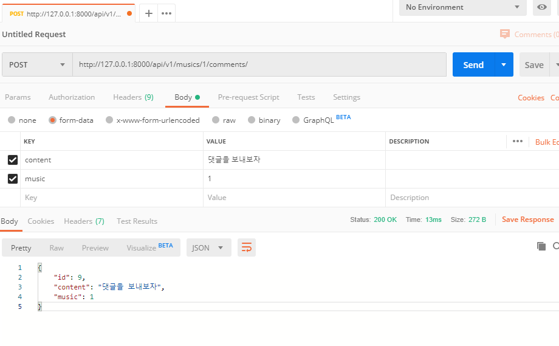

# API 서버

**SPA**: Single Page Application

- SPA만을 돌려주는, **Frontend server**를 별도로 운영한다.
- MERN (MongoDB(JSON데이터베이스), ExpressJS, React, Node.js) 스택
  - MongoDB : read, write에 특화됨(트위터). 데이터를 쌓는데에 유용

Server side, Frontend Server 두 개를 운용한다. (template의 역할을 frontend server가 담당. 분리됨) 인증과 같이 heavy한 작업은 server side가 담당한다.

- 최종적으로 우리는 Django를 서버사이드 API로만 사용할 것

- 오늘 목표는 Django 기반 REST API 서버 만들기


---


`API` 프로젝트 생성하기

- `mkdir API`

- `django-admin startproject api .`

Django REST Framework(DRF) 설치 [링크](https://www.django-rest-framework.org/)

- `pip install djangorestframework`

`settings.py`에 rest framework 추가

- ```python
  INSTALLED_APPS = [
      'rest_framework',
      ...
  ```

`musics` app 생성

- `python manage.py startapp musics`

- ```python
  INSTALLED_APPS = [
      'musics.apps.MusicsConfig', #'musics' 쓰는 것과 동일함
      ...
  ```

`models.py`에서 `Artist`, `Music` 모델 생성(1:N 가정)

```python
class Artist(models.Model):
    name = models.TextField()

    def __str__(self):
        return self.name

class Music(models.Model):
    title = models.TextField()
    artist = models.ForeignKey(Artist, on_delete=models.CASCADE)

    def __str__(self):
        return self.name

class Comment(models.Model):
    music = models.ForeignKey(Music, on_delete=models.CASCADE)
    content = models.TextField()

    def __str__(self):
        return self.content
```

`migrate` 실행

- `python manage.py makemigrations`
- `python manage.py migrate`

test 위한 superuser 생성

- `python manage.py createsuperuser`

작성한 모델을 admin에 등록 (admin 페이지에서 컨트롤 가능하도록)

- ```python
  from django.contrib import admin
  from .models import Artist, Music, Comment
  
  # Register your models here.
  admin.site.register(Artist)
  admin.site.register(Music)
  admin.site.register(Comment)
  ```

Dummy 데이터를 JSON 형태로 한꺼번에 넣어보자.

`musics` app 내에 [fixtures] > [musics] 폴더 생성. 내부에  `dummy.json` 작성 후 로딩.

- `python manage.py loaddata musics/dummy.json`

다른 앱에서 데이터를 꺼내서 `dummy.json`을 만들고싶어? 아래처럼 입력해(RECAP 프로젝트에서)

- `python manage.py dumpdata articles > dummy.json --indent 2`

- 빼는건 dumping, 넣는건 loading
- 데이터의 직렬화, Serializing


---


요청이 왔을 때, JSON 파일을 로드, 덤프하도록 만들자

API url 구성? Domain / Version / ...

```python
# [api] > urls.py
urlpatterns = [
    path('admin/', admin.site.urls),
    path('api/v1/', include('musics.urls')),
]
```

```python
# [musics] > urls.py
app_name = 'musics'

urlpatterns = [
    path('musics/', views.music_list, name='music_list'),
]
```

`musics` app 내에 `serializers.py` 생성.**(ModelForm같은 역할을 해줄 것)** 이를 통해  `views.py`에서 serializing된 응답을 보내줄 것.

```python
from rest_framework import serializers
from .models import *

# forms.ModelForm과 비슷한 느낌. 전달받은 쿼리셋을 직렬화 해주는 도구
class MusicSerializer(serializers.ModelSerializer):
    # MusicSerializer가 어떻게 생겼는지를 정의할 것
    class Meta:
        model = Music #어떤 모델을 직렬화 하려고 하는가?
        fields = ('id', 'title', 'artist_id',)
```

`rest_framework.response`의 `Response` 객체를 통해 응답을 보낼 것이다.

`view` 함수 위에, 받아들일 Http method를 데코레이터를 통해 반드시 명시해야 한다.

```python
# [musics] > views.py
from django.shortcuts import render
from .models import *
from .serializers import MusicSerializer
from rest_framework.response import Response
from rest_framework.decorators import api_view

# view 함수 위에, 받아들일 HTTP 메소드를 데코레이터를 통해 명시해야 한다.
@api_view(['GET'])
def music_list(request):
    musics = Music.objects.all()

    #불러온 쿼리셋을 serilizer에게 넘겨준다.
    serializer = MusicSerializer(musics, many=True)
    return Response(serializer.data)
```

url 뒤에 `?format=json`를 붙이면, JSON 파일만 응답된다.


**음악 상세보기 만들기**

```python
# [musics] > urls.py
...
    path('musics/<int:music_pk>', views.music_detail, name='music_detail'),
```

```python
# [musics] > views.py
@api_view(['GET'])
def music_detail(request, music_pk):
    music = get_object_or_404(Music, pk=music_pk)

    serializer = MusicSerializer(music) #하나밖에 안보내니까, many=True 불필요
    return Response(serializer.data)
```


**아티스트 명단보기&상세보기 만들기**

아티스트를 위한 Serializer를 만든다.

```python
#[musics] > serialziers.py
class ArtistSerializer(serializers.ModelSerializer):
    class Meta:
        model = Artist
        fields = ('id', 'name',)
```

`views.py`함수 추가

```python
# [musics] > views.py

@api_view(['GET'])
def artist_list(request):
    artists = Artist.objects.all()
    serializer = ArtistSerializer(artists, many=True)
    return Response(serializer.data)


@api_view(['GET'])
def artist_detail(request, artist_pk):
    artist = get_object_or_404(Artist, pk=artist_pk)
    serializer = ArtistSerializer(artist)
    return Response(serializer.data)
```

`urls.py`에 url 추가

```python
#[musics] > urls.py
...
    path('artists/', views.artist_list, name='artist_list'),
    path('artists/<int:artist_pk>', views.artist_detail, name='artist_detail'),
```

아티스트별 음악 명단까지 보여주는 Serializer를 만들어보자

```python
#[musics] > serialziers.py
class ArtistDetailSerializer(serializers.ModelSerializer):
    #music_set: 이 아티스트가 가지고 있는 music_set을 가지고 있는 변수
    music_set = MusicSerializer(many=True)
    class Meta(ArtistSerializer.Meta):
        #앞서 선언한 serializer를 상속받음. model 추가적으로 지정해줄 필요 없음
        fields = ArtistSerializer.Meta.fields + ('music_set',)
```

`views.py` 에서 `ArtistSerializer`를 `ArtistDetailSerializer`로 수정해준다.


**Comment 생성 API**

```python
# [musics] > serializers.py
class CommentSerializer(serializers.ModelSerializer):
    class Meta:
        model = Comment
        # fields = ('id', 'content', 'music_id',)
        fields = '__all__'
```

```python
# [musics] > views.py
@api_view(['POST'])
def comments_create(request, music_pk):
    # form = CommentForm(request.POST) 와 유사하게
    serializer = CommentSerializer(data=request.data)
    # if form.is_valid() 와 유사하게
    if serializer.is_valid(raise_exception=True)):
        serializer.save(music_id=music_pk)

    return Response(serializer.data)
```

*RESTful API*

*Music REST API*

- C                POST       /musics
- R(list)         GET         /musics
- R(detail)    GET         /musics/:pk
- U                PUT         /musics/:pk
- D                DELETE   /musics/:pk

*Comment REST API* (comment는 music에 dependent하므로, 반드시 music_pk가 필요하다.)

- C                POST       /musics/:pk/comments
- R(list)         GET         /musics/:pk/comments
- R(detail)    GET         /musics/:pk/comments/:pk
- U                PUT         /musics/:pk/comments/:pk
- D                DELETE   /musics/:pk/comments/:pk


*GraphQL*

- 페이스북에서는 URL을 무작정 길게 늘어트리지 않고, 쿼리 문장을 요청에 함께 보내는 방식으로 처리.(원하는 요청을 JSON으로 보낸다.)


Comment 생성 url 정의

```python
#[musics] > urls.py
...
    path('musics/<int:music_pk>/comments/', views.comments_create, name='comments_create'),
```

음악 상세보기 serializer 추가 (comment 명단을 확인할 수 있도록)

```python
#[musics] > serializers.py
class MusicDetailSerializer(serializers.ModelSerializer):
    comment_set = CommentSerializer(many=True)
    class Meta(MusicSerializer.Meta):
        fields = MusicSerializer.Meta.fields + ('comment_set',)
```


*Postman* 을 사용해서 POST 요청 가능 (다른 명령의 결과물도 확인 가능)

예) GET(메소드 선택) http://127.0.0.1:8000/api/v1/musics/ 입력 후 Send 버튼 클릭


POST http://127.0.0.1:8000/api/v1/musics/1/comments/

하단 Body > form-data, KEY, VALUE 값 입력 후 Send 버튼 클릭(Content, Music 모두 입력해줘야 한다.)




**명세 만들기**

자동 문서화 도구 사용 (drf yasg) [링크](https://github.com/axnsan12/drf-yasg)

설치

- `pip install drf-yasg`

`settings.py`에 추가

- ```python
  INSTALLED_APPS = [
      'drf_yasg',
      ...
  ```

`urls.py` 수정

- ```python
  # [musics] > urls.py
  from drf_yasg import openapi
  from drf_yasg.views import get_schema_view
  
  schema_view = get_schema_view(
      openapi.Info(
          title='Music API',
          default_version='v1',
      )
  )
  
  app_name = 'musics'
  
  urlpatterns = [
  	...
      #with_ui: view에 해당하는 ui도(redoc or swagger) 포함 가능
      path('docs/', schema_view.with_ui('redoc'), name='api_docs'), 
      path('swagger/', schema_view.with_ui('swagger'), name='api_swagger'),
  ]
  ```

- swagger에서는 test까지 즉석으로 가능.